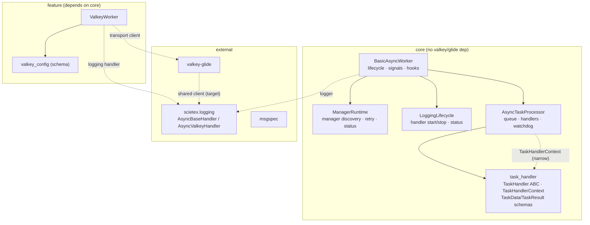

# Architecture Review — v3.0.0 Deep Review

**Date:** 2026-09-06
**Package:** `scietex.service` v3.0.0
**Baseline:** commit `cecd39d`; prior reviews `docs/reviews/architecture/2026-09-04.md` (v2.0.0, AR-001..AR-016) and `2026-09-05.md` (follow-up)
**Scope:** Fresh deep architectural review of the v3.0.0 codebase. All prior findings AR-001..AR-016 are **resolved** in this baseline; this review reports **new** findings (AR-017+) and re-assesses the open hotspots tracked in `docs/architecture/hotspots.md` (H7, H9, H11, H12, H16).
**Method:** Read `docs/architecture/*` as an initial map (not authoritative), then verified every claim against source. All files under `src/scietex/service/`, `examples/`, and `tests/` were read end-to-end. No source or tests were modified.

---

## Executive Summary

The v3.0.0 refactor is a genuine architectural improvement. The prior review's
central structural problem — a `BasicAsyncWorker` god class (AR-003) — was
addressed by extracting `ManagerRuntime` and `LoggingLifecycle`; the task
delivery contract (AR-005) is now at-least-once with deferred ack and
`XAUTOCLAIM` recovery; connection state is truthful (AR-006); and the
`task_handler` boundary is clean in both directions with a narrow
`TaskHandlerContext` (AR-009). The vertical layering is sound: core never
depends on the Valkey feature, and the `task_handler` package never imports the
worker. The architecture is **fundamentally sound** and the direction of travel
is correct.

The remaining risk concentrates in **two HIGH-severity lifecycle/ownership
gaps** that are carried over from the hotspot list and verified in source:

1. **AR-017 (H7) — the shutdown cancellation path can strand a worker in
   `STOPPING`.** `_shutdown` swallows `CancelledError` without forcing a
   terminal state or setting the exit event, so a worker can be left stuck in
   `STOPPING` with `exit` unset, and a subsequent `start()` polls forever.
2. **AR-018 (H9) — two independent `GlideClient` connection lifecycles.** The
   worker owns one client for task streams and the external `AsyncValkeyHandler`
   owns a second for logging, with split teardown owners and no shared
   connection accounting.

Below these, a cluster of **MEDIUM** findings concern silent failure modes
(broad `except Exception` swallowing valkey import errors, log-handler start
failures recorded as `RUNNING`, `xgroup_create` failures swallowed) and the
coarse error policy (H16). A long tail of **LOW** findings covers dead code,
commented-out code, `print()` vs logger inconsistency, emoji in logs, and test
slowness.

**Bottom line:** No CRITICAL findings. The framework is safe to run unattended
for the single-worker, single-process, per-identity-stream topology it
currently targets, provided the two HIGH items (AR-017, AR-018) are addressed.
The most valuable next investment is a **single shared connection lifecycle**
(AR-018) and a **terminal-state guarantee on shutdown** (AR-017), followed by
tightening the silent-failure boundaries (AR-019, AR-020, AR-021).

---

## Architecture Assessment

### Layering and dependency direction — SOUND

The package is a clean three-level vertical hierarchy with correct dependency
direction:

```
BasicAsyncWorker (foundation: lifecycle, managers, logging, signals)
        │ extends
AsyncTaskProcessor (in-process task queue, handlers, watchdog)
        │ extends
ValkeyWorker (Valkey/glide transport)
```

Verified: `BasicAsyncWorker` and `AsyncTaskProcessor` depend only on the
external `scietex.logging` and `msgspec` packages — never on Valkey/glide.
`ValkeyWorker` (feature) extends `AsyncTaskProcessor` (core); core never
imports feature. The `task_handler` package is a clean boundary in **both**
directions: it never imports the worker, and its `TaskHandlerContext`
(`task_handler/context.py:7`) deliberately narrows the surface a handler sees
to `service_name`, `worker_id`, and `logger` — no full worker reference. This
is the single best abstraction decision in the codebase.

### Module boundaries — GOOD, with two seams worth noting

- `ManagerRuntime` (`manager_runtime.py`) and `LoggingLifecycle`
  (`logging_lifecycle.py`) are genuine extractions that reduced the
  `BasicAsyncWorker` god class. They pass the deletion test: delete them and
  their complexity would reappear in the worker.
- The `valkey_config.py` schema layer is decoupled and testable without a
  worker or server — a good seam.
- **Seam worth keeping (AR-018):** the `AsyncValkeyHandler` owns its own
  `GlideClient`, separate from the worker's. This is a real seam (two adapters
  to the same transport) but currently an *unmanaged* one — see AR-018.

### State and resource ownership — the main weakness

Ownership is split across three cooperating objects (`BasicAsyncWorker`,
`ManagerRuntime`, `LoggingLifecycle`) that each hold their own status/task
dicts. This is coherent but creates several places where a status can diverge
from reality (AR-017 shutdown state, AR-020 log-handler marked RUNNING on
failure, AR-021 group-creation failure swallowed). The read-only
`MappingProxyType` views (AR-008) are a good guard on the public surface.

### Concurrency / async model — SOUND for its target

Single-process, single-threaded asyncio with managers as named tasks and a
bounded in-process queue. The `asyncio.wait` (not `wait_for`) pattern in
`cleanup`/`watchdog` correctly avoids re-cancelling cancellation-swallowing
handlers. The main async risk is the shutdown cancellation path (AR-017).

### Error-handling boundaries — the recurring theme

The framework's error policy is **"fail soft and keep running"** at the manager
level (bounded retry, then give up) but **"swallow and continue"** at several
transport/import boundaries (AR-019, AR-020, AR-021). The former is a sound,
observable design; the latter silently degrades features. The task error policy
(H16 / AR-022) is coarse: any handler failure collapses to a single stringly
`error` field with no taxonomy, retry count, or partial-progress signal.

---

## Strengths

1. **Correct dependency direction throughout.** Core never depends on feature;
   `task_handler` is clean in both directions. Verified against source.
2. **Narrow handler context (AR-009).** `TaskHandlerContext` exposes only
   `service_name`/`worker_id`/`logger`, not the worker — a strong encapsulation
   decision that keeps handlers decoupled and testable.
3. **Frozen typed `msgspec.Struct` schemas** (`task_handler/schemas.py`,
   `valkey/schemas.py`) as the single wire/contract source, with per-instance
   timestamp defaults (AR-012).
4. **At-least-once delivery (AR-005).** Deferred ack (`_task_entry_ids`),
   `XAUTOCLAIM` recovery on first fetch, and requeue-on-timeout with duplicate
   protection when a handler ignores cancellation.
5. **Truthful `connect()` (AR-006).** `_client` is assigned only after PING
   succeeds; the client is closed on ping failure.
6. **Read-only state views (AR-008)** via `MappingProxyType` for `events`,
   `task_handlers`, `running_tasks`.
7. **Non-blocking intake (AR-016).** `enqueue_task` uses `put_nowait` and
   returns `False` when full.
8. **`initialize()` before managers start (AR-007)** — resolves the startup
   race.
9. **Config fails loudly, never overwrites (AR-011).** `read_valkey_config`
   raises on present-but-invalid and only creates defaults when missing.
10. **Manager extraction (AR-003)** genuinely reduced the god class; the
    `ManagerRuntime`/`LoggingLifecycle` split is a real seam.
11. **Comprehensive test suite** covering AR-001..AR-016 fixes, using a
    `DummyClient` mock so no live Valkey server is required.
12. **Restartable-in-place logging handlers** (scietex.logging >= 1.0) — the
    factory-registry complexity was removed cleanly.

---

## Issues

### Critical

None.

### Major (HIGH)

#### AR-017 — Shutdown cancellation can strand the worker in `STOPPING` (H7)

- **Severity:** HIGH
- **Evidence:** `basic_async_worker.py:720-722` — `_shutdown` catches
  `asyncio.CancelledError`, logs "Shutdown task cancelled", and **passes**
  without re-raising or forcing a terminal state. `_startup` (`:646-648`)
  similarly re-raises `CancelledError` leaving state `STARTING` with no reset
  branch.
- **Problem:** If the `_shutdown` task is cancelled mid-shutdown (e.g. the
  process is being torn down, or a second stop races the first), the worker can
  be left in `STOPPING` with the `exit` event unset. A subsequent `start()`
  (`:653`) sees `STOPPING` and spawns `_shutdown` again, but `_startup`
  (`:625-626`) polls `while state != STOPPED` forever because nothing forces
  the transition.
- **Why it matters:** The advertised `STOPPED → RUNNING` restart path (the
  central promise of the framework) silently hangs if a shutdown was ever
  cancelled. This is a correctness gap in the lifecycle state machine, not a
  cosmetic one.
- **Recommendation:** In the `CancelledError` handler, force a terminal state:
  set `state = STOPPED`, clear `start_time`, and set the `exit` event if
  `exit_requested` — then re-raise so cancellation semantics are preserved for
  callers. Add a test that cancels `_shutdown` and asserts the worker reaches
  `STOPPED` and can be restarted.
- **Confidence:** HIGH

#### AR-018 — Two independent `GlideClient` connection lifecycles (H9)

- **Severity:** HIGH
- **Evidence:** `valkey/valkey_async_worker.py:154-163` registers an
  `AsyncValkeyHandler` that owns its own `GlideClient`; `:223` creates a second
  `GlideClient` in `connect()`. Teardown is split: the worker's client is
  closed in `disconnect()` (`:242`, called from `cleanup` `:320`), while the
  handler's client is closed by the handler's `stop_logging()` via
  `LoggingLifecycle.shut_down_handlers`.
- **Problem:** Two independent connections to the same server with two
  teardown owners and no shared accounting. Failure modes and resource
  lifetimes are split: the worker can be connected while logging is down, or
  vice versa. Each worker opens two connections where one would do.
- **Why it matters:** Doubles connection/resource footprint, splits the failure
  surface, and makes "is this worker connected?" ambiguous — the worker's
  `connect()` truthfully reports only its own client, not the logging client.
- **Recommendation:** Introduce a single shared connection lifecycle. Either
  (a) have the worker own one `GlideClient` and pass it to the
  `AsyncValkeyHandler` (requires the external `scietex.logging` handler to
  accept an injected client — an ownership-contract change outside this repo),
  or (b) make the worker the sole owner and have the handler use a client
  provided by the worker. At minimum, document the two-lifecycle model
  explicitly and make `connect()` report the health of both.
- **Confidence:** HIGH

### Moderate (MEDIUM)

#### AR-019 — Broad `except Exception` silently swallows valkey import errors

- **Severity:** MEDIUM
- **Evidence:** `__init__.py:24-53` — the guarded import block re-exports the
  Valkey surface inside `try/except Exception` and swallows **all** exceptions.
- **Problem:** If `valkey-glide` is installed but broken, or a real bug exists
  in the `valkey` module, the package imports silently **without**
  `ValkeyWorker` — no attribute, no error, no warning. Feature degradation is
  invisible until a caller hits `AttributeError` at use time.
- **Why it matters:** The documented trade-off (importable without
  `valkey-glide`) is legitimate, but the catch is too broad: it also hides
  genuine breakage. Silent degradation is the hardest failure mode to diagnose.
- **Recommendation:** Catch only `ImportError` (the intended case), and log a
  warning (or set a module flag) when the Valkey surface is unavailable. Let
  non-`ImportError` exceptions propagate so real bugs surface at import.
- **Confidence:** HIGH

#### AR-020 — Log handler start failure recorded as `RUNNING` (mirrors old AR-004)

- **Severity:** MEDIUM
- **Evidence:** `logging_lifecycle.py:57-91` — `start_handlers` sets
  `statuses[handler_name] = RUNNING` at `:91`, **outside** the `try/except`
  that wraps `wait_for(start_logging, ...)`. If `start_logging` times out or
  raises, the handler is still recorded `RUNNING`.
- **Problem:** A handler that failed to start is marked `RUNNING`, so it will
  not be retried on the next `start_handlers` call. The worker proceeds with a
  log handler that is not actually running.
- **Why it matters:** This is the same status-divergence bug class as the old
  AR-004 (which was fixed for the *shutdown* direction). The *start* direction
  still records optimistic state. Logging silently goes dark.
- **Recommendation:** Set `statuses[handler_name] = RUNNING` only after
  `start_logging` succeeds (inside the success path), and record a failed state
  otherwise so the handler can be retried.
- **Confidence:** HIGH

#### AR-021 — `xgroup_create` failures swallowed; worker runs with no consumer group

- **Severity:** MEDIUM
- **Evidence:** `valkey/valkey_async_worker.py:310-317` — `initialize` calls
  `xgroup_create(make_stream=True)` and swallows **all** exceptions at DEBUG.
  The comment claims it only ignores "group already exists", but the catch is
  unconditional.
- **Problem:** A genuine group-creation failure (e.g. permission denied,
  wrong database) is swallowed, and the worker proceeds to `RUNNING` with no
  consumer group. `fetch_tasks` (`:480`) will then fail on every read.
- **Why it matters:** The worker reports healthy (`RUNNING`, truthful
  `connect()`) while its core task-fetch path is broken. This defeats the
  AR-006 "truthful connect" improvement.
- **Recommendation:** Distinguish "group already exists" (ignore) from other
  errors (log at ERROR and fail `initialize`, or surface the failure). Do not
  swallow the whole class.
- **Confidence:** HIGH

#### AR-022 — Coarse task error policy; no taxonomy, retry, or partial-progress signal (H16)

- **Severity:** MEDIUM
- **Evidence:** `async_tasks_processor.py:509-544` — `process_task` maps any
  handler failure to a single `TaskResult(status='error', error=str(e))`.
  `TaskResult` (`task_handler/schemas.py:48`) has only `status`/`error`/
  `processed_at`/`payload`. Dispatch is first-match over active handlers by
  `supports()` (`_find_task_handler` `:400`), while registration keys
  (`add_task_handler`) are unrelated to task types — the name/type duality
  persists (examples register the same handler under multiple keys).
- **Problem:** A handler cannot express partial progress, a structured error
  code, a retry count, or a custom requeue intent. The framework cannot
  distinguish a permanent failure from a transient one, so it cannot apply
  per-task backoff or decide requeue policy beyond the coarse
  `canceled_action`/`timeout_action` literals.
- **Why it matters:** For a task-processing framework, the error contract is
  the highest-leverage interface. A stringly `error` field forces every
  consumer to parse text and prevents the framework from making smart retry
  decisions. This limits the framework's usefulness for real workloads.
- **Recommendation:** Extend `TaskResult` with an optional structured error
  (code/type) and a retry hint, and let a handler signal "retryable" vs
  "permanent". Consider aligning registration keys with `supported_tasks` so
  dispatch and registration use one vocabulary. This is a contract change and
  should be treated as a design task, not a patch.
- **Confidence:** MEDIUM (the duality is confirmed; the "right" contract shape
  is a design decision)

#### AR-023 — Per-`worker_id` stream/group naming couples scaling topology to identity (H11)

- **Severity:** MEDIUM
- **Evidence:** `valkey/valkey_async_worker.py:166-169` — stream/group/consumer
  names embed `worker_id`: `scietex:{service}:{worker_id}:tasks`,
  `...:task_group`, consumer `scietex:{service}:{worker_id}`.
- **Problem:** Horizontal scale-out requires multiple replicas to share the
  same `(service_name, worker_id)`, which defeats the purpose of `worker_id`
  as an identity. The "distributed task queue" is really replicated consumers
  of a per-identity stream, not a true distributed queue with independent
  consumers.
- **Why it matters:** The naming scheme bakes a single-worker-per-identity
  topology into the key space. Scaling out means either sharing an identity
  (losing per-worker status keys) or partitioning work by identity (not a
  shared queue).
- **Recommendation:** Separate the *stream/group* namespace (shared across
  replicas of a service) from the *consumer/status* namespace (per worker).
  E.g. stream `scietex:{service}:tasks`, group `scietex:{service}:task_group`,
  consumer `scietex:{service}:{worker_id}`. This is a breaking key change and
  should be coordinated with any deployment.
- **Confidence:** MEDIUM (the coupling is confirmed; whether it is a problem
  depends on the intended scaling model — see Open Questions)

### Minor (LOW)

#### AR-024 — Debug log prints literal `{result}` instead of the result

- **Severity:** LOW
- **Evidence:** `async_tasks_processor.py:546` —
  `self.logger.log(logging.DEBUG, "Task %s (%s) completed with result: {result}", task_data, task_id)`.
  The format string contains a literal `{result}` (not `%s`), and the `result`
  variable is never passed as an argument.
- **Problem:** The debug log always prints the literal text `{result}` rather
  than the actual result.
- **Recommendation:** Change to `"...completed with result: %s", task_data,
  task_id, result`.
- **Confidence:** HIGH

#### AR-025 — Dead commented-out code and duplication in `purge_tasks`

- **Severity:** LOW
- **Evidence:** `valkey/valkey_async_worker.py:330-403` — `purge_tasks` contains
  commented-out `print()` statements (`:346/355/367/377/388/395`) and
  commented-out `StreamReadGroupOptions`/`StreamReadOptions` args
  (`:351/372/391`); three near-identical XREADGROUP/XREAD loops; uses `print()`
  (`:342`) not the logger; and has **no caller** in `src/`.
- **Problem:** Commented-out code violates the project's own conventions, the
  three loops are duplicated logic, and a public method with no caller is dead
  surface.
- **Recommendation:** Remove the commented-out code, factor the three loops
  into one helper, route output through the logger, and either wire
  `purge_tasks` to a caller or mark it clearly as a consumer utility.
- **Confidence:** HIGH

#### AR-026 — Emoji in log messages

- **Severity:** LOW
- **Evidence:** `basic_async_worker.py:809` (`'💓 Heartbeat'`), `:821`
  (`'🐕 Watchdog'`); `manager_runtime.py:79/96/102/118/122` (`🟢❌🟡🔴`).
- **Problem:** Emoji in log output violates the project's no-emoji convention
  and is noisy/inconsistent in structured logs.
- **Recommendation:** Replace with plain-text level markers.
- **Confidence:** HIGH

#### AR-027 — `print()` used instead of logger in Valkey error paths

- **Severity:** LOW
- **Evidence:** `valkey/valkey_async_worker.py:225/232` (`connect`), `:342`
  (`purge_tasks`).
- **Problem:** Inconsistent error reporting — some paths use the logger, these
  use `print()`, so errors bypass the configured logging pipeline.
- **Recommendation:** Route through `self.logger`.
- **Confidence:** HIGH

#### AR-028 — Heartbeat failures swallowed at DEBUG

- **Severity:** LOW
- **Evidence:** `valkey/valkey_async_worker.py:280-287` — heartbeat errors are
  logged at DEBUG and swallowed.
- **Problem:** A failed heartbeat never surfaces, so health monitoring silently
  fails while the worker reports `RUNNING`.
- **Recommendation:** Log heartbeat failures at WARNING/ERROR (or expose a
  health counter) so a dead status key is observable.
- **Confidence:** HIGH (documented design choice, but the observability gap is
  real)

#### AR-029 — Failed handler start leaves handler in active dict

- **Severity:** LOW
- **Evidence:** `async_tasks_processor.py:357` adds the handler to
  `__task_handlers` **before** `start`; on start failure (`:360-368`) it is
  never removed.
- **Problem:** A handler that fails to start stays in the active dict. It is
  skipped by `process_task` (via `is_ready`), but the dict grows and dispatch
  iterates it.
- **Recommendation:** Remove the handler from `__task_handlers` on start
  failure.
- **Confidence:** HIGH

#### AR-030 — `stop_manager` pops a still-running task on timeout (orphan risk)

- **Severity:** LOW
- **Evidence:** `manager_runtime.py:148-168` — `stop_manager` pops the task from
  tracking even when `wait_for` times out (`:168`) while the task is still
  running.
- **Problem:** A later `start_manager` for the same name could create a second
  task, orphaning the first. Also, in `run_manager`'s `finally` (`:120`), if
  `manager.cleanup` raises, the `pop` at `:124-125` never runs.
- **Recommendation:** Only pop on success; on timeout, leave the task tracked
  (or mark it) so a restart cannot double-spawn. Guard the `finally` so the pop
  always runs.
- **Confidence:** MEDIUM (edge case, but the bookkeeping is fragile)

#### AR-031 — Dead `name` parameter in `register_logger_handler`

- **Severity:** LOW
- **Evidence:** `logging_lifecycle.py:40` — `register_logger_handler` accepts a
  `name` param that is never used; statuses are keyed by `handler.name` or
  `handler.__class__.__name__`.
- **Recommendation:** Remove the parameter or use it consistently.
- **Confidence:** HIGH

#### AR-032 — Doc drift: `logging_level` "read-only" docstring vs setter

- **Severity:** LOW
- **Evidence:** `basic_async_worker.py:454` docstring says "read-only" but a
  setter exists at `:463`.
- **Recommendation:** Fix the docstring.
- **Confidence:** HIGH

#### AR-033 — Signal handler spawns a new task per signal

- **Severity:** LOW
- **Evidence:** `basic_async_worker.py:511` —
  `loop.add_signal_handler(sig, lambda: asyncio.create_task(self.exit(), name='StopTask'))`.
- **Problem:** Multiple signals spawn multiple `exit()` calls / tasks.
- **Recommendation:** Guard against re-entry (e.g. only spawn if not already
  exiting).
- **Confidence:** MEDIUM

#### AR-034 — Watchdog timeout check never fires for timeout <= 0

- **Severity:** LOW
- **Evidence:** `async_tasks_processor.py:656` — `0 < timeout < (now - started)`.
- **Problem:** A `timeout` of 0 or negative never triggers the watchdog.
- **Recommendation:** Decide intended semantics for `timeout <= 0` and handle
  explicitly.
- **Confidence:** HIGH

#### AR-035 — Non-durable-transport task loss on shutdown (cleanup drain footgun)

- **Severity:** LOW
- **Evidence:** `async_tasks_processor.py:474-483` — `cleanup` drains the queue
  without requeueing; the comment (`:474-479`) acknowledges items from a
  durable transport stay pending, but for non-durable in-memory transports the
  drained tasks are lost. `examples/async_task_processor.py` does **not**
  override `cleanup` to requeue.
- **Problem:** On shutdown, queued-but-undispatched tasks are silently lost for
  in-memory transports.
- **Recommendation:** Document the requirement that non-durable transports must
  override `cleanup` to requeue, and make the example do so.
- **Confidence:** HIGH

#### AR-036 — Test slowness and a vestigial fixture

- **Severity:** LOW
- **Evidence:** `tests/test_basic_async_service.py:28/33/37/42` —
  `test_graceful_shutdown` uses four real-time `asyncio.sleep(5)` calls (~20s);
  the `test_event_loop` fixture (`:13-18`) creates a loop never used since
  pytest-asyncio provides the running loop.
- **Problem:** Slow tests and dead fixture code.
- **Recommendation:** Replace real-time sleeps with a fast fake clock or
  shortened intervals; remove the vestigial fixture.
- **Confidence:** HIGH

#### AR-037 — Dead example config in `valkey_async_service.py`

- **Severity:** LOW
- **Evidence:** `examples/valkey_async_service.py:35-44` builds a `ValkeyConfig`
  that is never used; `asyncio.run(main(None))` passes `None`, so the worker
  reads `valkey.yml` instead.
- **Recommendation:** Either pass the built config or remove the dead
  construction.
- **Confidence:** HIGH

#### AR-038 — PubSub path is dead code in the package

- **Severity:** LOW
- **Evidence:** `valkey/valkey_config.py:310-320` — `generate_glide_config`
  supports `listening=True` PubSub subscriptions, but `ValkeyWorker` always
  passes `listening=False` (`valkey_async_worker.py:134-139`).
- **Recommendation:** Decide whether the control/PubSub path is a planned
  feature; if not, remove it or document it as reserved.
- **Confidence:** HIGH

#### AR-039 — `pyyaml` declared but not imported in `src/`

- **Severity:** LOW
- **Evidence:** `pyproject.toml` declares `pyyaml>=6.0`; no `src/` file imports
  it (`msgspec.yaml` is used instead). Commit `0c5130d` states pyyaml is
  required by `msgspec.yaml`.
- **Problem:** A declared dependency with no direct import is confusing; the
  deps doc already flags it as unused.
- **Recommendation:** Confirm whether `msgspec.yaml` requires pyyaml
  transitively; if so, document why it is a direct dependency.
- **Confidence:** MEDIUM

#### AR-040 — First heartbeat/watchdog delayed by a full interval

- **Severity:** LOW
- **Evidence:** `basic_async_worker.py:777-796` — `_heartbeat_manager` and
  `_watchdog_manager` sleep the full interval **before** their first action.
- **Problem:** The first heartbeat/watchdog is delayed by the full interval
  after startup.
- **Recommendation:** Act first, then sleep (or sleep a short initial delay) so
  the first beat is prompt.
- **Confidence:** HIGH (design choice, but worth noting)

---

## Cross-Cutting Analysis

### The "fail soft" vs "swallow" tension

The framework has two distinct error philosophies that coexist uneasily:

- **Manager level (sound):** bounded retry with backoff, then observable
  give-up (`manager_runtime.py:94-101`). Errors are recorded in `self.errors`
  and logged. This is a good, observable "fail soft" design.
- **Transport/import level (weak):** several boundaries swallow errors
  wholesale — valkey import (`__init__.py:46`), `xgroup_create`
  (`valkey_async_worker.py:316`), heartbeat (`:280`), log-handler start
  (`logging_lifecycle.py:91`). These silently degrade features while the worker
  reports `RUNNING`.

The recurring theme across AR-019/AR-020/AR-021/AR-028 is that **the worker's
reported state can diverge from its actual capability**. The AR-006 "truthful
connect" fix addressed one instance; the same discipline needs to be applied to
every "swallow and continue" boundary. The rule should be: *swallow only what
you can prove is benign, and make the rest observable.*

### Status divergence as a systemic risk

AR-017 (shutdown state), AR-020 (log handler RUNNING), AR-021 (no consumer
group), AR-030 (task popped while running) all share a root cause: **status
dicts are updated optimistically or not at all on failure paths.** The
`ManagerRuntime`/`LoggingLifecycle`/`BasicAsyncWorker` split, while a good
decomposition, spread state across three objects with no single invariant
enforcer. A future improvement is a small state-transition helper that makes
"set status only on success" a structural guarantee rather than a per-site
discipline.

### The task contract is the highest-leverage interface

For a task-processing framework, `TaskResult` and the dispatch/registration
model (AR-022) are the interfaces every consumer depends on. They are currently
coarse. Because this is a public contract, changing it is a design task with
migration implications — it should not be patched ad hoc.

### Testability

The codebase is genuinely testable: `valkey_config` is tested without a server,
`ValkeyWorker` against a `DummyClient` mock, and lifecycle ordering via
subclass hooks. The main testability debt is the reliance on real-time sleeps
(AR-036), which makes the suite slow and slightly flaky-prone. The
`TaskHandlerContext` seam makes handlers trivially testable in isolation.

---

## Architectural Recommendations

### Priority 1 (correctness / reliability — do first)

1. **AR-017 — Guarantee a terminal state on shutdown cancellation.** Force
   `STOPPED` + set `exit` in the `CancelledError` handler, then re-raise. Add a
   regression test.
2. **AR-018 — Unify the `GlideClient` lifecycle.** Make the worker the single
   owner of the connection and have the logging handler consume it, or
   explicitly document and health-report the two-lifecycle model. Coordinate
   the ownership contract with the external `scietex.logging` package.
3. **AR-019/AR-020/AR-021 — Tighten the silent-failure boundaries.** Catch only
   `ImportError` in `__init__.py`; set log-handler status only on success; fail
   `initialize` (or surface) on genuine `xgroup_create` errors. Apply the
   "truthful state" discipline from AR-006 everywhere.

### Priority 2 (contract / design)

4. **AR-022 — Redesign the task error contract.** Add structured error
   taxonomy, retry hints, and partial-progress signaling to `TaskResult`;
   reconcile registration keys with `supported_tasks`. Treat as a design task
   with migration.
5. **AR-023 — Separate stream/group namespace from consumer/status namespace.**
   Decide the intended scaling model first (see Open Questions), then align the
   key space.

### Priority 3 (hygiene / polish)

6. **AR-024..AR-040 — Low-severity cleanup:** fix the `{result}` log bug,
   remove commented-out code and emoji, route `print()` through the logger,
   surface heartbeat failures, fix handler-start bookkeeping, remove dead
   params/code, speed up tests, fix doc drift.

---

## Suggested Target Architecture

The current architecture is sound; the target is an *evolution*, not a rewrite.
The key changes are: (1) a single shared connection lifecycle, (2) a guaranteed
terminal shutdown state, and (3) a richer task error contract.



**Target deltas vs current:**

- **AR-018:** one `GlideClient` owned by the worker, shared with the logging
  handler (dashed "shared client" edge above) — or an explicit documented
  two-lifecycle model with unified health reporting.
- **AR-017:** a state-transition helper guaranteeing `STOPPED` is always
  reachable from any shutdown path.
- **AR-022:** `TaskResult` carries structured error + retry hint; dispatch and
  registration share one vocabulary.
- **AR-023:** stream/group keys are service-scoped; consumer/status keys are
  worker-scoped.

---

## Migration Strategy

Because the HIGH/MEDIUM items are mostly *internal* (state handling, error
boundaries) or *contract* (task error model, key naming), migration risk is
concentrated in the two contract changes:

1. **Phase 1 — Internal fixes (low risk, no API change):** AR-017, AR-019,
   AR-020, AR-021, AR-024..AR-040. These change behavior only on failure paths
   that currently misbehave. Land as a patch release with regression tests.
2. **Phase 2 — Connection lifecycle (AR-018):** coordinate with the external
   `scietex.logging` package on the handler's client-ownership contract. If the
   handler cannot accept an injected client, ship the documented two-lifecycle
   model with unified health reporting first, and defer true unification.
3. **Phase 3 — Task error contract (AR-022):** additive change first — add
   optional structured fields to `TaskResult` with defaults so existing
   handlers keep working — then migrate dispatch/registration vocabulary.
   Treat as a minor version bump.
4. **Phase 4 — Key-space change (AR-023):** breaking; coordinate with any
   deployed consumers. Only do this once the scaling model is decided.

Each phase is independently shippable and verifiable; none requires a rewrite.

---

## Open Questions

1. **What is the intended scaling model?** If multiple replicas of a service
   are meant to consume one shared queue, AR-023 (per-`worker_id` stream/group
   naming) is a real limitation. If each `worker_id` is a distinct logical
   worker with its own queue, the current scheme is fine. This decision gates
   AR-023.
2. **Can the external `scietex.logging` handler accept an injected
   `GlideClient`?** AR-018's cleanest fix depends on an ownership-contract
   change in a package outside this repo. If not, is the two-lifecycle model
   acceptable if health is reported for both?
3. **Should a manager give-up propagate to the worker's overall state?**
   (Carried from 2026-09-05.) A persistently failing manager stops observably
   but the worker stays `RUNNING`. Is that acceptable, or should it transition
   the worker to a failed state?
4. **What error taxonomy does the task contract need?** AR-022's redesign
   should be driven by real handler needs (retryable vs permanent, partial
   progress, structured codes). What do actual consumers require?
5. **Is the control/PubSub path (`listening=True`) a planned feature?**
   (Carried from 2026-09-05.) It is dead code in the package (AR-038).
6. **Is `pyyaml` required transitively by `msgspec.yaml`?** (AR-039.) Affects
   whether it should remain a declared dependency.
7. **Is `purge_tasks` intended as a consumer utility?** It has no caller in
   `src/` (AR-025). If it is meant for operators, it should be documented and
   cleaned; otherwise removed.

---

## Final Prioritization

| ID | Issue | Severity | Impact | Effort | Priority |
| -- | ----- | -------- | ------ | ------ | -------- |
| AR-017 | Shutdown cancellation strands worker in `STOPPING` (H7) | HIGH | High | Low | 1 |
| AR-018 | Two independent `GlideClient` lifecycles (H9) | HIGH | High | Medium | 1 |
| AR-019 | Broad `except Exception` swallows valkey import errors | MEDIUM | Medium | Low | 1 |
| AR-020 | Log-handler start failure recorded `RUNNING` | MEDIUM | Medium | Low | 1 |
| AR-021 | `xgroup_create` failure swallowed; no consumer group | MEDIUM | Medium | Low | 1 |
| AR-022 | Coarse task error policy; no taxonomy/retry (H16) | MEDIUM | Medium | High | 2 |
| AR-023 | Per-`worker_id` stream/group naming couples scaling (H11) | MEDIUM | Medium | Medium | 2 |
| AR-024 | Debug log prints literal `{result}` | LOW | Low | Low | 3 |
| AR-025 | Dead commented code + duplication in `purge_tasks` | LOW | Low | Low | 3 |
| AR-026 | Emoji in log messages | LOW | Low | Low | 3 |
| AR-027 | `print()` instead of logger in Valkey paths | LOW | Low | Low | 3 |
| AR-028 | Heartbeat failures swallowed at DEBUG | LOW | Low | Low | 3 |
| AR-029 | Failed handler start stays in active dict | LOW | Low | Low | 3 |
| AR-030 | `stop_manager` pops still-running task on timeout | LOW | Low | Low | 3 |
| AR-031 | Dead `name` param in `register_logger_handler` | LOW | Low | Low | 3 |
| AR-032 | `logging_level` doc drift | LOW | Low | Low | 3 |
| AR-033 | Signal handler spawns task per signal | LOW | Low | Low | 3 |
| AR-034 | Watchdog never fires for timeout <= 0 | LOW | Low | Low | 3 |
| AR-035 | Non-durable task loss on shutdown | LOW | Low | Low | 3 |
| AR-036 | Slow tests + vestigial fixture | LOW | Low | Low | 3 |
| AR-037 | Dead example config in `valkey_async_service.py` | LOW | Low | Low | 3 |
| AR-038 | PubSub path dead code | LOW | Low | Low | 3 |
| AR-039 | `pyyaml` declared but not imported | LOW | Low | Low | 3 |
| AR-040 | First heartbeat/watchdog delayed by interval | LOW | Low | Low | 3 |

**Priority 1 rationale:** AR-017 and AR-018 are the two remaining correctness/
reliability gaps that can strand or silently misreport a worker. AR-019/AR-020/
AR-021 are cheap, low-risk fixes that close the "reported state diverges from
actual capability" class — the same discipline AR-006 established for
`connect()`. Together they make the framework safe to run unattended.

---

## Verification

This review is read-only; no source or tests were modified. Findings were
verified by reading every file under `src/scietex/service/`, `examples/`, and
`tests/` end-to-end, and cross-checking the claims in `docs/architecture/*`
against source line numbers. All line references above were confirmed against
the baseline commit `cecd39d`.
