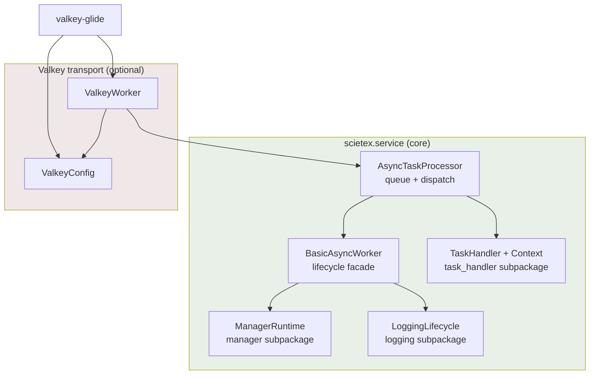

# Architectural Review of scietex.service v4.0.0

- **Date:** 2026-09-08
- **Version:** v4.0.0 (HEAD `91b0afe`)
- **Scope:** entire repository `src/scietex/service/`, `tests/`, `examples/`
- **Method:** reading `docs/architecture/*` as a starting map (not authoritative), verifying claims against source code, reading all source files and tests end-to-end
- **Type:** deep architectural review (read-only). The only repository change is this document.

---

## Executive Summary

The v4.0.0 architecture is **sound and markedly improved** over v3.0.0. All
findings from the previous review (2026-09-06, AR-017..AR-040) are confirmed as
fixed in code: single shared `GlideClient` (AR-018), error taxonomy with
retry-once (AR-022), shared-queue topology with `instance_id` and worker
registry (AR-023), single exit guard (AR-033), forced STOPPED on cancellation
(AR-017), narrowed `except ImportError` (AR-019).

Dependency direction is clean: the core (`BasicAsyncWorker` →
`AsyncTaskProcessor`) never depends on `valkey`/`glide`; `ValkeyWorker` extends
the processor (feature → core). Task handlers receive a narrow
`TaskHandlerContext` and cannot reach into the processor internals. There are no
module-level circular dependencies. The lifecycle
(STOPPED→STARTING→RUNNING→STOPPING→STOPPED) is consistent and covered by tests.

However, the review surfaced **new systemic problems** not covered by previous
findings, plus several **unclosed tails** from earlier reviews. Main themes:

1. **Silent task loss on shutdown** in the base `AsyncTaskProcessor`
   (non-durable transport): `cleanup()` drains the queue without requeue. For
   the base class this is a data-loss default. — **Resolved** (2026-09-08) via
   the `_on_queue_drain_task_processing` hook; see AR-041.
2. **Polling-based concurrency** in `task_manager`/`task_queue_manager`: a mix
   of blocking `queue.get()` with a 1 s timeout and `sleep(0.01)`; a throughput
   ceiling of ~100 tasks/s per replica with `fetch_tasks(count=1)`. —
   **Resolved** (2026-09-08) via batched Valkey reads (`task_fetch_batch_size`)
   and a productive-fetch fast path in `task_queue_manager`; see AR-042.
3. **Dead code** that survived earlier reviews: `purge_tasks()` and related
   methods in `ValkeyWorker`, the PubSub branch in `generate_glide_config`.
   — `purge_tasks` **Resolved** (2026-09-08) by moving it to a standalone
   `purge_task_stream` utility (`valkey/purge.py`); see AR-043. The PubSub
   branch **Resolved** (2026-09-08) by keeping it as a documented, tested
   capability for custom workers (`examples/valkey_pubsub_worker.py`); see
   AR-044.
4. **Blown-up `BasicAsyncWorker`** (891 lines) with a layer of forwarding
   wrappers duplicating `ManagerRuntime`/`LoggingLifecycle` logic.
5. **Configuration via ~15 constructor kwargs** with no central config object
   (except valkey) — a blurred config/DI boundary. — **Resolved** (2026-09-09)
   via a typed config object (`WorkerConfig`/`TaskProcessorConfig`/
   `ValkeyWorkerConfig` immutable `msgspec.Struct`s, config-only constructors,
   setters removed, strict construction-time validation); see AR-046.
6. **Write side effects in "reading" config functions**
   (`read_valkey_config`, `prepare_conf_dir`).

Recommendations are prioritized (P1/P2/P3) at the end. None requires urgent
fixing for the correctness of current scenarios; all concern robustness,
scalability, and maintainability.

---

## Architecture Assessment

### What is confirmed in code (cross-check against docs/architecture/*)

| Documentation claim | Status | Evidence |
|---|---|---|
| Three levels: BasicAsyncWorker → AsyncTaskProcessor → ValkeyWorker | ✅ | `basic_async_worker.py`, `async_tasks_processor.py`, `valkey/worker.py` |
| Core does not depend on valkey/glide | ✅ | `valkey/__init__.py` imported only from the package `__init__.py` under an `ImportError` guard; `async_tasks_processor.py` does not import valkey |
| Handlers receive a narrow context | ✅ | `task_handler/context.py` — frozen dataclass `TaskHandlerContext(service_name, instance_id, logger)` |
| Import-time errors in valkey swallowed only as ImportError | ✅ | package `__init__.py:44-58` — `except ImportError` (AR-019) |
| Shared-queue topology (AR-023) | ✅ | `worker.py:110-118`: stream/group service-scoped, consumer/status/registry worker-scoped |
| Single shared GlideClient (AR-018) | ✅ | `connect()` creates one `_client`, injected into `AsyncValkeyHandler`; test `disconnect_closes_shared_client_once` |
| Retry-once + error taxonomy (AR-022) | ✅ | `TaskResult.error_code/retryable/partial`; requeue before ack in `handle_task` |
| Single exit guard (AR-033) | ✅ | `_request_exit` + `__stop_task`; test `signal_handler_no_reentry` |
| Forced STOPPED on cancellation (AR-017) | ✅ | `_force_stopped()`; test `shutdown_cancellation_forces_stopped` |
| Watchdog does not requeue a task that ignores cancellation | ✅ | `watchdog()` uses `asyncio.wait` (not `wait_for`); test `watchdog_does_not_requeue_when_handler_ignores_cancellation` |
| timeout<=0 means no timeout (AR-034) | ✅ | `watchdog()`: `if timeout>0`; test `watchdog_ignores_non_positive_timeout` |

### Documentation-to-code mismatches (minor)

- **`docs/architecture/hotspots.md` H12** (usage-docs drift) remains open —
  outside the scope of an architectural review.
- **H18 / AR-031**: the `name` parameter in
  `LoggingLifecycle.register_logger_handler` is unused (documented as "to be
  removed"). Remains open.

---

## Strengths

1. **Clean dependency direction.** The core knows nothing about valkey.
   `ValkeyWorker` is an overlay on `AsyncTaskProcessor`. This is the correct
   feature→core orientation, letting the processor be used without Valkey.
2. **Narrow handler contract.** `TaskHandlerContext` (frozen dataclass) +
   abstract `supported_tasks`/`handle()` + `supports()` by first match. A
   handler cannot break the processor from within.
3. **Well-thought-out lifecycle.** Explicit states, a single exit path, forced
   STOPPED on cancellation, correct `_shutdown` ordering (stop managers →
   unregister → cleanup → shut down loggers).
4. **Resilient manager runtime.** `ManagerRuntime` with bounded restart (max 5),
   inline retry without a self-cancel deadlock, cleanup in `finally`, correct
   handling of managers that ignore cancellation.
5. **Good test base** (1701 lines): retries, cancellation, requeue, watchdog,
   shared client, registry, restart logic are covered. Tests are white-box but
   deterministic and fast.
6. **Typed schemas** via `msgspec.Struct` (frozen) — a compact msgpack
   protocol with validation at the boundary.
7. **Deferred ack** (enqueue without ack, ack+xdel in `on_task_completed`) — a
   correct at-least-once model for the Valkey transport.
8. **Pending-task recovery** via `XAUTOCLAIM` at startup — tasks stranded at a
   crashed replica are picked up.

---

## Critical Issues

No critical issues found. The v4.0.0 architecture is correct for the stated
scenarios (single-process asyncio worker with a Valkey transport).

---

## Major Issues

### AR-041 — Silent task loss on shutdown in the base AsyncTaskProcessor

- **Status:** ✅ RESOLVED (2026-09-08)
- **Severity:** HIGH
- **Evidence:** `async_tasks_processor.py:473` `cleanup()` — drains
  `__task_queue` via `get_nowait()+task_done()` **without requeue**; the
  docstring warns that non-durable transports MUST override the method or tasks
  are lost. The test `cleanup_drain_does_not_requeue_queued_tasks` locks this
  behavior in as expected.
- **Problem:** For a user of the base `AsyncTaskProcessor` (without Valkey),
  shutting down the worker silently discards every task still queued and not yet
  started. This is a data-loss default hidden in a docstring.
- **Why it matters:** The base class is public API. A developer using
  `AsyncTaskProcessor` with their own transport can easily miss the warning and
  get silent task loss on a normal `stop()`.
- **Recommendation:** Make the behavior explicit: either log a WARNING with the
  number of dropped tasks by default, or introduce an abstract/overridable hook
  `_on_queue_drain(items)` defaulting to "log and discard" so subclasses are
  forced to decide the fate of tasks. At minimum, a WARNING log.
- **Confidence:** HIGH
- **Resolution:** Fixed via an overridable hook
  `_on_queue_drain_task_processing(task_id, task_data)` in
  `async_tasks_processor.py`. The base default requeues a drained task when
  `canceled_action == "requeue"` (so a non-durable transport no longer silently
  loses queued work on shutdown); `ValkeyWorker` overrides it to a no-op because
  its durable stream entries stay pending and redeliver on restart (re-enqueueing
  would duplicate them). Covered by two new tests in
  `tests/test_async_task_processor.py`:
  `test_cleanup_drain_requeues_queued_tasks_for_non_durable_transport` and
  `test_cleanup_drain_does_not_requeue_queued_tasks_for_durable_transport`.

### AR-042 — Polling-based concurrency with uneven latency

- **Severity:** HIGH
- **Evidence:** `async_tasks_processor.py:571` `task_manager`: when the pool is
  full, `sleep(task_manager_sleep_time=0.01)`; when the queue is empty,
  `wait_for(queue.get(), timeout=TASK_QUEUE_FETCH_TIMEOUT=1)`.
  `task_queue_manager` (664): `if not queue.full(): await fetch_tasks();
  sleep(...)`. `fetch_tasks` in `ValkeyWorker` (569):
  `XREADGROUP(count=1, block_ms=1000)` — one task per call.
- **Problem:** The mix of blocking wait (1 s) and active polling (0.01 s)
  yields uneven dispatch latency: after an enqueue, a task may wait up to ~1 s
  until `task_queue_manager` wakes and pulls it. The throughput ceiling is
  ~100 tasks/s/replica (one task per `fetch_tasks` + 0.01 s sleep).
- **Why it matters:** Under high load or low-latency requirements, polling is
  the bottleneck. The "manager-loop" model forces polling instead of
  event-driven wake-up.
- **Recommendation:** Consider an event-driven model: `task_queue_manager`
  should wake `task_manager` via `asyncio.Event`/`Condition` on enqueue rather
  than poll. For Valkey, raise `count` in `XREADGROUP` (batch read) and drop the
  hard `sleep` between reads (rely on `block_ms`).
- **Confidence:** HIGH (problem), MEDIUM (what exactly to change depends on the
  target load)
- **Status:** ✅ RESOLVED (2026-09-08)
- **Resolution:** The measurable ceiling was the serialized `count=1` intake,
  not the polling loops themselves (asyncio primitives already provide
  event-driven wake-ups: `Queue.get()` returns on put, `XREADGROUP block_ms`
  blocks on the stream). Fixed by (1) batching the Valkey read — new
  `task_fetch_batch_size` param (default 10, clamped >= 1) used as the
  `XREADGROUP` count in `ValkeyWorker.fetch_tasks`, so the internal queue can
  fill up to `max_concurrent_tasks`; and (2) making `fetch_tasks` return a bool
  (enqueued any?) so the base `task_queue_manager` skips its idle backoff after
  a productive fetch and drains a backlog back-to-back, sleeping only when the
  fetch was empty or the queue is full. Covered by new tests
  `test_fetch_tasks_reads_batch_and_reports_enqueued`,
  `test_fetch_tasks_reports_nothing_when_stream_empty`,
  `test_fetch_tasks_batch_size_clamped_to_at_least_one` (test_valkey_worker.py)
  and `test_task_queue_manager_skips_sleep_after_productive_fetch`,
  `test_task_queue_manager_sleeps_after_empty_fetch`
  (test_async_task_processor.py).

---

## Moderate Issues

### AR-043 — Dead purge_tasks code survived earlier reviews

- **Severity:** MEDIUM
- **Evidence:** `valkey/worker.py:428-492` — `purge_tasks()`,
  `_purge_group_entries()`, `_purge_stream_entries()`, `_stream_entry_ids`.
  Verified with `rg`: no calls anywhere in `src/`, `tests/`, `examples/`.
- **Problem:** The unused public method `purge_tasks` and three private helpers
  are dead code that enlarges the API surface and cognitive load. Already noted
  in an earlier review but not removed.
- **Why it matters:** Dead code is a source of confusion (it looks like a stream
  cleanup operation exists) and extra maintenance surface.
- **Recommendation:** Remove `purge_tasks` and its helpers if there is no plan
  for a cleanup operation. If it is needed, move it to a separate utility module
  rather than the worker class.
- **Confidence:** HIGH
- **Status:** ✅ RESOLVED (2026-09-08)
- **Resolution:** The purge capability was kept (it is a legitimate operational
  utility) and moved off the worker class into a standalone module
  `src/scietex/service/valkey/purge.py`, exposed as
  `purge_task_stream(client, stream_name, group_name, consumer_name, logger=None)`.
  The four methods (`purge_tasks`, `_purge_group_entries`, `_purge_stream_entries`,
  `_stream_entry_ids`) were removed from `ValkeyWorker`; the utility takes the
  client + stream/group/consumer names as parameters instead of worker instance
  state, and imports `GlideClient` only under `TYPE_CHECKING` (no runtime glide
  dependency). Re-exported from `scietex.service.valkey`. Covered by the existing
  suite (67 tests pass; ruff/ty clean).

### AR-044 — Dead PubSub branch in generate_glide_config

- **Severity:** MEDIUM
- **Evidence:** `valkey/valkey_config.py:282-325` `generate_glide_config(...,
  listening=False, parse_control_message=None)` — `pubsub_subscriptions` is
  built only when `listening=True`; `ValkeyWorker` always passes `False`
  (`worker.py:120`). The branch is documented as "reserved for
  future control-plane use".
- **Problem:** The public signature carries a dead parameter and unused PubSub
  logic. Already noted in an earlier review.
- **Why it matters:** It blurs the contract: it is unclear whether the library
  supports a control plane. It complicates reading.
- **Recommendation:** Remove `listening`/`parse_control_message` from the public
  signature until a real control plane is implemented. If kept, mark it
  explicitly as experimental and do not export it in `__all__`.
- **Confidence:** HIGH
- **Status:** ✅ RESOLVED (2026-09-08)
- **Resolution:** Kept as a supported capability for custom workers instead of
  removing it. The PubSub branch is now exercised and documented: added
  `examples/valkey_pubsub_worker.py` (a `ValkeyWorker` subclass that builds its
  client with `generate_glide_config(..., listening=True)` and a
  `parse_control_message` callback), two config tests in `tests/test_valkey_config.py`
  (`test_generate_glide_config_pubsub_listening_true`,
  `test_generate_glide_config_pubsub_listening_false_default`), an end-to-end
  delivery test in `tests/test_valkey_pubsub_integration.py`
  (`test_pubsub_directed_and_broadcast_delivery`, skipped when no server is
  reachable on localhost:6379, runs against the CI `redis` service container),
  and rewrote the stale "reserved for future control-plane use" docstring in
  `valkey_config.py:289-314` to describe the real custom-worker usage.

### AR-045 — Blown-up BasicAsyncWorker and a layer of forwarding wrappers

- **Severity:** MEDIUM
- **Evidence:** `basic_async_worker.py` — 891 lines. The real manager and logger
  logic has been moved into `ManagerRuntime`/`LoggingLifecycle`, but the class
  keeps ~10 thin forwarding wrappers "for subclass/test compatibility":
  `_iter_manager_definitions`, `_register_logger_handler`, `_logger_start_handlers`,
  `_logger_shut_down_handlers`, `_run_manager`, `_start_manager`, `_stop_manager`,
  `_start_managers`, `_stop_managers`.
- **Problem:** Dual responsibility: `BasicAsyncWorker` is both a lifecycle
  "facade" and a set of stale proxies. The wrappers are redundant indirection:
  logic lives in two places (wrapper + runtime), which complicates reading and
  is risky under change.
- **Why it matters:** The base class is the most-read file in the library. 891
  lines with a proxy layer obscure the real control flow.
- **Recommendation:** Gradually remove the forwarding wrappers, updating internal
  calls to `_manager_runtime`/`_logging_lifecycle` directly. If the wrappers are
  needed for external compatibility, mark them `@deprecated` and schedule
  removal for the next major version.
- **Confidence:** HIGH

### AR-046 — Configuration via ~15 constructor kwargs with no central object

- **Status:** ✅ RESOLVED (2026-09-09)
- **Severity:** MEDIUM
- **Evidence:** `BasicAsyncWorker.__init__` takes `service_name, version,
  conf_dir, logging_level, heartbeat_interval, watchdog_interval` + `**kwargs`
  (`logger_handler_timeout, manager_shutdown_timeout, manager_max_retries,
  manager_restart_backoff`); `AsyncTaskProcessor` adds `queue_size,
  max_concurrent_tasks, task_manager_sleep_time, task_queue_manager_sleep_time,
  task_handler_start_timeout, task_handler_stop_timeout`; `ValkeyWorker` adds
  `valkey_config, log_stream_name`. All timings are clamped by module-level
  MIN/MAX constants. The only structured config is valkey (`ValkeyConfig`).
- **Problem:** Configuration is spread across the constructors of three
  inheritance levels with `**kwargs` passthrough. There is no single
  config/DI object; timings are clamped in different places.
- **Why it matters:** Config is hard to inspect/override, combinations are hard
  to test, and `**kwargs` hides typos in parameter names.
- **Recommendation:** Consider introducing a typed configuration object (e.g. a
  `WorkerConfig`/`ProcessorConfig` msgspec.Struct or dataclass) passed whole,
  with validation in one place. Not urgent — the current approach works but
  scales poorly.
- **Confidence:** MEDIUM (this is a trade-off, not a defect)
- **Resolution:** Introduced a typed configuration object. `WorkerConfig` and
  `TaskProcessorConfig` are immutable `msgspec.Struct`s (`frozen=True`) in
  `src/scietex/service/config.py`; `ValkeyWorkerConfig` extends
  `TaskProcessorConfig` in `src/scietex/service/valkey/config.py` (kept there
  because its `valkey_config` field references optional `glide` types that must
  not force a glide dependency on the core package). All three workers now take
  a single config object — `BasicAsyncWorker(config: WorkerConfig | None)`,
  `AsyncTaskProcessor(config: TaskProcessorConfig | None)`,
  `ValkeyWorker(config: ValkeyWorkerConfig | None)` — with no `**kwargs`. The
  runtime setters are removed and the config is immutable; ranges are validated
  in `__post_init__`, raising `msgspec.ValidationError` on an out-of-range
  value instead of silently clamping. The MIN/MAX/DEFAULT constants are the
  single source of truth in `config.py`. AR-055 also raised
  `DEFAULT_MAX_TASKS_QUEUE_SIZE` to 100 and `DEFAULT_MAX_CONCURRENT_TASKS` to
  10.

### AR-047 — Write side effects in "reading" config functions

- **Status:** ✅ RESOLVED (2026-09-09)
- **Severity:** MEDIUM
- **Evidence:** `valkey/valkey_config.py:239` `read_valkey_config(conf_dir)` —
  creates the directory (`mkdir`) and **writes a default `valkey.yml` to disk**
  if the file is missing. `utils/conf.py:prepare_conf_dir` — creates
  `~/.config/scietex/` if nothing is found.
- **Problem:** Functions named "read"/"prepare" have filesystem write side
  effects. Calling `read_valkey_config` in a read-only context (e.g. inspecting
  config) silently creates files.
- **Why it matters:** Violates the principle of least surprise; in container
  environments with a read-only FS the call may fail or create unexpected
  artifacts.
- **Recommendation:** Separate "read config" from "create default when absent":
  `read_valkey_config` should not write; move default generation to an explicit
  initialization step (or a `create_default=True` parameter).
- **Confidence:** HIGH
- **Resolution:** Added a keyword-only `create_default: bool = True` parameter
  to `read_valkey_config` (`valkey/config.py`). The default `True` preserves the
  worker first-run auto-create; `create_default=False` is a write-free read-only
  path that raises `RuntimeError` on a missing file or directory instead of
  writing. `prepare_conf_dir`'s `mkdir` is retained (it runs only at worker
  construction, a legitimate bootstrap site).

---

## Minor Issues

### AR-048 — Duplicated glide import-guard

- **Status:** ✅ RESOLVED (2026-09-09)
- **Severity:** LOW
- **Evidence:** `valkey/worker.py:1-20` and `valkey/valkey_config.py:1-20`
  — two near-identical `try: from glide import ... except ImportError: raise
  ImportError(...)` blocks with different name sets.
- **Problem:** Duplicated guard logic; when adding a new glide import it is easy
  to forget to update the second block.
- **Recommendation:** Move the glide import into a single module (e.g.
  `valkey/_glide.py`) from which both modules take their names.
- **Confidence:** HIGH
- **Resolution:** Consolidated the guarded glide import into a single private
  module `valkey/_glide.py`, which re-exports the full union of glide names
  (incl. aliases `GlideConnectionError`, `GlideTimeoutError`) and raises the
  install-hint `ImportError` when `valkey-glide` is absent. `config.py` and
  `worker.py` import their glide names from it (`from ._glide import ...`, no
  local guard); `purge.py` imports `GlideClient` from `._glide` under
  `TYPE_CHECKING`. The outer package-level guard in `__init__.py` is unchanged.

### AR-049 — First ValkeyWorker heartbeat is skipped (unclosed AR-040)

- **Severity:** LOW
- **Evidence:** `valkey/worker.py:297` `heartbeat()` — guard
  `if self.client and self.start_time`. `start_time` is set in `_startup` AFTER
  the managers start (`basic_async_worker.py:626`). So the first heartbeat cycle
  is a no-op; the status-key TTL is not refreshed until the second beat. The
  test `first_heartbeat_fires_promptly` (AR-040) covers only the default
  `BasicAsyncWorker` heartbeat, NOT the `start_time` guard in `ValkeyWorker`.
- **Problem:** A window of up to ~2×heartbeat_interval during which a replica's
  status key may be absent/expired even though the worker is already RUNNING.
- **Why it matters:** To observers (registry/monitoring) a replica may look
  inactive right after startup.
- **Recommendation:** Set `start_time` before the managers start (or use a
  separate "RUNNING" flag) so the first heartbeat is written. Add a test for
  ValkeyWorker.
- **Confidence:** HIGH

### AR-050 — _task_entry_ids is not cleared on shutdown

- **Severity:** LOW
- **Evidence:** `valkey/worker.py` `_task_entry_ids` is populated in
  `fetch_tasks`/`_recover_pending_tasks` and cleared only in `on_task_completed`
  (pop). During `cleanup()`, tasks whose handler ignored cancellation stay in
  the dict forever.
- **Problem:** Memory leak across repeated stop/start cycles with
  cancellation-ignoring handlers. UUID collisions are unlikely, so there is no
  functional harm.
- **Recommendation:** Clear `_task_entry_ids` in `cleanup()`/`disconnect()`.
- **Confidence:** MEDIUM

### AR-051 — Early return from _recover_pending_tasks when the queue is full

- **Severity:** LOW
- **Evidence:** `valkey/worker.py:513` `_recover_pending_tasks` —
  when the queue is full it logs DEBUG and returns, leaving `_recovered=True`.
  The remaining pending entries are not picked up in this process run (only on
  restart/another replica via XAUTOCLAIM min-idle).
- **Problem:** On startup with many pending tasks and a small queue, part of the
  tasks stay unclaimed until the next restart.
- **Recommendation:** Do not set `_recovered=True` on incomplete recovery (or
  continue recovery as the queue frees up).
- **Confidence:** MEDIUM

### AR-052 — Handler is not removed from __task_handlers on stop timeout

- **Status:** ✅ RESOLVED (2026-09-09)
- **Severity:** LOW
- **Evidence:** `async_tasks_processor.py:379` `_stop_task_handler` — on
  `TimeoutError` it logs but does NOT remove the handler from `__task_handlers`.
  `remove_task_handler` (398) removes it from `__task_handlers_map`, but the
  active instance remains.
- **Problem:** After a stop timeout the handler stays in the active dict even
  though its `stop()` did not finish — an ambiguous state.
- **Recommendation:** Explicitly remove it from `__task_handlers` on timeout
  (with a WARNING), or document that the handler remains "stuck".
- **Confidence:** MEDIUM
- **Resolution:** `_stop_task_handler` in `task_processor.py` now removes the
  handler from `__task_handlers` on a stop timeout (via `pop(handler_name,
  None)`, which also guards against a concurrent removal) and logs a WARNING,
  so a handler whose `stop()` times out is no longer left in an ambiguous
  tracked-but-stuck state.

### AR-053 — Handlers are keyed only by class name

- **Severity:** LOW
- **Evidence:** `async_tasks_processor.py:311` `add_task_handler` — key is
  `handler_class.__name__`; a duplicate class raises `ValueError`.
- **Problem:** Two instances of the same class with different configuration
  cannot be registered (e.g. two handlers of one type for different task_types).
- **Why it matters:** An extensibility limit for "one class — different
  settings" scenarios.
- **Recommendation:** Allow an explicit instance key/name at registration (an
  optional parameter), keeping the class-name default.
- **Confidence:** MEDIUM (this is a deliberate AR-022 trade-off)

### AR-054 — Broad except Exception in best-effort operations

- **Status:** ✅ RESOLVED (2026-09-09)
- **Severity:** LOW
- **Evidence:** `valkey/worker.py` `heartbeat()` (broad except →
  WARNING), `_register_instance`/`_unregister_instance` (broad except →
  WARNING).
- **Problem:** Broad catching hides real errors (e.g. msgpack encoding bugs),
  masking them as "network unavailable".
- **Why it matters:** Hinders diagnosis; best-effort operations should catch
  expected connection errors, not everything.
- **Recommendation:** Narrow to expected glide exceptions (ConnectionError/
  RequestError/TimeoutError) and re-raise the rest.
- **Confidence:** MEDIUM
- **Resolution:** Narrowed the three best-effort catch blocks in
  `valkey/worker.py` (`heartbeat()`, `_register_instance()`,
  `_unregister_instance()`) from `except Exception` to
  `except (GlideConnectionError, RequestError, GlideTimeoutError)`, so only
  expected glide connection/protocol/timeout errors are swallowed (log WARNING
  and continue) while genuine non-glide bugs (e.g. msgpack encoding errors)
  propagate and surface.

### AR-055 — Low defaults for queue_size and max_concurrent_tasks

- **Status:** ✅ RESOLVED (2026-09-09)
- **Severity:** LOW
- **Evidence:** `async_tasks_processor.py` `DEFAULT_MAX_TASKS_QUEUE_SIZE=2`,
  `DEFAULT_MAX_CONCURRENT_TASKS=2`.
- **Problem:** A default of 2 tasks is extremely conservative; a user who does
  not set parameters gets a throughput of 2 parallel tasks.
- **Why it matters:** Unexpectedly low out-of-the-box performance.
- **Recommendation:** Document the defaults explicitly; consider higher values
  or auto-tuning.
- **Confidence:** MEDIUM (this is a deliberate trade-off)
- **Resolution:** Raised `DEFAULT_MAX_TASKS_QUEUE_SIZE` to 100 and
  `DEFAULT_MAX_CONCURRENT_TASKS` to 10 in `config.py` (the single source of
  truth from AR-046) and documented the new defaults. Auto-tuning is now
  implemented: the `TaskProcessorConfig.auto_tune` flag (default `False`)
  makes the worker derive `max_concurrent_tasks` from `os.cpu_count()` at
  startup when `max_concurrent_tasks` is unset; an explicit
  `max_concurrent_tasks` always wins.

---

## Cross-Cutting Analysis

### Separation of responsibilities
Good: core/processor/valkey are clearly separated; the manager runtime and
logging are factored into subpackages. The weak spot is `BasicAsyncWorker`
retaining a proxy layer (AR-045) and configuration (AR-046).

### Module boundaries and dependency direction
Clean. The glide import-guard, previously duplicated across `valkey` modules,
is now consolidated in `valkey/_glide.py` (AR-048). The PubSub branch in
`generate_glide_config` (AR-044) is now a documented, tested capability for
custom workers.

### Abstractions
`TaskHandler`/`TaskHandlerContext` is a good narrow abstraction. The `Manager`
decorator + MRO reflection is an unusual but tested implicit-registration
mechanism; it works but is fragile to renames.

### State and resource ownership
`GlideClient` — single owner, correctly injected into the logger handler and
closed once (AR-018). `_task_entry_ids` — leak on cancellation (AR-050).

### Lifecycle
Consistent and covered by tests. Residual risks: first heartbeat (AR-049),
handler on stop timeout (AR-052).

### Concurrency/async
The polling model (AR-042) was the main systemic limiter; it is now resolved via
batched Valkey reads and a productive-fetch fast path. The rest (cancellation,
watchdog, requeue) is carefully worked out.

### Error-handling boundaries
The error taxonomy (AR-022) is good. Broad `except Exception` in best-effort
operations (AR-054) is a residual risk.

### Testability
High, but the tests are white-box (access to `_client`, `_task_entry_ids`,
`_start_task_handler`, `_manager_runtime`). This is a trade-off: white-box tests
are deterministic but bind to internals.

### Global state
None. All state lives in the worker instance.

---

## Architectural Recommendations

### Priority 1 (data robustness and predictability)
1. **AR-041** — make task loss on shutdown explicit (WARNING + `_on_queue_drain`
   hook). — **DONE** (2026-09-08).
2. **AR-042** — move from polling to event-driven wake-up of `task_manager`;
   batch reads from Valkey. — **DONE** (2026-09-08): batched Valkey reads
   (`task_fetch_batch_size`) + productive-fetch fast path in
   `task_queue_manager`; the polling loops were not the bottleneck (asyncio
   primitives already wake on events), the serialized `count=1` intake was.

### Priority 2 (code cleanliness and maintainability)
3. **AR-043** — remove dead `purge_tasks` and its helpers. — **DONE** (2026-09-08):
   moved to standalone `purge_task_stream` utility (`valkey/purge.py`), removed
   from `ValkeyWorker`.
4. **AR-044** — remove the dead PubSub branch from the public signature. —
   **DONE** (2026-09-08): kept as a supported capability for custom workers;
   added `examples/valkey_pubsub_worker.py` and two PubSub config tests.
5. **AR-045** — remove/deprecate the forwarding wrappers in `BasicAsyncWorker`.
6. **AR-047** — remove write side effects from `read_valkey_config`. —
   **DONE** (2026-09-09): added a keyword-only `create_default: bool = True`
   parameter; `create_default=False` is the write-free read-only path that
   raises `RuntimeError` on a missing file or directory instead of writing.
7. **AR-048** — move the glide import-guard into a single module. — **DONE**
   (2026-09-09): consolidated the guarded glide import into a single
   `valkey/_glide.py` module from which `config.py`, `worker.py`, and `purge.py`
   take their names.

### Priority 3 (extensibility and observability)
8. **AR-046** — introduce a typed configuration object. — **DONE** (2026-09-09):
   `WorkerConfig`/`TaskProcessorConfig` (`config.py`) and `ValkeyWorkerConfig`
   (`valkey/config.py`) immutable `msgspec.Struct`s; config-only constructors;
   setters removed; strict construction-time validation.
9. **AR-049** — fix the first ValkeyWorker heartbeat.
10. **AR-050/051/052** — clear `_task_entry_ids`, complete pending recovery,
    remove the handler on stop timeout.
11. **AR-053** — allow named handler instances.

---

## Suggested Target Architecture

The current structure is already close to the target. The key changes are not a
rebuild but simplification and dead-code removal:

**Target changes:**
- `BasicAsyncWorker` — a thin facade without proxy wrappers (AR-045).
- `purge_tasks` moved to a standalone `purge_task_stream` utility (AR-043) —
  **done**; PubSub branch kept as a documented custom-worker capability
  (AR-044) — **done**.
- `task_manager` woken by an event, not polling (AR-042) — **done** via batched
  Valkey reads + productive-fetch fast path; the polling loops themselves were
  not the bottleneck.
- Configuration — a single typed object (AR-046) — **done** (2026-09-09):
  `WorkerConfig`/`TaskProcessorConfig` (`config.py`) + `ValkeyWorkerConfig`
  (`valkey/config.py`) immutable `msgspec.Struct`s.
- `read_valkey_config` without side effects (AR-047).

---

## Migration Strategy

All recommendations are **incremental and non-API-breaking**:

1. **Phase 1 (safe cleanups):** remove dead code (AR-043/044), extract the
   glide import-guard (AR-048), remove write side effects (AR-047). Each `purge_task_stream` utility.
2. **Phase 2 (behavior):** WARNING + hook on queue drain (AR-041) — **done**
   (2026-09-08); fix the first heartbeat (AR-049), clear `_task_entry_ids`
   (AR-050). Cover with new tests.
3. **Phase 3 (performance):** batched Valkey reads + productive-fetch fast path
   (AR-042) — **done** (2026-09-08); the polling loops were not the bottleneck,
   so no event-driven loop refactor was needed.
4. **Phase 4 (structure):** removal of forwarding wrappers (AR-045) — only in
   the next major version (v5), since it changes the public constructor; the
   configuration object (AR-046) — **done** (2026-09-09): it landed in the
   still-unreleased v4.0.0, so the constructor change is acceptable now rather
   than deferred to v5.

Each phase is independent and can be deferred without blocking the others.

---

## Open Questions

1. **Target load?** The polling model (AR-042) is a problem only under high
   load/low latency. Is it needed now?
2. **Is a purge/stream-cleanup operation needed?** — **Answered** (2026-09-08):
   yes, kept as the standalone `purge_task_stream` utility (`valkey/purge.py`),
   moved off the worker class (AR-043).
3. **Is a PubSub-based control plane planned?** — **Answered** (2026-09-08):
   the PubSub branch (AR-044) is kept as a supported capability for custom
   workers, demonstrated by `examples/valkey_pubsub_worker.py` and covered by
   two config tests. A full control plane is not part of `ValkeyWorker`.
4. **Subclass compatibility with the forwarding wrappers (AR-045)?** Are there
   external users that would break on removal?
5. **Is support for multiple instances of one handler class needed (AR-053)?**
   A real scenario or hypothetical?

---

## Final Prioritization

| ID | Issue | Severity | Impact | Effort | Priority | Status |
|---|---|---|---|---|---|---|
| AR-041 | Task loss on shutdown in the base processor | HIGH | Data loss (non-durable) | S | P1 | ✅ resolved |
| AR-042 | Polling concurrency, ~100 tasks/s ceiling | HIGH | Performance/latency | M | P1 | ✅ resolved |
| AR-043 | Dead purge_tasks code | MEDIUM | Maintainability | S | P2 | ✅ resolved |
| AR-044 | Dead PubSub branch in signature | MEDIUM | Contract/reading | S | P2 | ✅ resolved |
| AR-045 | Blown-up BasicAsyncWorker + proxy layer | MEDIUM | Maintainability | M | P2 | open |
| AR-046 | Config via kwargs, no central object | MEDIUM | Scalability | L | P3 | ✅ resolved |
| AR-047 | Write side effects in read functions | MEDIUM | Least surprise | S | P2 | ✅ resolved |
| AR-048 | Duplicated glide import-guard | LOW | Maintainability | S | P2 | ✅ resolved |
| AR-049 | First ValkeyWorker heartbeat skipped | LOW | Observability | S | P3 | open |
| AR-050 | _task_entry_ids not cleared | LOW | Memory leak | S | P3 | open |
| AR-051 | Early return from pending recovery | LOW | Reliability (edge) | S | P3 | open |
| AR-052 | Handler remains on stop timeout | LOW | State | S | P3 | ✅ resolved |
| AR-053 | Handlers keyed only by class name | LOW | Extensibility | M | P3 | open |
| AR-054 | Broad except Exception in best-effort | LOW | Diagnosis | S | P3 | ✅ resolved |
| AR-055 | Low queue/concurrency defaults | LOW | Performance | S | P3 | ✅ resolved |

**Verdict:** the v4.0.0 architecture is sound and significantly improved over
v3.0.0. There are no critical issues. The data-loss robustness gap (AR-041), the
throughput ceiling (AR-042), the dead `purge_tasks` code (AR-043), and the dead
PubSub branch (AR-044) are now resolved; the rest is dead-code cleanup and
maintainability.
