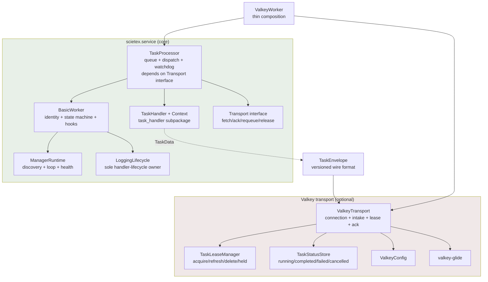

# Architecture Review

- **Date:** 2026-09-16
- **Version:** v4.1.0 (`src/scietex/service/version.py:6`) — the unreleased v4.1.0 line; the v4.2/v4.3 commit labels were a message error, since corrected (AR-081, resolved).
- **Scope:** entire repository — `src/scietex/service/`, `tests/`, `examples/`
- **Method:** read all `docs/architecture/*` as an initial map (not authoritative), read the prior review (2026-09-09, AR-056..AR-071), verified claims against every source file end-to-end, and confirmed evidence with targeted searches.
- **Type:** deep architectural review (read-only). The only repository change is this document.

---

## Executive Summary

> **All findings resolved (2026-09-16).** AR-072..AR-085 were addressed in the
> v4.2.0 migration across five phases: Phase 1 AR-074 (`635acbf`), Phase 2
> AR-073 (`635acbf`), Phase 3 AR-072 (`f406bad`), Phase 4 AR-075/005/014
> (`510daad`), Phase 5 AR-077..080/082..084 (`e346cc6`). AR-081 was already
> resolved. Each finding below carries a `Status` line with its phase and
> commit. The analysis that follows is the original review text, retained for
> provenance.

The architecture is **fundamentally sound**. The three-level hierarchy
(`BasicWorker` → `TaskProcessor` → `ValkeyWorker`), the strict feature→core
dependency direction, the narrow `TaskHandlerContext` handler boundary, the
versioned `TaskEnvelope` wire format, the at-least-once transport, the per-entry
lease, and the immutable typed config structs are all genuine, well-preserved
design decisions. The 2026-09-09 review's AR-056..AR-071 findings are all
resolved in the source; this review found **no CRITICAL defect**.

The strongest, most durable aspects are the dependency direction and the
handler contract. The most important weaknesses are all in the same place as
last time — the **transport/worker boundary** — but they have shifted from
"shared-resource races" (largely fixed) to a **cohesion and abstraction**
problem: the transport extension contract is an implicit, wide, ordering-sensitive
set of ~10 template-method hooks, and `ValkeyWorker` (988 lines) has become a
component that mixes connection, config, logging-handler, intake/recovery,
lease, tracking, progress, heartbeat, registry, and acknowledgement
responsibilities. Correctness invariants (at-least-once, requeue-before-ack,
lease-at-enqueue-accept) live only in docstrings spread across the class
hierarchy, so any future transport or modification risks silently breaking
delivery semantics.

**What to fix first:** AR-072 (make the transport contract an explicit
interface/component instead of a hook soup), then AR-073/AR-074 (extract the
lease and tracking sub-systems and add a client-injection seam). These are the
changes that will most reduce the cost of every future change to this package.

---

## Architecture Assessment

### Boundaries
Module boundaries are well chosen and respected. Core (`basic_worker`,
`task_processor`, `task_handler`, `manager`, `log_handlers`, `config`, `utils`)
never imports `valkey`/`glide`; `ValkeyWorker` extends `TaskProcessor`
(feature → core). `task_handler` receives a narrow frozen `TaskHandlerContext`
and holds no reference to the worker. The one boundary that still leaks is the
**core↔transport extension surface**: the base `TaskProcessor` exposes ten
no-op/template hooks whose semantics are defined by the *Valkey* implementation
and documented in the *base* class docstrings (AR-072). A second, minor leak is
the cross-package private import `_validate_range` from `valkey/config.py` into
`..config` (AR-079).

### Responsibilities
Responsibility extraction is good at the worker level (`ManagerRuntime`,
`LoggingLifecycle`), but **weak at the transport level**. `ValkeyWorker` mixes
six-plus distinct responsibilities that do not change together: connection
lifecycle, config loading, logging-handler construction, stream intake and
recovery, per-entry lease management, tracking/status records, progress,
heartbeat, and instance registry (AR-073). The lease subsystem and the
tracking subsystem are each coherent enough to be their own component but are
currently five-plus methods inlined on the worker.

### Dependencies
Direction is correct everywhere (verified: no runtime circular imports; the
`manager`/`log_handlers` `__init__ ↔ submodule` cycles from AR-065 are gone).
One encapsulation smell remains: `valkey/config.py:16` imports the private
`_validate_range` helper from the core `config.py` (AR-079).

### Abstractions
`TaskHandler`/`TaskHandlerContext`, the frozen config structs, and the
versioned `TaskEnvelope` are deep, well-shaped abstractions. The weak point is
the **template-method transport contract** (AR-072): instead of a single
`Transport` interface, the processor↔transport seam is a set of ~10 methods
(`fetch_tasks`, `return_task_to_queue`, `on_task_started`, `on_task_completed`,
`_write_task_progress`, `_on_queue_drain_task_processing`, plus the inherited
`initialize`/`cleanup`/`watchdog`/`_register_instance`/`_unregister_instance`)
whose interaction ordering carries the delivery guarantee.

### Lifecycle
The worker state machine and manager sub-lifecycle are consistent, guarded, and
tested. The transport lifecycle (`connect` in `initialize`, `disconnect` in
`cleanup`, registry hooks between managers-stop and cleanup) is correctly
ordered and lock-serialized. Residual risk: the `_client_lock` serializes the
*mutation* of `_client` but not its *use* by heartbeat/registry/tracking, so a
reconnect can still swap the client under a command that already captured the
old handle (AR-083).

### Concurrency
Cancellation, watchdog, requeue, and ack ordering are carefully worked out
(`asyncio.wait` not `wait_for`, requeue-only-after-handler-stopped, monotonic
timeouts). The lease subsystem uses `SET ... NX` for atomic cross-replica claim.
The remaining concurrency concerns are narrow (AR-077 lease/requeue race,
AR-083 stale-client window).

### State ownership
Per-worker state is well-encapsulated (name-mangled, read-only
`MappingProxyType` views). `_task_entry_ids` is the single authoritative
ownership map for queued+running tasks and is correctly the iteration source
for lease refresh. No module-level mutable global state.

### Testability
Deterministic and comprehensive, but heavily white-box: 53 sites across the
test suite assign `worker._client`, seed `worker._task_entry_ids`, or flip
`worker._recovered` because `connect()` builds its own `GlideClient` with no
public injection seam (AR-074). The `valkey` unit tests are excellent *despite*
this, but the coupling makes the internals effectively frozen against
refactoring.

### Extensibility
Handlers are cleanly pluggable (named instances, `handler_kwargs`, the
`cancel_task` built-in). Config structs extend compositionally. The weak spot is
transport extensibility (AR-072): adding a second transport (the stated goal
behind `TaskEnvelope`, MQTT/Kafka) means re-implementing all ten hooks with
matching ordering semantics, with no interface to guide the author.

---

## Strengths

1. **Clean feature→core dependency direction.** `ValkeyWorker` is an overlay on
   `TaskProcessor`; core never imports `valkey`/`glide`; the processor is fully
   usable without Valkey. The single guarded glide import (`valkey/_glide.py`)
   and the narrow `except ImportError` at the package boundary are correct.
2. **Narrow, safe handler contract.** `TaskHandlerContext` (frozen
   `service_name`/`instance_id`/`logger`) means a handler cannot reach processor
   internals; dispatch is first-match over `supports()`, and the
   transport-agnostic `CancelTaskHandler` gets cancellation via an injected
   callback rather than reaching into the processor.
3. **Immutable typed configuration.** `WorkerConfig`/`TaskProcessorConfig`/
   `ValkeyWorkerConfig` (frozen `msgspec.Struct`, `__post_init__` range
   validation) replaced ~15 constructor kwargs; `ValkeyWorkerConfig` correctly
   lives out of the core to avoid dragging `glide` in.
4. **Correct at-least-once transport with a per-entry lease.** Enqueue-without-
   ack, ack+xdel only after the handler terminates, retry-copy-before-ack
   (XADD then XACK), `XAUTOCLAIM` recovery gated by an atomically-claimed
   (`SET ... NX`) per-entry lease that covers both queued and running tasks and
   is refreshed over `_task_entry_ids`.
5. **Careful cancellation semantics.** `asyncio.wait` (never `wait_for`) for
   cancellation, requeue only after the handler actually stopped,
   `_force_stopped()` so a cancelled startup/shutdown never strands a terminal
   state, and a `CancelReason` that distinguishes deliberate/timeout/shutdown.
6. **Versioned wire envelope** (`TaskEnvelope` + `task_handler/wire.py`) that
   decouples the durable format from the handler contract, with unknown-version
   entries skipped rather than crashing intake.
7. **Bounded, restart-safe manager runtime** with consecutive-failure budget,
   terminal `FAILED` state surfaced through `failed_managers`, and a CRITICAL
   watchdog log.

---

## Critical Issues

None. The one CRITICAL defect in the prior review (AR-056, stdlib-name
shadowing) was fixed, and no finding of comparable severity was identified in
this pass.

---

## Major Issues

### AR-072 — The transport extension contract is an implicit, ordering-sensitive hook soup

- **Status:** ✅ RESOLVED (2026-09-16) — Phase 3: `TaskTransport`/`TaskSink` Protocols + `InMemoryTransport` default; commit `f406bad`.
- **Severity:** HIGH
- **Evidence:** `task_processor.py` declares the no-op/template seams
  `fetch_tasks` (794), `return_task_to_queue` (403), `on_task_started` (531),
  `on_task_completed` (503), `_write_task_progress` (538),
  `_on_queue_drain_task_processing` (578); `ValkeyWorker` overrides these plus
  `initialize` (527), `cleanup` (580), `watchdog` (841),
  `_register_instance` (602), `_unregister_instance` (625), `on_task_started`
  (867), `on_task_completed` (885), `_write_task_progress` (958),
  `_recover_pending_tasks` (666), and adds the lease helpers
  `_write_task_lease`/`_acquire_task_lease`/`_delete_task_lease`/
  `_refresh_task_leases`. The delivery guarantee is encoded only in docstrings:
  "requeue a retryable error BEFORE acking" (task_processor.py:740-746),
  "lease acquired at enqueue-accept" (worker.py:770-773), "delete lease on
  drain without re-enqueueing" (worker.py:562-578), "refresh over
  `_task_entry_ids`" (worker.py:852-865).
- **Problem:** There is no `Transport` interface; the processor↔transport
  contract is a set of ten-plus methods whose *relative ordering* carries the
  at-least-once and lease invariants. The base class documents Valkey-specific
  semantics ("durable transport … entries stay pending", "subclasses source
  tasks from a durable transport") while nominally being transport-agnostic.
- **Why it matters:** This is a change-amplification and correctness risk. A
  second transport (the explicit motivation for `TaskEnvelope`, MQTT/Kafka)
  must re-derive the ordering invariants from docstrings; a future edit to one
  hook (e.g. moving lease acquisition) can silently break delivery without any
  type or interface to catch it. The knowledge of "how these hooks compose" is
  not in the code structure, only in prose.
- **Recommendation:** Collapse the hooks into a single `Transport`/`TaskSink`
  interface with a small, order-independent surface (e.g. `fetch()`, `ack()`,
  `requeue()`, `release()`), provide an in-memory default, and have
  `TaskProcessor` depend on it (composition) rather than on override points.
  `ValkeyWorker` becomes a thin composition of `TaskProcessor` + a
  `ValkeyTransport`. See "Suggested Target Architecture".
- **Confidence:** HIGH — the hook count and the ordering-sensitive docstrings
  are directly observable.

---

## Moderate Issues

### AR-073 — `ValkeyWorker` is a large, low-cohesion component; lease and tracking sub-systems are inlined

- **Status:** ✅ RESOLVED (2026-09-16) — Phase 2: `TaskLeaseManager` (`lease.py`) and `TaskStatusStore` (`tracking.py`) extracted; commit `635acbf`.
- **Severity:** MEDIUM
- **Evidence:** `valkey/worker.py` is 988 lines (vs 901 for `task_processor.py`
  and 682 for `basic_worker.py`). It bundles: connection lifecycle
  (`connect`/`_connect_locked`/`disconnect`/`_disconnect_locked` 401-484),
  config loading (`_ensure_client_config` 339), logging-handler construction
  (`_logging_handler_config` 56, `_ensure_logging_handler` 366), intake/recovery
  (`fetch_tasks` 758, `_recover_pending_tasks` 666), lease management
  (5 methods, 269-337), tracking records (`_task_tracking_key`/
  `_write_task_tracking` 248-267), progress (`_write_task_progress` 958),
  heartbeat (486), registry (`_register_instance`/`_unregister_instance` 602/625),
  and ack (`on_task_completed` 885).
- **Problem:** A single class owns six-plus responsibilities that change for
  different reasons. The lease subsystem (TTL derivation + 5 methods) and the
  tracking/status subsystem are each coherent, independently testable units
  that happen to be spread across the worker's methods.
- **Why it matters:** High cognitive load and merge/review friction on the
  hottest file in the codebase; the subtle correctness invariants (lease
  acquire/refresh/delete ordering) are interleaved with unrelated connection
  and logging code, making them easy to perturb. Tests are forced to reach into
  this one object for every concern (AR-074).
- **Recommendation:** Extract a `TaskLeaseManager` (acquire/refresh/delete/held,
  TTL derivation) and a `TaskStatusStore` (write terminal/progress records) as
  small collaborators constructed by the worker. This is preparatory for, and
  reduces the risk of, the AR-072 transport extraction.
- **Confidence:** HIGH (factually multi-responsibility); MEDIUM (severity — the
  class works and is well-tested).

### AR-074 — No client-injection seam; `connect()` is a concrete factory, forcing white-box tests

- **Status:** ✅ RESOLVED (2026-09-16) — Phase 1: `client_factory=` constructor seam; commit `635acbf`.
- **Severity:** MEDIUM
- **Evidence:** `_connect_locked` calls `GlideClient.create(client_config)`
  directly (`worker.py:438`); there is no constructor/parameter seam to supply a
  client or a client factory. `tests/valkey_worker/_helpers.py:1-8` states the
  consequence explicitly: the suite "reaches into private `ValkeyWorker`
  internals (`_client`, `_task_entry_ids`, `_recovered`, `_client_config`) to
  inject a fake client … because `connect()` builds its own `GlideClient` and
  there is no public injection seam." 53 test sites assign `worker._client`,
  seed `_task_entry_ids`, or flip `_recovered` (e.g. `test_connection.py:56`,
  `test_fetching.py:85-86`, `test_lease.py:171`, `test_recovery.py:121`).
- **Problem:** The transport client is a hard dependency created inside
  `connect()` rather than injected. Tests compensate with `monkeypatch` of
  `GlideClient.create` plus private-attribute seeding.
- **Why it matters:** It is a dependency-inversion gap: the worker depends on a
  concrete `GlideClient` factory instead of an abstraction, and the test suite
  is coupled to internals that any AR-072/AR-073 refactor would move. It also
  blocks in-process use with a shared/externally-owned client (a real scenario
  for embedded deployments).
- **Recommendation:** Accept an optional client factory (or a
  `client_factory`/`transport` collaborator) at construction, defaulting to
  `GlideClient.create`, so tests and embedders inject a fake without touching
  private state.
- **Confidence:** HIGH.

### AR-075 — Weak operational observability: no connection-health supervision

- **Status:** ✅ RESOLVED (2026-09-16) — Phase 4: `TransportHealth` (aggregate state, single reconnect owner, watchdog CRITICAL); commit `510daad`.
- **Severity:** MEDIUM
- **Evidence:** Heartbeat (`worker.py:518-525`), registry SADD/SREM
  (`worker.py:616-623`, `637-644`), tracking writes (`worker.py:266-267`), and
  lease writes/deletes (`worker.py:289-290`, `309-311`, `320-321`) all swallow
  glide errors with a WARNING. Reconnection is driven only by a read error in
  `fetch_tasks` (`worker.py:835-838`). The base `watchdog` surfaces only failed
  *managers* (`basic_worker.py:648-653`), never connection/transport health.
- **Problem:** There is no aggregate health/error signal for the transport.
  Every transport failure is a swallowed, per-site WARNING; nothing observes
  "client is disconnected" as a state, and nothing triggers a reconnect from
  heartbeat/registry/tracking paths.
- **Why it matters:** The daemon can be `RUNNING` but effectively disconnected
  (heartbeats and tracking silently failing) with only scattered WARNING logs —
  the same "running but not working" class of failure AR-063 addressed for
  managers, but unaddressed for the transport. Reconnect latency is also bound
  to the next intake read error, not to the first observed failure.
- **Recommendation:** Introduce a transport/connection health signal (e.g. a
  `connected`/`degraded` state with an aggregate error accessor and a CRITICAL
  watchdog log when the client has been down past a threshold), and consider
  routing reconnect through a single owner that all paths observe.
- **Confidence:** MEDIUM-HIGH (behavior is clear; severity depends on how much
  operators rely on heartbeat/tracking as liveness signals).

### AR-076 — Dual-mode config leaks a union type and forces two parallel translations

- **Status:** ✅ RESOLVED (2026-09-16) — Phase 4: `ValkeyPubSubConfig` added, `valkey_config` narrowed to `ValkeyConfig | None`, raw fallback removed; commit `510daad`.
- **Severity:** MEDIUM
- **Evidence:** `_valkey_config` is typed `ValkeyConfig | GlideClientConfiguration | None`
  (`worker.py:156`, public `valkey_config` property at 220-235). `isinstance`
  branches appear in `__init__` (155-168), `_ensure_client_config` (351-364),
  `_ensure_logging_handler` (384-397), and `_disconnect_locked` (480-481). Two
  translators exist: `generate_glide_config` (full `GlideClientConfiguration`,
  `valkey/config.py:344`) and `_logging_handler_config` (a scalar dict,
  `worker.py:56-79`).
- **Problem:** The worker accepts either a typed schema or a raw glide config,
  and the union propagates into `isinstance`-driven control flow in four
  methods. The same typed config is translated twice — once into the operational
  client, once into the logging handler's scalar dict — by two separate
  functions that must be kept in sync.
- **Why it matters:** The raw-`GlideClientConfiguration` fallback is the source
  of the remaining `handler.client` reach (AR-085) and the shared-client
  fallback; it complicates connection ownership and doubles the config-mapping
  surface. It is a leaky abstraction: a configuration concern (how the client
  is built) leaks into connection, logging, and teardown logic.
- **Recommendation:** Normalize to one config form internally (build the
  `GlideClientConfiguration` once at construction/connect and derive the
  logging-handler config from it), or introduce a `TransportFactory` that
  encapsulates both translations behind one interface.
- **Confidence:** HIGH (structural), MEDIUM (severity — the branching is
  contained and tested).

### AR-077 — Per-entry lease: non-configurable derived TTL and a residual requeue/id-reuse race

- **Status:** ✅ RESOLVED (2026-09-16) — Phase 5: configurable `task_lease_ttl` field; lease released at requeue time and ack-path delete skipped for retryable results; commit `e346cc6`.
- **Severity:** MEDIUM
- **Evidence:** The lease TTL is *derived*, not configurable:
  `__task_lease_ttl = max(1, int(max(2*heartbeat_interval, 3*watchdog_interval)))`
  (`worker.py:190-198`, `LEASE_TTL_*` constants at 51-53). A requeued task
  reuses the same `task_id` as a stream entry field (`return_task_to_queue`
  `worker.py:646-664`), and `on_task_completed` deletes the lease
  unconditionally after ack (`worker.py:947-956`).
- **Problem:** (a) The lease duration cannot be tuned independently of the
  heartbeat/watchdog cadence; an operator who lengthens one interval silently
  changes lease expiry. (b) On the requeue path, `handle_task` requeues (XADD,
  same `task_id`) then `on_task_completed` runs `_delete_task_lease(task_id)`;
  if a peer has already fetched the requeued copy and written a fresh lease for
  that `task_id`, the original worker's delete can clobber the peer's lease,
  leaving the re-queued copy unprotected for a later `XAUTOCLAIM`.
- **Why it matters:** (a) is an operability coupling. (b) is a narrow
  duplicate-processing window — it requires a timeout/retry requeue, an
  overlapping peer fetch of the retry copy, and a crash or recovery in between.
  The model is at-least-once and handlers must be idempotent (documented), so
  (b) is a residual risk rather than a defect, but it is worth closing or
  documenting explicitly.
- **Recommendation:** Make `task_lease_ttl` a config field (with the derived
  value as the default) and, for (b), consider scoping lease deletes to the
  specific stream entry id being acked (only delete when the entry id still
  matches the one this worker owns), or document the window precisely.
- **Confidence:** HIGH for (a); LOW-MEDIUM for (b) (real but narrow; not
  reproduced).

---

## Minor Issues

### AR-078 — `_task_lease_held` is dead code

- **Status:** ✅ RESOLVED (2026-09-16) — Phase 5: `TaskLeaseManager.held()` removed; commit `e346cc6`.
- **Severity:** LOW
- **Evidence:** `worker.py:323-337` defines `_task_lease_held`; it is referenced
  nowhere in `src/` or `tests/` (only in `docs/`).
- **Problem:** A leftover helper from the pre-`SET NX` lease design (the 2026-09-09
  review already flagged it as "remains").
- **Why it matters:** Dead surface invites confusion about the lease design and
  is one more method to read in an already large class (AR-073).
- **Recommendation:** Remove it (git history preserves it) or reuse it where
  the fail-safe "is a live holder present" check is genuinely needed.
- **Confidence:** HIGH.

### AR-079 — Cross-package import of a private helper (`_validate_range`)

- **Status:** ✅ RESOLVED (2026-09-16) — Phase 5: `validate_range` promoted to `scietex.service._validation`; commit `e346cc6`.
- **Severity:** LOW
- **Evidence:** `valkey/config.py:16` imports `_validate_range` (underscore-
  private) from `..config`, and uses it at 270-282.
- **Problem:** The valkey package depends on a private name of the core config
  module, so a rename/refactor of that helper breaks the optional subpackage
  without any public-API signal.
- **Why it matters:** It weakens the otherwise clean core↔valkey boundary (the
  one non-re-export edge between them that isn't the guarded public API).
- **Recommendation:** Promote `_validate_range` to a stable internal helper
  (e.g. `config._validate_range` → a shared `_validation` module, or make it
  public-but-underscored-by-convention and document it), and import it from its
  own module rather than from `config`.
- **Confidence:** HIGH.

### AR-080 — `None`-means-default config resolution uses two inconsistent mechanisms

- **Status:** ✅ RESOLVED (2026-09-16) — Phase 5: `BasicWorker`'s six timing fields now resolve eagerly in `__init__`, matching `TaskProcessor`; commit `e346cc6`.
- **Severity:** LOW
- **Evidence:** `BasicWorker` exposes timing fields as properties that resolve
  `None` → `DEFAULT_*` at *read* time (`basic_worker.py:205-313`), while
  `TaskProcessor.__init__` resolves `task_timeout`/`task_queue_fetch_timeout`/
  `task_cancellation_timeout`/`queue_size`/`max_concurrent_tasks` *eagerly* into
  private attributes (`task_processor.py:97-127`).
- **Problem:** The same "a `None` field means use the default" concept is
  implemented two ways in adjacent classes, with no stated rule for which
  pattern a new field should follow.
- **Why it matters:** A contributor adding a new timing knob must guess the
  convention; the eager path has the subtle `is not None` (not `or`) requirement
  to preserve the `<= 0` "unbounded" sentinel, which is easy to get wrong.
- **Recommendation:** Pick one pattern (eager resolution in `__init__` is
  better for hot-loop fields) and centralize it, or document the two patterns
  explicitly as a deliberate trade-off.
- **Confidence:** HIGH (inconsistency is factual); LOW (harm).

### AR-081 — Version string (4.1.0) is stale relative to v4.2/v4.3 feature commits

- **Status:** ✅ RESOLVED (2026-09-16) — commit messages corrected; no version bump was needed.
- **Severity:** LOW
- **Evidence:** `version.py:6` is `"4.1.0"`, but `git log` showed
  `e6084d9 feat(v4.2): add task cancellation and progress-reporting example` and
  `81273e1 feat(v4.3): add per-entry lease to close AR-060 autoclaim window`,
  and `docs/architecture/README.md:1` also says v4.1.0.
- **Problem:** Features landed under v4.2/v4.3 labels without bumping the
  single source of truth (`version.py`, read by setuptools dynamic version).
- **Why it matters:** Published artifacts would be mislabeled; release
  provenance is ambiguous; the architecture map's version claim drifts from the
  release history.
- **Recommendation:** Bump `__version__` to match the latest feature commit (or
  establish a rule that `version.py` is bumped in the same commit as the
  feature).
- **Resolution:** The premise was inverted — v4.1.0 was never released and all
  three commits since `v4.0.0` are part of the unreleased v4.1.0 line, so
  `version.py` was already correct. The defect was in the commit messages: the
  `v4.2`/`v4.3` prefixes implied releases that never happened. Both messages
  were reworded to drop the prefixes (`2915a7e feat: add task cancellation and
  progress-reporting example`, `1aeea45 feat: add per-entry lease to close
  AR-060 autoclaim window`); the tree is byte-identical to the pre-rewrite tip.
  The next release tag is `v4.1.0`, covering all three commits since `v4.0.0`.
- **Confidence:** HIGH.

### AR-082 — Handler capability injection is informal (magic `handler_kwargs`)

- **Status:** ✅ RESOLVED (2026-09-16) — Phase 5: documented as an accepted trade-off in `add_task_handler`; `TaskCapabilities` deferred until a third capability appears; commit `e346cc6`.
- **Severity:** LOW
- **Evidence:** Handlers reach processor capabilities only through
  `**handler_kwargs` at registration — `add_task_handler(LongJobHandler,
  report=worker.report_progress)` (`examples/progress_and_cancel.py:178`) and
  the built-in `CancelTaskHandler` injected with `cancel=self._cancel_task`
  (`task_processor.py:141`). `TaskHandlerContext` deliberately exposes only
  `service_name`/`instance_id`/`logger`.
- **Problem:** The set of capabilities a handler can request (`report=`,
  `cancel=`) is not part of the handler contract; it is an implicit convention
  of kwarg names chosen at the registration site. A misspelled kwarg fails
  loudly (good), but there is no discoverable list of what is available.
- **Why it matters:** It is a reasonable, pragmatic DI seam, but it is
  stringly-typed and undiscoverable; as capabilities grow (pause, reschedule,
  sub-task spawn), the convention will not scale.
- **Recommendation:** When a second or third capability appears, introduce an
  explicit `TaskCapabilities` object (with `report`/`cancel`/…) passed to the
  handler, rather than continuing to grow the kwarg surface.
- **Confidence:** MEDIUM (this is a defensible trade-off today).

### AR-083 — `_client_lock` serializes `_client` mutation but not its use

- **Status:** ✅ RESOLVED (2026-09-16) — Phase 5: client captured once per worker op in heartbeat/initialize/register/unregister; commit `e346cc6`.
- **Severity:** LOW
- **Evidence:** `connect`/`disconnect` are lock-serialized
  (`worker.py:401-484`), but `heartbeat` (511), `_register_instance` (615),
  `_write_task_tracking` (261), and lease writes (284) read `self.client` and
  then `await` on it without holding the lock.
- **Problem:** A reconnect (driven by `fetch_tasks` on a glide error) can swap
  `_client` between a reader's capture of `self.client` and its awaited
  command, so the command runs against a closed/stale client.
- **Why it matters:** The failures are swallowed as WARNINGs, so they surface
  as silent heartbeat/registry/tracking gaps during reconnect — the same
  residual noted at MEDIUM confidence in AR-059's resolution. asyncio's
  cooperativeness bounds the window, so severity is low.
- **Recommendation:** Capture the client reference once per operation under the
  lock, or guard-and-use a generation/versioned handle, or route all command
  issuance through a small `Transport` object that owns the reconnect (this
  falls out of AR-072).
- **Confidence:** MEDIUM (window is real; practical impact is low).

### AR-084 — Manager discovery via MRO `__dict__` reflection is stringly-named and rename-fragile

- **Status:** ✅ RESOLVED (2026-09-16) — Phase 5: documented as an accepted trade-off in `iter_manager_definitions`; explicit registration API deferred; commit `e346cc6`.
- **Severity:** LOW
- **Evidence:** `iter_manager_definitions` walks `type(self.worker).__mro__` and
  each class's `__dict__` for `Manager` instances, keying by
  `attribute.name or attribute_name` (`manager/runtime.py:49-80`).
- **Problem:** Manager identity is the *method attribute name*; renaming a
  decorated method changes its manager name, and overriding a manager method
  without re-applying the decorator does not shadow the base `Manager`
  instance. The warn-on-name-collision half of AR-068 is resolved, but the
  rename-fragility remains.
- **Why it matters:** Implicit registration by reflection is surprising and
  grep-hostile; failures are silent.
- **Recommendation:** Long-term, an explicit registration API; short-term,
  accept as a documented trade-off (this is the residual of AR-068).
- **Confidence:** HIGH (known), LOW (harm).

### AR-085 — `ValkeyWorker` still mutates `handler.client` in the raw-config fallback

- **Status:** ✅ RESOLVED (2026-09-16) — Phase 4: raw-config fallback removed, so the `handler.client` mutation is gone; commit `510daad`.
- **Severity:** LOW
- **Evidence:** `_ensure_logging_handler` re-points
  `self._valkey_logger_handler.client = self._client` (380-381) and
  `_disconnect_locked` nulls it (480-481), but only when
  `isinstance(self._valkey_config, GlideClientConfiguration)`.
- **Problem:** The worker reaches into the external `scietex.logging`
  `AsyncValkeyHandler` internals (`.client`) on the raw-config fallback path,
  the exact coupling AR-061 removed for the typed-config path.
- **Why it matters:** It is a lingering cross-package abstraction leak; the
  library breaks if the external package renames that attribute, and the
  shared-client ownership subtlety (who closes it) persists for that path.
- **Recommendation:** Eliminate the raw-`GlideClientConfiguration` fallback or
  route it through the same `valkey_config=` seam (see AR-076).
- **Confidence:** HIGH.

---

## Cross-Cutting Analysis

### Dependency chains
The chains are healthy: task path (transport → `TaskEnvelope` → `TaskData` →
`process_task` → handler → `TaskResult`), config path (`conf_dir` →
`read_valkey_config` → `ValkeyConfig` → `generate_glide_config` →
`GlideClientConfiguration`), log path (worker logger → external handlers), and
manager chain (`@Manager` → MRO scan → `run_manager` loop). The only structural
wart is the private `_validate_range` import across the core↔valkey boundary
(AR-079).

### Responsibility leakage
The dominant leak is **transport semantics into the base class** (AR-072): the
`TaskProcessor` docstrings define the durable/non-durable and requeue/ack
contract that only the Valkey subclass fulfills. Secondary leaks: the
logging-handler ownership split re-appears on the raw-config fallback (AR-085),
and config translation is duplicated (AR-076).

### Lifecycle / resource ownership
Worker and manager lifecycles are strong. Client ownership is single-owner and
lock-serialized for mutation, but *use* is unsynchronized (AR-083), and the
client has no observable health state (AR-075). The lease has a derived,
non-configurable TTL (AR-077).

### State management
Well-encapsulated per-worker state; `_task_entry_ids` is the single ownership
map and is correctly the lease-refresh source. The `TaskStatus`/`TaskTracker`
split (wire schema vs runtime handle) is clean.

### Async/concurrency boundaries
Cancellation/requeue/ack ordering is careful and monotonic. The residual
concurrency risks (AR-077 requeue/id reuse, AR-083 stale client) are narrow and
consistent with the documented at-least-once + idempotency contract.

### Abstractions crossing package boundaries
Three: (1) the template-method transport seam (AR-072) — the biggest; (2) the
private `_validate_range` import (AR-079); (3) the `handler.client` reach on the
raw-config fallback (AR-085). All three are fixable by the same architectural
move (make the transport a first-class component).

### Observability
Transport health is the weak dimension: no connection state, no aggregate
error, only swallowed WARNINGs (AR-075). Manager health was fixed (AR-063);
transport health was not.

---

## Architectural Recommendations

### Priority 1 — Should fix first
1. **AR-072 — make the transport a first-class interface/component.** Extract a
   `Transport` abstraction so `TaskProcessor` depends on it rather than on ten
   override points; the delivery invariants become code, not docstrings.
2. **AR-074 — add a client/transport injection seam.** This is the
   lowest-risk enabler: it unblocks test de-whitening and is a prerequisite for
   AR-072/AR-073 without changing behavior.
3. **AR-073 — extract `TaskLeaseManager` and `TaskStatusStore`** as small
   collaborators, shrinking `ValkeyWorker` and isolating the lease/tracking
   invariants.

### Priority 2 — Important
4. **AR-075 — add a transport/connection health signal** (connected/degraded
   state + aggregate error, CRITICAL watchdog log when down).
5. **AR-076 — normalize config to one internal form** and derive the
   logging-handler config from it, eliminating the dual-translation and the
   raw-config `isinstance` branching.

### Priority 3 — Opportunistic
6. **AR-077 — make `task_lease_ttl` configurable** (derived default) and
   document/close the requeue lease-clobber window.
7. **AR-078/AR-080 — hygiene:** remove `_task_lease_held`, converge the
   two `None`-resolution patterns. (AR-081 resolved: commit messages corrected,
   no version bump needed.)
8. **AR-079/AR-082/AR-084/AR-085** — promote `_validate_range`, consider a
   `TaskCapabilities` object when capabilities grow, and eliminate the
   raw-config `handler.client` reach as part of AR-076.

---

## Suggested Target Architecture

The current structure is close to target; the main change is making the
transport a component instead of a hook soup. Composition over inheritance at
the transport seam, and two extracted collaborators for the lease and status
concerns.

**Target changes:**
- A `Transport` interface owns `fetch`/`ack`/`requeue`/`release` (AR-072);
  `ValkeyTransport` implements it and owns the client, reconnect, intake,
  recovery, and acknowledgement (AR-072, AR-075, AR-083). The client is
  injectable via a factory seam (AR-074).
- `TaskLeaseManager` and `TaskStatusStore` become collaborators of
  `ValkeyTransport` (AR-073, AR-077).
- One normalized internal config form with the logging-handler config derived
  from it (AR-076, AR-085).
- A transport health/connection state surfaced to the worker's watchdog
  (AR-075).

---

## Migration Strategy

Safe, incremental, dependency-ordered; each step is behavior-preserving and
independently testable.

1. **Phase 1 — testability (no behavior change):** add a client/transport
   factory seam to `ValkeyWorker` construction (AR-074). De-white-box tests as
   the seam lands.
2. **Phase 2 — extraction (no behavior change):** extract `TaskLeaseManager`
   and `TaskStatusStore` from `ValkeyWorker` (AR-073). Keep the existing public
   methods as thin delegators initially.
3. **Phase 3 — transport interface:** define the `Transport` interface and
   re-home the hooks behind it; `TaskProcessor` depends on the interface
   (AR-072). `ValkeyWorker` becomes thin composition of `TaskProcessor` +
   `ValkeyTransport`. Depends on Phases 1-2 (the collaborators and the seam
   must exist first).
4. **Phase 4 — observability + config normalization:** add the transport health
   signal (AR-075) and collapse the dual config mode (AR-076, AR-085). Depends
   on Phase 3 (there is then one place to attach health and one config form).
5. **Phase 5 — hardening/hygiene:** make `task_lease_ttl` configurable and
   document the requeue lease window (AR-077); remove `_task_lease_held`
   (AR-078); converge config resolution (AR-080);
   promote `_validate_range` (AR-079); add `TaskCapabilities` when the
   capability count grows (AR-082).

Phases 1-2 are prerequisites for 3; 4 depends on 3; 5 is independent and can
proceed opportunistically.

**Status (2026-09-16):** all five phases completed in the v4.2.0 migration —
Phase 1 `635acbf`, Phase 2 `635acbf`, Phase 3 `f406bad`, Phase 4 `510daad`,
Phase 5 `e346cc6`. AR-082 was resolved by documenting the trade-off rather than
adding `TaskCapabilities` (deferred until a third capability appears).

---

## Open Questions

> **Resolved during the v4.2.0 migration (2026-09-16).** Q3/Q4 were answered by
> the raw-config fallback removal (Phase 4); Q1/Q2 remain operational questions
> that did not block the behavior-preserving migration.

1. **Scale-out reality:** Is the multi-replica shared-queue model actually
   deployed, or is `ValkeyWorker` used as a single consumer? This determines
   the practical severity of AR-077(b) and AR-083.
2. **Second transport timeline:** Is an MQTT/Kafka transport actually planned
   (the `TaskEnvelope` motivation), or is Valkey the only transport for the
   foreseeable future? This determines whether AR-072 is a near-term priority
   or a theoretical one.
3. **Raw-`GlideClientConfiguration` usage:** Is the raw-config fallback (the
   source of AR-076/AR-085) exercised by any real consumer, or can it be
   dropped in favor of the typed `ValkeyConfig` path?
   *Resolved:* the only consumer was `examples/valkey_pubsub_worker.py`, which
   was migrated to the typed `ValkeyPubSubConfig`; the fallback was removed.
4. **`scietex.logging` ownership contract:** Is `AsyncValkeyHandler.client`
   public enough to keep the raw-config fallback, or should the fallback be
   removed entirely (depends on Q3)?
   *Resolved:* the fallback was removed, so the `handler.client` mutation is
   gone and the handler owns its own connection.

---

## Final Prioritization

| ID | Issue | Severity | Impact | Effort | Priority |
| -- | ----- | -------- | ------ | ------ | -------- |
| AR-072 | Transport contract is an ordering-sensitive hook soup | HIGH | Extensibility/correctness | L | 1 | ✅ resolved |
| AR-073 | `ValkeyWorker` low cohesion; lease/tracking inlined | MEDIUM | Maintainability | M | 1 | ✅ resolved |
| AR-074 | No client-injection seam; white-box tests | MEDIUM | Testability/DI | S | 1 | ✅ resolved |
| AR-075 | No connection-health supervision | MEDIUM | Observability | M | 2 | ✅ resolved |
| AR-076 | Dual-mode config leaks union + two translators | MEDIUM | Maintainability | M | 2 | ✅ resolved |
| AR-077 | Lease TTL derived + requeue lease-clobber race | MEDIUM | Operability/edge correctness | S | 3 | ✅ resolved |
| AR-078 | `_task_lease_held` dead code | LOW | Clarity | S | 3 | ✅ resolved |
| AR-079 | Cross-package private `_validate_range` import | LOW | Boundary hygiene | S | 3 | ✅ resolved |
| AR-080 | Two inconsistent `None`-resolution patterns | LOW | Consistency | S | 3 | ✅ resolved |
| AR-081 | Version string stale (4.1.0 vs v4.2/v4.3) | LOW | Release provenance | S | 3 | ✅ resolved |
| AR-082 | Informal handler capability injection | LOW | Extensibility (future) | S | 3 | ✅ resolved |
| AR-083 | `_client_lock` protects mutation not use | LOW | Concurrency (residual) | S | 3 | ✅ resolved |
| AR-084 | MRO-reflection manager discovery rename-fragile | LOW | Maintainability | M | 3 | ✅ resolved |
| AR-085 | `handler.client` reach in raw-config fallback | LOW | Cross-package leak | S | 3 | ✅ resolved |

**Verdict:** sound, clean, and further hardened since the 2026-09-09 review.
No critical defect. The work ahead is a cohesion/abstraction consolidation at
the transport seam (AR-072..AR-074), not a redesign: the correctness machinery
(at-least-once, lease, cancellation) is right and well-tested, but it is
packaged as a wide hook surface and a 988-line central class rather than as
explicit components.

**Resolution (2026-09-16):** all 14 findings were addressed in the v4.2.0
migration (Phases 1–5, commits `635acbf`, `f406bad`, `510daad`, `e346cc6`).
The cohesion/abstraction consolidation landed as the `TaskTransport` interface
(AR-072), the `TaskLeaseManager`/`TaskStatusStore` extraction (AR-073), and the
`client_factory=` seam (AR-074); observability and config normalization followed
(AR-075/005/014), then the hardening/hygiene items (AR-077..080, 082..084).

Succeeded: 14 findings (0 CRITICAL, 1 HIGH, 5 MEDIUM, 8 LOW). Failed: 0.
Skipped: 0.
