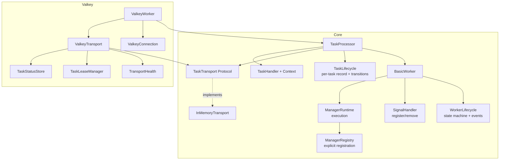

# Architecture Review

- **Date:** 2026-09-16
- **Version:** v4.2.0 (`src/scietex/service/version.py:6`)
- **Scope:** entire repository — `src/scietex/service/`, `tests/`, `examples/`
- **Method:** read all `docs/architecture/*` as an initial map (not authoritative), read the prior review (2026-09-16-1, AR-072..AR-085), verified every claim against the full source package (5433 lines) end-to-end, and confirmed evidence with targeted searches.
- **Type:** deep architectural review (read-only). The only repository change is this document.

> **Identifier note.** Findings in this review were renumbered from the original AR-015..AR-028 to AR-086..AR-099 to preserve repository-wide identifier uniqueness. The 2026-09-04 finding AR-015 is unrelated and retains its number.

---

## Executive Summary

The architecture is **sound**. The v4.2.0 migration (AR-072..AR-085) closed the
cohesion/abstraction problem at the transport/worker boundary that the previous
review identified: the transport contract is now an explicit `TaskTransport`
Protocol, `ValkeyWorker` delegates delivery to a `ValkeyTransport` and composes
`TransportHealth`/`TaskLeaseManager`/`TaskStatusStore` collaborators, and the
config surface is a single typed form. The three-level hierarchy
(`BasicWorker` → `TaskProcessor` → `ValkeyWorker`), the strict feature→core
dependency direction, the narrow `TaskHandlerContext` handler boundary, the
versioned `TaskEnvelope` wire format, and the immutable typed config structs
remain genuine, well-preserved design decisions. This review found **no
CRITICAL defect**.

The strongest aspects are the **dependency direction** (core never imports
`valkey`/`glide`; the only tolerated edge is the guarded re-export in
`__init__.py`) and the **handler contract** (`TaskHandler` + frozen
`TaskHandlerContext`, no worker back-reference). The transport seam introduced
in v4.2.0 is a real improvement: `TaskProcessor` now depends on a Protocol it
composes rather than on a set of template hooks it inherits.

The most important remaining weaknesses are **not** in the transport boundary
anymore — they are in the **worker lifecycle and manager runtime**:

1. **Manager discovery is reflection-based and rename-fragile** (AR-086). The
   manager set is derived by walking the MRO `__dict__` and keying on the
   decorated attribute name. Renaming a decorated method silently renames the
   manager; overriding without re-decorating silently drops it. This is the
   single most load-bearing implicit contract in the framework.
   **Resolved (2026-09-17, commit `a62985f`)** — see the `Status` line on
   AR-086 below.
2. **`BasicWorker` still owns too many distinct concerns** (AR-087): signal
   handling, the startup/shutdown state machine, manager orchestration
   delegation, logging-lifecycle delegation, heartbeat/watchdog managers, and
   the instance registry hooks all live in one 703-line class. The v4.2.0 work
   extracted `ManagerRuntime` and `LoggingLifecycle`, but the state machine and
   the signal/registry concerns remain inline.
3. **The `TaskProcessor` task lifecycle is spread across three managers and a
   `ContextVar`** (AR-088): `TaskManager` runs handlers, `TaskQueueManager`
   fetches, `Watchdog` times out, and cancellation state lives in
   `__cancel_reasons` + `__running_tasks` + a `ContextVar`. The invariants
   (requeue-before-ack, lease-at-enqueue-accept, cancel-reason precedence) are
   correct but distributed, so a change to one path can silently break another.

**What to fix first:** AR-086 (make manager registration explicit), then
AR-087 (extract the worker state machine / signal handling), then AR-088
(consolidate the task lifecycle state). These are the changes that will most
reduce the cost of every future change to this package.

---

## Architecture Assessment

### Boundaries

Module boundaries are well chosen and respected. Core (`basic_worker`,
`task_processor`, `task_handler`, `manager`, `log_handlers`, `config`,
`transport`, `utils`) never imports `valkey`/`glide`; `ValkeyWorker` extends
`TaskProcessor` (feature → core). `task_handler` receives a narrow frozen
`TaskHandlerContext` and holds no reference to the worker. `transport.py`
imports only `task_handler.schemas`. The core↔transport extension surface that
leaked in v4.1.0 is now an explicit Protocol (AR-072 resolved).

Two residual boundary smells remain, both minor:

- `valkey/transport.py` imports four sibling modules (`config`, `health`,
  `lease`, `tracking`) that sit at different layers. This is correct
  composition for the Valkey implementation, but it means the "transport"
  concept is split across a core Protocol and a Valkey package that also owns
  connection schema, health, and two keyed stores (AR-089).
- `utils/config.py` evaluates `_CWD_DIR = Path().cwd() / "config"` at import
  time, so the config search path is frozen at first import rather than at
  call time (AR-090).

### Responsibilities

Responsibility extraction is good at the worker level (`ManagerRuntime`,
`LoggingLifecycle`) and now good at the transport level (`ValkeyTransport`,
`TransportHealth`, `TaskLeaseManager`, `TaskStatusStore`). It remains **weak at
the `BasicWorker` level**: the class still owns the startup/shutdown state
machine, signal-handler registration, the two built-in managers, the instance
registry hooks, and the logging-lifecycle delegation (AR-087). The manager
runtime owns manager *execution* but not manager *discovery*, which is
reflection over the worker class (AR-086).

### Dependencies

Direction is correct everywhere (verified: no runtime circular imports). The
`manager`/`log_handlers` `__init__ ↔ submodule` cycles from AR-065 are gone.
The cross-package private import `_validate_range` from `valkey/config.py` into
`..config` was fixed in v4.2.0 (AR-079 resolved; now `_validation.validate_range`).

One dependency-direction observation: `valkey/health.py` imports **no** glide
types and is a generic connection-health supervisor, yet it lives under
`valkey/`. It is the one module in that package that is not Valkey-specific
(AR-089).

### Abstractions

`TaskHandler`/`TaskHandlerContext`, the frozen config structs, the
`TaskTransport`/`TaskSink` Protocols, and the `TaskEnvelope` wire format are
appropriate and well-scoped. The `Manager` decorator is a clever abstraction
that is also the framework's most fragile one: it is a class-based decorator
whose identity is the attribute name, discovered by MRO reflection (AR-086).
The `**handler_kwargs` capability-injection channel (`cancel=`, `report=`) is
an informal abstraction documented as an accepted trade-off (AR-082 resolved);
it remains a latent problem if a third capability appears (AR-091).

### Lifecycle

The worker state machine (`STOPPED → STARTING → RUNNING → STOPPING →
STOPPED`) is correct and well-documented, with a single guarded exit task
(AR-033). The manager lifecycle (`STARTING → RUNNING → STOPPING → STOPPED`,
give-up → `FAILED`) is correct. The task-handler lifecycle is correct. The
weakness is that the state machine is implemented inline in `BasicWorker`
rather than as a component, so the transitions are interleaved with signal
handling, logging, and registry calls (AR-087). The `lifecycle.md` map itself
flags an `UNKNOWN`: the explicit process-exit path when a worker stops without
a signal (AR-092).

### Concurrency

Single-process, single-threaded asyncio throughout; no thread pool or
multiprocessing. The concurrency model is sound: managers are independent
`asyncio.Task`s, the task queue is an `asyncio.Queue`, and the client mutation
is guarded by `_client_lock`. The v4.2.0 work removed the double-read of
`self.client` around awaits (AR-083 resolved) and added a single reconnect
owner (`TransportHealth.recover()` with an `asyncio.Lock` + cooldown). The
remaining concurrency concern is **state distribution**: the task lifecycle
state (`__running_tasks`, `__cancel_reasons`, the `ContextVar`, the transport's
entry-id map, the lease store, the status store) is spread across four
components with no single owner, so reasoning about a task's state requires
reading all four (AR-088).

### State Ownership

Ownership is mostly clear: the worker owns manager tasks and the internal task
queue; logging handlers own their queues and worker tasks; the Valkey log
handler owns its own `GlideClient`; task handlers own `is_ready` but not their
own tasks. The v4.2.0 extraction clarified the transport state (entry-id map +
`recovered` now live on `ValkeyTransport`). The residual ambiguity is the
**task lifecycle state** noted above (AR-088) and the **manager registry**,
which is derived rather than declared (AR-086).

### Testability

Testability is good and improved in v4.2.0: the `client_factory=` seam removed
the need to monkeypatch `GlideClient.create`, and the `transport=` kwarg lets
tests inject a recording transport. The remaining testability friction is the
manager discovery (tests must define decorated methods on a subclass to
exercise managers) and the `ContextVar`-based current-task tracking, which
requires the test to run inside the right task context (AR-088).

### Extensibility

Extensibility is the framework's stated goal and is now well-served at the
transport boundary: a new transport implements the 7-method `TaskTransport`
Protocol. Extensibility is **weak at the manager boundary**: adding a manager
means adding a decorated method to the worker class, and the manager's identity
is its method name (AR-086). Extensibility at the handler boundary is good
(`TaskHandler` ABC + `add_task_handler`).

---

## Strengths

- **Dependency direction is enforced and correct.** Core never imports
  `valkey`/`glide`; the only tolerated edge is the guarded re-export in
  `__init__.py` (`VALKEY_AVAILABLE`). Verified across all 25 modules.
- **The transport seam is now an explicit Protocol.** `TaskTransport`/`TaskSink`
  in `transport.py` (imports only `task_handler.schemas`) with a working
  `InMemoryTransport` default; `ValkeyTransport` implements it. This is a real
  architectural improvement over the v4.1.0 hook soup.
- **The handler contract is narrow and stable.** `TaskHandler` + frozen
  `TaskHandlerContext(service_name, instance_id, logger)` — handlers hold no
  worker reference, so they cannot reach into lifecycle or transport state.
- **The wire format is versioned.** `TaskEnvelope(version=1, data=...)` with
  `decode_task_envelope` returning `None` for unknown versions — a forward-
  compatible boundary.
- **Config is immutable typed data.** Frozen `msgspec.Struct`s with
  `__post_init__` range validation via a shared `validate_range` helper; the
  `None`-means-default convention is documented.
- **Delivery semantics are correct and tested.** At-least-once, requeue-before-
  ack, lease-at-enqueue-accept, and the AR-077b lease-clobber fix are all
  implemented and covered by tests.
- **The reconnect path is now single-owner.** `TransportHealth.recover()` with
  an `asyncio.Lock`, cooldown, and supervised retry; one CRITICAL per down
  episode.

---

## Critical Issues

None. No defect was found that causes data loss, corruption, or a security
hole in the current single-process deployment model.

---

## Major Issues

### AR-086 — Manager discovery is reflection-based and rename-fragile

- **Status:** ✅ RESOLVED (2026-09-17) — explicit per-class manager registry (`__manager_registry__`), required `Manager.name`, `register_manager()` API, registry-based discovery, and a discovery-time shadow warning; commit `a62985f`.
- **Severity:** HIGH
- **Evidence:** `manager/runtime.py:49` `iter_manager_definitions()` walks
  `type(self.worker).__mro__` `__dict__` and yields
  `(attribute.name or attribute_name, Manager)`; `manager/__init__.py:24`
  `Manager` is a class-based decorator whose `__call__` stores the method and
  whose `__get__` returns a bound `MethodType`. `basic_worker.py:622,633`
  define `_heartbeat_manager`/`_watchdog_manager`; `task_processor.py:716,830`
  define `task_manager`/`task_queue_manager`.
- **Problem:** The set of managers is derived by reflecting over the worker
  class's MRO `__dict__` and keying each manager on the decorated attribute
  name. There is no explicit registration call and no registry object. The
  identity of a manager is therefore a Python attribute name, and the discovery
  mechanism is coupled to the class layout.
- **Why it matters:** Renaming a decorated method silently renames the manager
  (breaking any external reference to it by name, e.g. `failed_managers`,
  status maps, logs). Overriding a decorated method in a subclass **without**
  re-decorating silently drops the manager from the set. Adding a manager
  requires editing the worker class rather than registering a component. This
  is the framework's most load-bearing implicit contract, and it fails
  silently. The v4.2.0 review accepted this as a trade-off (AR-084) with an
  explicit-registration API as the planned long-term replacement; this review
  elevates it because the reflection is now the *only* discovery path and the
  framework's extensibility story depends on it.
- **Recommendation:** Introduce an explicit manager registry. Managers should
  be registered by a call (e.g. `register_manager(name, method, cleanup=...)`)
  or declared in a class-level collection, with the decorator as sugar that
  appends to that collection. Discovery should read the registry, not the MRO.
  Keep the decorator's ergonomics; remove the reflection.
- **Confidence:** HIGH (mechanism verified in source; failure modes are
  structural, not speculative).
- **Resolution (2026-09-17, commit `a62985f`):** Discovery no longer reflects
  over the MRO `__dict__`. Each class carries its own ordered registry
  (`MANAGER_REGISTRY_ATTR = "__manager_registry__"`), populated by
  `Manager.__set_name__` at class creation and by the new
  `register_manager(owner, method, *, name, cleanup, attribute_name, replace)`
  API for post-creation registration; `iter_manager_definitions()` reads the
  registry and yields `(manager.name, manager)`. `Manager.name` is now required
  and non-empty, so identity is an explicit author-written string and renaming
  a decorated method no longer renames the manager. Most-derived-wins and the
  name-collision warning are preserved. Failure mode 2 (override without
  re-decorating) is now reported by an advisory discovery-time warning, though
  the base manager still runs — the override is diagnosed, not prevented. The
  review's requested test ("a renamed method keeps its manager name") is
  `tests/test_manager_restart.py::test_manager_name_stable_across_attribute_rename`.
  Breaking change: `@Manager()` without a name now raises `TypeError`; version
  bumped to 4.3.0.

### AR-087 — `BasicWorker` still owns the state machine, signals, and registry

- **Status:** ✅ RESOLVED (2026-09-17) — `WorkerLifecycle` and `SignalHandler` extracted from `BasicWorker`, which now composes four components; heartbeat/watchdog registered through the manager registry; commit `98eae6a`.
- **Severity:** HIGH
- **Evidence:** `basic_worker.py` (703 lines): `_setup_signal_handlers` (371),
  `_request_exit` (388), `_remove_signal_handlers` (401), `_startup` (425),
  `_force_stopped` (508), `_shutdown` (522), `start` (480), `stop` (569),
  `exit` (612), `_heartbeat_manager` (622), `_watchdog_manager` (633),
  `heartbeat` (644), `watchdog` (656), `cleanup` (676), `_register_instance`
  (685), `_unregister_instance` (695). `ManagerRuntime` and `LoggingLifecycle`
  are composed (138,139) but the state machine and signal handling are inline.
- **Problem:** `BasicWorker` interleaves six distinct concerns that do not
  change together: (1) the startup/shutdown state machine, (2) signal-handler
  registration/removal, (3) manager orchestration delegation, (4) logging-
  lifecycle delegation, (5) the two built-in managers (heartbeat/watchdog),
  and (6) the instance-registry hooks. The v4.2.0 work extracted the manager
  runtime and logging lifecycle but left the state machine and signals inline.
- **Why it matters:** The state machine is the framework's core contract, and
  it is implemented as a sequence of statements interleaved with signal
  registration, logo printing, logging start, registry calls, and manager
  start. Any change to one concern risks the others. The class is the base of
  the entire hierarchy, so its size and coupling propagate to every worker.
  Testing the state machine in isolation requires constructing a full worker.
- **Recommendation:** Extract a `WorkerLifecycle` (or `WorkerStateMachine`)
  component that owns the state transitions and the `exit_requested`/`exit`
  events, and a `SignalHandler` component that owns registration/removal.
  `BasicWorker` should orchestrate these components, not implement them. The
  built-in heartbeat/watchdog managers should be registered through the
  manager registry (AR-086) rather than defined as methods.
- **Confidence:** HIGH (structure verified; the extraction is the same pattern
  already applied successfully to `ManagerRuntime`/`LoggingLifecycle`).
- **Resolution (2026-09-17, commit `98eae6a`):** `WorkerLifecycle`
  (`lifecycle.py`) now owns the state machine, `start_time`, both events
  (`exit_requested`/`exit`), and the stop-task guard; `SignalHandler`
  (`signal_handler.py`) owns signal registration and removal behind a
  loop-keyed `WeakKeyDictionary` ownership registry implementing
  last-worker-wins. That registry is the one intended behavior change: a
  worker's `stop()` no longer unregisters SIGINT/SIGTERM for another worker
  sharing the event loop. `BasicWorker` now composes four components
  (`ManagerRuntime`, `LoggingLifecycle`, `WorkerLifecycle`, `SignalHandler`),
  with `start`/`stop`/`exit` and `_startup`/`_shutdown` kept as thin
  orchestrators and the state/event/signal methods as thin delegators.
  Heartbeat/watchdog are module-level functions registered via
  `register_manager(..., attribute_name="_heartbeat_manager"/"_watchdog_manager")`,
  preserving descriptor shape and discovery order. New tests:
  `tests/test_lifecycle.py` and `tests/test_signal_handler.py`; full suite 270
  passed; `ruff check src/` and `ty check src/` clean.

---

## Moderate Issues

### AR-088 — Task lifecycle state is distributed across four components

- **Status:** ✅ RESOLVED (2026-09-17) — the per-task running record (tracker) and cancel reason were extracted into a new worker-free `TaskLifecycle` component (`src/scietex/service/task_lifecycle.py`); `TaskProcessor` now composes `self._task_lifecycle` and delegates all tracker/cancel-reason access to it; the `ContextVar`-based progress channel was replaced by an explicit per-call `TaskCapabilities` object passed to `handle`; commit `c6cdc83`.
- **Severity:** MEDIUM
- **Evidence:** `task_processor.py`: `__running_tasks: dict[UUID, TaskTracker]`
  (tracker), `__cancel_reasons: dict[UUID, CancelReason]`, `__current_task_id:
  ContextVar[UUID|None]`, `__task_queue: asyncio.Queue`. `valkey/transport.py`:
  `_entry_ids: dict[UUID, str|bytes]`, `recovered`. `valkey/lease.py`:
  per-task lease keys. `valkey/tracking.py`: per-task status records. The
  lifecycle is driven by three managers: `task_manager` (716), `task_queue_manager`
  (830), `watchdog` (850).
- **Problem:** A single task's lifecycle state is spread across the processor's
  running-tasks map, the cancel-reasons map, a `ContextVar`, the transport's
  entry-id map, the lease store, and the status store. There is no single
  component that owns "the state of a task". The invariants that keep these
  consistent (requeue-before-ack, lease-at-enqueue-accept, cancel-reason
  precedence, entry-id pop ordering) are correct but distributed across
  `handle_task`, `ack`, `requeue`, `watchdog`, and `cleanup`.
- **Why it matters:** Reasoning about a task's state requires reading four
  components. A change to one path (e.g. adding a new terminal status) must be
  mirrored in the others, and the compiler cannot enforce it. The `ContextVar`
  in particular is an implicit channel: `report_progress` reads the current
  task id from ambient context, so correctness depends on the call site being
  inside the right task.
- **Recommendation:** Introduce a `TaskLifecycle` (or `TaskRegistry`) component
  that owns the per-task record (id, data, tracker, cancel reason, entry id)
  and exposes the transitions (`started`, `completed`, `cancelled`,
  `timed_out`). The transport and the stores should be collaborators it calls,
  not parallel state holders. The `ContextVar` should be replaced by an
  explicit task handle passed to `report_progress`.
- **Confidence:** MEDIUM (the distribution is verified; whether consolidation
  is worth the churn depends on how often the lifecycle changes — see Open
  Questions).
- **Resolution (2026-09-17, commit `c6cdc83`):** `TaskLifecycle` owns the tracker map and the cancel-reason map with two deliberately separate pops (`remove_tracker` / `take_cancel_reason`) so the watchdog's ignored-cancellation path preserves the `"timeout"` reason for the eventual ack; `running_tasks` remains as a delegating property returning a snapshot; the `ContextVar` was removed and progress is reported via `TaskCapabilities.report_progress`. New tests: `tests/test_task_lifecycle.py` (8 tests) and `test_watchdog_ignored_cancellation_preserves_timeout_reason`. Note that the transport entry-id map, the lease store, and the status store were deliberately NOT moved into core (they remain transport-owned collaborators).

### AR-089 — The "transport" concept is split across core and the Valkey package

- **Severity:** MEDIUM
- **Evidence:** `transport.py` (core) defines `TaskTransport`/`TaskSink`/
  `InMemoryTransport`. `valkey/transport.py` defines `ValkeyTransport`, which
  imports `valkey/config.py`, `valkey/health.py`, `valkey/lease.py`,
  `valkey/tracking.py`. `valkey/health.py` imports no glide types and is a
  generic connection-health supervisor.
- **Problem:** The transport abstraction is split: the contract is in core, but
  the only implementation lives in a package that also owns connection schema,
  health supervision, and two keyed stores. `TransportHealth` is generic (no
  glide coupling) yet is placed under `valkey/`. A future `MqttTransport` would
  implement the core Protocol but would not reuse `health.py` where it lives.
- **Why it matters:** The layering is defensible today (the Valkey package is
  the only transport), but it means the "transport" concept has no single home.
  A second transport would either duplicate the health supervisor or import it
  from `valkey/`, creating a feature→feature dependency. The v4.2.0 review
  explicitly deferred this ("don't standardize now"), which is reasonable, but
  the placement of `health.py` is the one part that is already mis-layered.
- **Recommendation:** When a second transport is planned, hoist the generic
  pieces (`TransportHealth`, and possibly a `ConnectionHealth` Protocol) to
  core, leaving only the Valkey-specific implementation under `valkey/`. Until
  then, document the intended layering so the split is deliberate rather than
  accidental.
- **Confidence:** MEDIUM (the split is verified; whether it is a problem
  depends on the second-transport roadmap — see Open Questions).

### AR-090 — Config search path is frozen at import time

- **Status:** ✅ RESOLVED (2026-09-17) — `./config` candidate computed at call time inside `prepare_conf_dir`; regression test added; commit `2a2e065`.
- **Severity:** MEDIUM
- **Evidence:** `utils/config.py`: `_CWD_DIR = Path().cwd() / "config"` is a
  module-level constant evaluated at import; `prepare_conf_dir` (33) uses it in
  the resolution order.
- **Problem:** The `./config` candidate in the config-directory search order is
  computed once, at first import of `utils/config.py`, from the process's
  working directory at that moment. If the process changes its working
  directory (or if the module is imported before the intended cwd is set), the
  `./config` candidate points at the wrong directory.
- **Why it matters:** Config resolution is a startup-critical path, and the
  failure is silent: the wrong directory is simply not found, and resolution
  falls through to `~/.config/scietex`. This is a latent bug for any embedder
  that imports the package before setting its working directory.
- **Recommendation:** Compute the `./config` candidate inside `prepare_conf_dir`
  at call time, not at import time. The other candidates (`$XDG_CONFIG_HOME`,
  `~/.config`, `/etc`, `/usr/local/etc`) are environment-derived and can stay
  module-level, but the cwd-relative one must be dynamic.
- **Confidence:** HIGH (mechanism verified; the impact depends on whether any
  consumer changes cwd after import).
- **Resolution (2026-09-17, commit `2a2e065`):** The module-level `_CWD_DIR`
  constant was removed; `Path.cwd() / "config"` is now evaluated inside
  `prepare_conf_dir` at call time. The other four candidates (`$XDG_CONFIG_HOME`,
  `~/.config`, `/etc`, `/usr/local/etc`) remain module-level since they are
  environment-derived and static. New `tests/test_utils_config.py` covers the
  regression (cwd changed after import) and the resolution-order branches; the
  regression test was demonstrated to fail against the old import-time constant.
  Full suite 275 passed; `ruff check src/ tests/` and `ty check src/` clean.

### AR-091 — `**handler_kwargs` capability injection is informal

- **Status:** ✅ RESOLVED (2026-09-17) — the per-call capability channel is now an explicit typed `TaskCapabilities` object (`src/scietex/service/task_handler/capabilities.py`) passed as a keyword-only argument to `TaskHandler.handle`; `**handler_kwargs` remains as the per-instance state-injection channel; commit `c6cdc83`.
- **Severity:** MEDIUM
- **Evidence:** `task_processor.py:267` `add_task_handler(handler_class, *,
  name=None, **handler_kwargs)`; instantiation at 329-335
  `handler_class(handler_name, context, **handler_kwargs)`. Capabilities today:
  `cancel=self._cancel_task` (151), `report=worker.report_progress`
  (`examples/progress_and_cancel.py`). Documented as an accepted trade-off
  (AR-082 resolved).
- **Problem:** Capabilities are injected as arbitrary keyword arguments with no
  declared contract. A handler that needs `cancel` or `report` must know the
  exact keyword name, and a misspelling fails at construction time (loudly) but
  a *missing* capability fails at call time (silently, if the handler guards
  with `getattr`). There is no type-level statement of which capabilities a
  handler requires.
- **Why it matters:** This is the handler subsystem's dependency-injection
  channel, and it is untyped. As the capability set grows, the risk of
  name collisions and silent omissions grows. The v4.2.0 review deferred a
  `TaskCapabilities` object until a third capability appears; this review
  agrees with the trigger but flags that the current channel is already the
  only way to give a handler access to processor state.
- **Recommendation:** When a third capability appears, introduce an explicit
  `TaskCapabilities` object (or a typed `HandlerDependencies` struct) passed as
  a single argument, and deprecate the `**handler_kwargs` channel. Until then,
  document the two capabilities and their contracts in the `TaskHandler` base
  class.
- **Confidence:** HIGH (mechanism verified; the severity is bounded by the
  current two-capability set).
- **Resolution (2026-09-17, commit `c6cdc83`):** `TaskCapabilities` carries `task_id` and a clamping `report_progress` method; the abstract `handle` signature is now `handle(self, task_data: TaskData, *, capabilities: TaskCapabilities)`; the `cancel` capability deliberately stays a typed constructor kwarg (it is per-instance, not per-call); `**handler_kwargs` was NOT retired because it is also the per-instance state channel (e.g. `stateful_handler.py`, `SharedStateHandler`).

### AR-092 — The no-signal process-exit path is undefined

- **Severity:** MEDIUM
- **Evidence:** `docs/architecture/lifecycle.md` flags `UNKNOWN` for the
  explicit process-exit path when a worker stops without a signal.
  `basic_worker.py:612` `exit()` sets `exit_requested` and cancels `__stop_task`;
  `_shutdown` (522) sets the `exit` event only `if exit_requested`.
- **Problem:** The documented lifecycle covers signal-driven shutdown
  (SIGINT/SIGTERM → `_request_exit` → `exit()` → `_shutdown`). The path where a
  worker is stopped programmatically without a signal (e.g. `await worker.stop()`
  directly, or a manager calling `exit()`) is not fully specified: whether the
  `exit` event is set, and what happens to a process whose last worker stops
  without a signal, is left as `UNKNOWN`.
- **Why it matters:** Embedders that drive the worker programmatically (tests,
  supervisors, multi-worker processes) depend on this path. An undefined
  contract here means the shutdown semantics are only correct for the
  signal-driven case, which is the case the examples exercise.
- **Recommendation:** Specify the no-signal path explicitly: define whether
  `stop()` sets the `exit` event, whether `exit()` is required before `stop()`,
  and what the process-exit contract is when the last worker stops. Document it
  in `lifecycle.md` and cover it with a test.
- **Confidence:** MEDIUM (the gap is documented as `UNKNOWN`; the exact
  behavior was not fully traced, so the severity may be lower if the path is
  already correct by construction).

---

## Minor Issues

### AR-093 — `ValkeyWorker` still owns connection/config/logging-handler concerns

- **Severity:** LOW
- **Evidence:** `valkey/worker.py` (599 lines): `_ensure_client_config` (291),
  `_ensure_logging_handler` (314), `connect` (338), `_connect_locked` (352),
  `disconnect` (399), `_disconnect_locked` (409), `_reconnect` (423),
  `_logging_handler_config` (51).
- **Problem:** The v4.2.0 work extracted the transport and the lease/tracking/
  health collaborators, but the connection lifecycle, the deferred config read
  (AR-066), and the logging-handler construction remain inline on the worker.
  These are three distinct concerns (connection, config, logging) that do not
  change together.
- **Why it matters:** `ValkeyWorker` is still the largest class in the package
  and still mixes concerns. The extraction is less urgent than AR-087 because
  the concerns are Valkey-specific and the class is a leaf, but it is the same
  pattern.
- **Recommendation:** Consider a `ValkeyConnection` component owning
  `connect`/`disconnect`/`_reconnect`/`_ensure_client_config`, and a
  `ValkeyLoggingHandlerFactory` owning `_ensure_logging_handler`/
  `_logging_handler_config`. Defer until the class changes again.
- **Confidence:** HIGH (structure verified; low urgency).

### AR-094 — `purge_task_stream` swallows all exceptions

- **Severity:** LOW
- **Evidence:** `valkey/purge.py:22` `purge_task_stream(...)`; the internal
  helpers swallow all exceptions with an ERROR log.
- **Problem:** The operator utility catches broad exceptions and logs them,
  returning no indication of partial failure. A caller cannot distinguish
  "purged everything" from "purged some and hit an error".
- **Why it matters:** It is an operator tool, so a silent partial purge could
  leave the stream in an unexpected state. The blast radius is small (it is not
  on the delivery path).
- **Recommendation:** Return a result (counts purged / errors) or re-raise
  after logging, so the operator can detect partial failure.
- **Confidence:** HIGH (mechanism verified; low impact).

### AR-095 — `TaskStatusStore.update_progress` synthesizes a record on miss

- **Severity:** LOW
- **Evidence:** `valkey/tracking.py:141` `update_progress` — GET, decode
  (`DecodeError` → silent return), synthesize a default running record if the
  raw value is `None`, then `replace(...)` and write.
- **Problem:** If a progress update arrives for a task with no status record
  (e.g. the record expired, or the task was never recorded), the store
  fabricates a `running` record with default fields. This masks the missing
  record rather than surfacing it.
- **Why it matters:** The synthesized record has no `task` name, no `created_at`
  from the original, and a fresh `updated_at`, so a consumer polling status
  sees a plausible-but-wrong record. The behavior is deliberate (documented in
  the v4.2.0 plan) but is a silent-data-quality risk.
- **Recommendation:** Either log a WARNING when synthesizing, or return without
  writing when the record is absent (progress for an unknown task is arguably a
  no-op). Document the chosen semantics.
- **Confidence:** HIGH (mechanism verified; low impact).

### AR-096 — `_validation.validate_range` has an `unbounded_ok` special case

- **Severity:** LOW
- **Evidence:** `_validation.py:11` `validate_range(value, name, *, minimum,
  maximum=None, unbounded_ok=False)` — returns early when `unbounded_ok and
  value <= 0`. Used by `task_timeout` (`config.py`).
- **Problem:** The `unbounded_ok` flag encodes a per-field semantic ("`<= 0`
  means unbounded") inside a generic range validator. The validator now knows
  about a domain convention that belongs to the field.
- **Why it matters:** It is a small leak of domain semantics into a generic
  helper. A future field with a different "special value" convention would need
  another flag.
- **Recommendation:** Keep the flag (it is used once and documented) or move
  the `<= 0` interpretation into the field's `__post_init__` and pass a plain
  range to the validator.
- **Confidence:** HIGH (mechanism verified; low impact).

### AR-097 — `TaskProcessor` auto-tunes `max_concurrent_tasks` from `os.cpu_count()`

- **Severity:** LOW
- **Evidence:** `task_processor.py:74` `__init__` — `__max_concurrent_tasks`
  derived from `os.cpu_count()` when `auto_tune=True`.
- **Problem:** The concurrency limit is derived from the host CPU count, which
  is a poor proxy for an I/O-bound asyncio workload. On a many-core host the
  limit may be far higher than the workload can use; on a constrained container
  `os.cpu_count()` may report the host's cores.
- **Why it matters:** `auto_tune` is opt-in, so the blast radius is limited,
  but the default heuristic is misleading for the framework's actual workload
  (async I/O, not CPU-bound).
- **Recommendation:** Document that `auto_tune` is a CPU-count heuristic and
  that I/O-bound services should set `max_concurrent_tasks` explicitly; or
  derive from a configurable multiplier.
- **Confidence:** HIGH (mechanism verified; low impact).

### AR-098 — `TaskEnvelope` version handling is a single hard-coded branch

- **Severity:** LOW
- **Evidence:** `task_handler/wire.py:28` `decode_task_envelope` returns
  `TaskData` for version 1 and `None` for any other version or `DecodeError`.
- **Problem:** The versioned envelope has exactly one supported version and no
  migration hook. An unknown version is indistinguishable from a decode error
  (both return `None`).
- **Why it matters:** The versioning is forward-compatible in the sense that
  unknown versions are rejected, but the caller cannot tell "this is a v2
  message I don't understand" from "this is corrupt". As the wire format
  evolves, that distinction matters for diagnostics.
- **Recommendation:** Return a discriminated result (e.g. an enum or a small
  result struct) distinguishing "unsupported version" from "malformed", or log
  the version at the rejection site.
- **Confidence:** HIGH (mechanism verified; low impact).

### AR-099 — `Manager.__get__` descriptor returns a bound method, hiding the decorator

- **Severity:** LOW
- **Evidence:** `manager/__init__.py:24` `Manager.__get__` returns
  `MethodType(self.method, instance)` when accessed on an instance, else `self`.
- **Problem:** The descriptor makes the decorated attribute behave as a plain
  bound method on instances, which is ergonomic but means the `Manager` object
  (with its `name`/`cleanup`) is only reachable via the class `__dict__` — the
  same reflection path as AR-086.
- **Why it matters:** It reinforces the reflection-based discovery: there is no
  way to enumerate managers from an instance without walking the MRO. This is a
  contributing factor to AR-086 rather than an independent defect.
- **Recommendation:** Fold into the AR-086 fix: if managers are registered
  explicitly, the descriptor can stay for ergonomics without being the
  discovery mechanism.
- **Confidence:** HIGH (mechanism verified; low impact).

---

## Cross-Cutting Analysis

### Dependency chains

The dependency graph is acyclic and correctly directed. The longest chain is
`ValkeyWorker → ValkeyTransport → {config, health, lease, tracking} → _glide`,
with `health` terminating at stdlib. Core chains terminate at `msgspec` and
`scietex.logging`. The one cross-layer observation is AR-089: `health.py` is
generic but lives under `valkey/`.

### Responsibility leakage

Three leaks remain, all identified above:

1. **Manager discovery leaks into the worker class layout** (AR-086): the
   runtime reflects over the worker's MRO to find managers.
2. **The state machine leaks into `BasicWorker`** (AR-087): lifecycle
   transitions are interleaved with signals, logging, and registry calls.
3. **Task lifecycle state leaks across four components** (AR-088): no single
   owner of a task's state.

### Lifecycle and resource ownership

Resource ownership is well-documented (12-row map in `lifecycle.md`) and mostly
correct. The v4.2.0 extraction clarified transport state ownership. The
remaining gaps are the undefined no-signal exit path (AR-092) and the
distributed task lifecycle state (AR-088).

### State management

State is immutable where it should be (frozen config structs, frozen
`TaskTracker`, frozen `TaskHandlerContext`) and mutable where it must be
(worker state, manager statuses, task maps). The concern is **distribution**,
not mutability: the task lifecycle state is spread across the processor, the
transport, and two stores (AR-088).

### Async/concurrency boundaries

The concurrency model is sound and improved in v4.2.0 (single reconnect owner,
single client capture per operation). The remaining concern is the `ContextVar`
used for current-task tracking, which is an implicit channel that couples
`report_progress` to the call site's task context (AR-088).

### Abstractions crossing package boundaries

The core↔Valkey boundary is clean (guarded re-export only). The
core↔transport boundary is now an explicit Protocol. The one abstraction that
crosses awkwardly is the transport *implementation* split (AR-089): the
contract is in core, the implementation and its generic health supervisor are
in `valkey/`.

---

## Architectural Recommendations

### Priority 1 — Should fix first

- **AR-086 — Explicit manager registration.** Replace MRO reflection with a
  registry. This is the highest-leverage change: it removes the framework's
  most fragile implicit contract and unblocks AR-087 (the built-in managers
  should be registered, not defined as methods).
- **AR-087 — Extract the worker state machine and signal handling.** Apply the
  same extraction pattern that worked for `ManagerRuntime`/`LoggingLifecycle`.
  This shrinks the base class and makes the lifecycle testable in isolation.

### Priority 2 — Important

- **AR-088 — Consolidate the task lifecycle state.** Introduce a single owner
  for a task's record and transitions; replace the `ContextVar` with an
  explicit handle.
- **AR-090 — Compute the `./config` candidate at call time.** A small, safe fix
  to a latent startup bug.
- **AR-092 — Specify the no-signal exit path.** Close the documented `UNKNOWN`
  and cover it with a test.

### Priority 3 — Opportunistic

- **AR-089 — Plan the transport layering.** Hoist generic health to core when a
  second transport is planned; document the intended layering now.
- **AR-091 — Introduce `TaskCapabilities` when a third capability appears.**
  Keep the current channel until then; document the two capabilities.
- **AR-093 — Extract `ValkeyConnection`/logging-handler factory.** Defer until
  `ValkeyWorker` changes again.
- **AR-094 — Return a result from `purge_task_stream`.**
- **AR-095 — Log or skip on synthesized progress records.**
- **AR-096 — Reconsider the `unbounded_ok` flag.**
- **AR-097 — Document the `auto_tune` heuristic.**
- **AR-098 — Distinguish unsupported version from malformed envelope.**
- **AR-099 — Fold into the AR-086 fix.**

---

## Suggested Target Architecture

The target keeps the three-level hierarchy and the dependency direction, and
adds explicit components for the three concerns that are currently implicit.

**Component boundaries and responsibilities:**

- `WorkerLifecycle` — owns the state machine and the `exit_requested`/`exit`
  events. `BasicWorker` delegates transitions to it.
- `SignalHandler` — owns signal registration/removal and the last-worker-wins
  rule.
- `ManagerRegistry` — owns the manager set; `ManagerRuntime` reads it instead
  of reflecting over the MRO.
- `TaskLifecycle` — owns the per-task record (id, data, tracker, cancel reason,
  entry id) and the transitions; the transport and stores are collaborators.
- `ValkeyConnection` — owns connect/disconnect/reconnect and the deferred
  config read.
- `TransportHealth` — hoisted to core when a second transport is planned.

**Dependency direction:** unchanged — feature → core, core → infrastructure
only. The new components are all core-side except `ValkeyConnection`.

**Ownership:** each new component owns exactly one concern; the worker
orchestrates them.

**Interfaces:** `ManagerRegistry` and `TaskLifecycle` are concrete core
components; `TaskTransport` remains the extension Protocol.

---

## Migration Strategy

The changes are independent enough to land incrementally, but AR-086 should go
first because AR-087 depends on it (the built-in managers move into the
registry).

1. **AR-086 — Manager registry.** Add the registry, make the decorator append
   to it, switch `ManagerRuntime` to read it. Keep the decorator ergonomics.
   Verify: existing manager tests pass; add a test that a renamed method keeps
   its manager name.
2. **AR-087 — Worker lifecycle + signal handler.** Extract the state machine
   and signals. Verify: lifecycle tests pass; add a test for the no-signal path
   (AR-092).
3. **AR-090 — Config cwd fix.** Independent, small. Verify: a test that changes
   cwd after import and resolves `./config` correctly.
4. **AR-088 — Task lifecycle consolidation.** The largest change; do it after
   AR-086/AR-087 so the manager set is stable. Verify: all delivery-semantics
   tests pass unchanged.
5. **AR-089/AR-091/AR-093..AR-099 — Opportunistic.** Land as the relevant
   components change.

Dependencies between changes: AR-087 → AR-086; AR-088 → AR-086 (stable manager
set); AR-089 → a second-transport decision; the rest are independent.

---

## Open Questions

1. **Is a second transport (MQTT/Kafka) actually planned?** This determines
   whether AR-089 is worth acting on now or should stay deferred.
2. **How often does the task lifecycle change?** AR-088's consolidation is
   worth the churn only if the lifecycle is expected to evolve; if it is
   stable, the distributed state is a documentation problem, not a refactor.
3. **Do any embedders drive the worker programmatically without signals?** This
   determines the severity of AR-092.
4. **Is `auto_tune` used in production?** This determines whether AR-097 is a
   documentation fix or a behavior change.
5. **Is the `./config` candidate relied upon?** This determines whether AR-090
   is a latent bug or a theoretical one.

---

## Final Prioritization

| ID | Issue | Severity | Impact | Effort | Priority |
|----|-------|----------|--------|--------|----------|
| AR-086 | Manager discovery is reflection-based and rename-fragile | HIGH | High — framework's most load-bearing implicit contract | Medium | 1 | ✅ resolved |
| AR-087 | `BasicWorker` owns state machine, signals, registry | HIGH | High — base class coupling propagates to all workers | Medium | 1 | ✅ resolved |
| AR-088 | Task lifecycle state distributed across four components | MEDIUM | Medium — reasoning and change cost | High | 2 | ✅ resolved |
| AR-089 | "Transport" concept split across core and Valkey | MEDIUM | Medium — blocks clean second transport | Medium | 2 |
| AR-090 | Config search path frozen at import time | MEDIUM | Medium — silent startup misresolution | Low | 2 | ✅ resolved |
| AR-091 | `**handler_kwargs` capability injection is informal | MEDIUM | Medium — untyped DI channel | Medium | 2 | ✅ resolved |
| AR-092 | No-signal process-exit path undefined | MEDIUM | Medium — embedder contract gap | Low | 2 |
| AR-093 | `ValkeyWorker` owns connection/config/logging concerns | LOW | Low — leaf class, same pattern | Medium | 3 |
| AR-094 | `purge_task_stream` swallows all exceptions | LOW | Low — operator tool | Low | 3 |
| AR-095 | `update_progress` synthesizes a record on miss | LOW | Low — silent data quality | Low | 3 |
| AR-096 | `validate_range` has an `unbounded_ok` special case | LOW | Low — small semantic leak | Low | 3 |
| AR-097 | `auto_tune` uses `os.cpu_count()` for an I/O workload | LOW | Low — opt-in heuristic | Low | 3 |
| AR-098 | Envelope version handling is a single hard-coded branch | LOW | Low — diagnostics only | Low | 3 |
| AR-099 | `Manager.__get__` hides the decorator | LOW | Low — contributes to AR-086 | Low | 3 |

**Resolution (2026-09-17):** AR-086 was addressed in commit `a62985f`
(v4.3.0). The reflection-based discovery was replaced by an explicit per-class
manager registry, `Manager.name` became required, and `register_manager()` was
added as the dynamic registration path. The review's requested test exists
(`tests/test_manager_restart.py::test_manager_name_stable_across_attribute_rename`).
Failure mode 2 is now diagnosed by an advisory warning rather than prevented.
AR-087 was addressed in commit `98eae6a`: `WorkerLifecycle` and `SignalHandler`
were extracted from `BasicWorker`, which now composes four components, and the
built-in heartbeat/watchdog managers are registered through the manager
registry. AR-090 was addressed in commit `2a2e065`: the cwd-relative `./config`
candidate is now computed at call time inside `prepare_conf_dir`, with a
regression test in `tests/test_utils_config.py`. AR-088 was addressed in commit
`c6cdc83`: the per-task tracker and cancel reason were extracted into a
worker-free `TaskLifecycle` component, `TaskProcessor` delegates tracker and
cancel-reason access to it, and the `ContextVar`-based progress channel was
replaced by an explicit `TaskCapabilities` object passed to `handle`; the
transport entry-id map, the lease store, and the status store remain
transport-owned. AR-091 was addressed in commit `c6cdc83`: `TaskCapabilities`
(`task_handler/capabilities.py`) is now passed as a keyword-only argument to
`TaskHandler.handle`, with `**handler_kwargs` retained as the per-instance
state channel. The remaining findings (AR-089, AR-092..AR-099) are open.

Succeeded: 5 findings (AR-086, AR-087, AR-088, AR-090, AR-091). Failed: 0. Skipped: 0.
