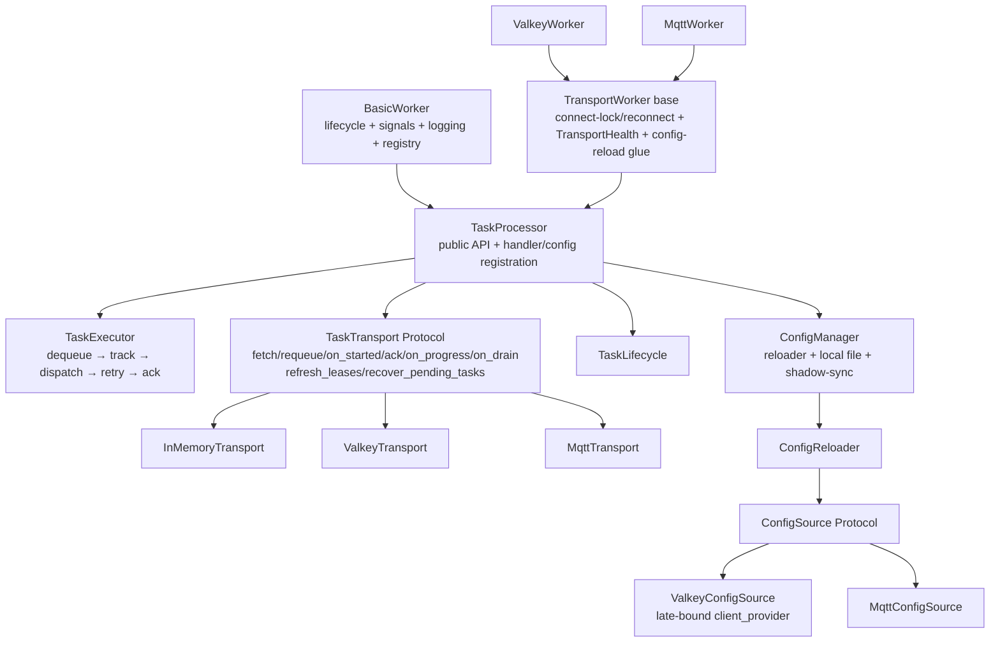

# Architecture Review

- **Date:** 2026-09-18
- **Version:** 4.4.0 (`src/scietex/service/version.py:6`)
- **Scope:** entire repository — core worker/processor/lifecycle/manager, transport seam, Valkey and MQTT transports, remote configuration, task-handler subsystem
- **Method:** read `docs/architecture/*` and prior `docs/reviews/architecture/*.md` as an initial map (not authoritative), then verified every significant claim against source. Three parallel deep source audits (core; transport/Valkey/MQTT; remote-config/task-handler) plus direct verification of the highest-severity claims.
- **Type:** deep architectural review (read-only). The only repository change is this document.
- **Identifier note:** prior reviews ended at **AR-099** (all resolved). This review continues at **AR-100**.

---

## Executive Summary

The architecture is **fundamentally sound**. The v4.2–v4.4 extraction wave (transport Protocols, `TaskLifecycle`, `WorkerLifecycle`/`SignalHandler`, `TransportHealth`, `ConfigReloader`, lease/status collaborators) has genuinely de-risked the core: dependency direction is clean (core imports nothing optional; transports depend on core), there are no circular imports, the delivery/retry/lease semantics are correct and well-commented, and the remote-config apply pipeline is validate-before-swap and exception-safe. No CRITICAL correctness break was found.

The remaining structural debt is concentrated in three places:

1. **`TaskProcessor` is still a god-component.** The scheduler/executor (dequeue → dispatch → track → retry → ack) remains a ~90-line closure inside a manager method, and the class owns queue + handlers + cancellation + retry + watchdog + config delegation across ~1200 lines. This is the single largest maintainability and testability liability.
2. **"Effective config" has three representations** (the frozen struct, private shadows, live-read properties) with the resolution logic duplicated between `__init__` and `_apply_reloadable_config`, and the reloadable allowlist hand-maintained in five places. This is a standing drift hazard on the hot-reload path.
3. **The two concrete workers duplicate ~250 lines of transport-independent scaffolding** (connect-lock/reconnect, `TransportHealth` construction, config-reload pipeline, watchdog glue) with no shared base — and one of those copies (`ValkeyConfigSource`) holds a client that goes stale on reconnect, the only HIGH-severity correctness gap found.

**Strongest aspects:** the transport seam and its collaborator decomposition; the at-least-once delivery design (Valkey lease/`XAUTOCLAIM`, MQTT durable inbox); the `ConfigReloader` validate-before-swap pipeline; the narrow `TaskHandlerContext` + `TaskCapabilities` + `**handler_kwargs` injection model; and the disciplined versioned-envelope evolution.

**What to fix first:** (1) the stale `ValkeyConfigSource` client (small, closes the only correctness gap); (2) consolidate config into one effective representation; (3) extract a `TaskExecutor` from `TaskProcessor`; (4) extract a shared `TransportWorker` base.

---

## Architecture Assessment

**Boundaries.** Package boundaries are clean and intentional. `config_reload.py` imports no transport package and no processor type; `ValkeyConfigSource`/`MqttConfigSource` implement `ConfigSource` structurally without importing it; `task_handler/*` is leaf-ish; `transport`/`health`/`lifecycle`/`manager`/`signal_handler`/`log_handlers` compose into `BasicWorker`/`TaskProcessor` without back-edges. The one boundary that has eroded is remote config leaking into core `TaskProcessor` (AR-105).

**Responsibilities.** Mostly well-separated after the extraction wave, with two exceptions: `TaskProcessor` still owns the scheduler/executor (AR-101), and the two concrete workers duplicate transport-independent lifecycle scaffolding (AR-102). The `Manager` class conflates decorator, descriptor, and registry entry (AR-107).

**Dependencies.** Direction is correct and acyclic. The `TaskTransport` Protocol is an *incomplete* seam: it declares a dead method (`release`) and omits the two lifecycle operations both workers actually invoke (`refresh_leases`, `recover_pending_tasks`), forcing concrete down-casts (AR-103).

**Abstractions.** The transport seam, `ConfigSource`, and the handler injection model are appropriate. Two abstractions leak: `ConfigSource.load` has divergent freshness semantics per transport (AR-110), and `TaskTracker` is a serializable `msgspec.Struct` holding a live `asyncio.Task` (AR-109).

**Lifecycle.** The worker state machine is a bare settable enum with no transition enforcement and a 100 ms busy-wait poll; `start()`/`stop()` are fire-and-forget with no awaitable "fully started/stopped" future (AR-106). Manager restart is bounded and correct.

**Concurrency.** Single-process, single-threaded asyncio throughout — a deliberate and coherent model. The main concurrency risks are the uncapped timeout-requeue loop (AR-104) and the control-plane starvation under saturation (AR-108).

**State ownership.** The clearest weakness: effective config is owned three ways (AR-100), and the reloader's revision state is instance-lifetime rather than run-lifetime (AR-111).

**Testability.** Good at the collaborator level (transports, reloader, lifecycle components are independently testable). Weak at the core: the scheduler is a closure inside a manager coroutine, and lifecycle ordering must be asserted by polling.

**Extensibility.** The transport seam is the intended extension point, but the class docstring still recommends the legacy template-method overrides (AR-112), and the reloadable allowlist is hand-maintained in five sites (AR-100).

---

## Strengths

- **Transport seam and collaborator decomposition.** `TaskTransport`/`TaskSink` Protocols plus `InMemoryTransport`, with `TaskLeaseManager`/`TaskStatusStore`/`TransportHealth` extracted from `ValkeyWorker`, is a genuine improvement over the pre-v4.2 hook soup. The `client_factory` and late-bound `client_provider` seams make both transports testable without a broker.
- **At-least-once delivery design.** Valkey's enqueue-without-ack + `XACK`/`XDEL`-after-termination + lease-gated `XAUTOCLAIM` recovery, and MQTT's persist-before-enqueue durable inbox with `.done` tombstones, are correct and well-documented. The AR-077b retryable lease/tombstone skip is present in both `ack` implementations.
- **`ConfigReloader` validate-before-swap pipeline.** Decode → hash → HMAC → replay → section decode → section hooks → core swap is atomic with respect to the event loop (no `await` between lock acquisition and swap), exception-safe, and returns an outcome for every terminal state. The `type(current)(**merged)` reconstruction correctly re-runs `__post_init__`/`validate_range` and preserves nested structs by reference.
- **Handler injection model.** `TaskHandlerContext` (stable read-only contract), `TaskCapabilities` (per-call task id), and `**handler_kwargs` (per-instance state) cleanly separate three lifetimes; control handlers reach the processor only through injected callables.
- **Versioned-envelope discipline.** `TaskEnvelope` and `ConfigEnvelope` share the same version + opaque-bytes evolution pattern, with `decode_*_version` helpers and rejection-site logging.
- **Single-path reconnect.** `TransportHealth.report_failure` only sets flags; `recover` is the sole reconnect owner, lock-serialized with cooldown, firing CRITICAL once per episode.

---

## Critical Issues

None. No finding compromises the architecture fundamentally or imposes a serious correctness/reliability constraint that cannot be addressed incrementally.

---

## Major Issues

### AR-100 — Effective config is duplicated across the struct, private shadows, and live-read properties
- **Status:** ✅ RESOLVED (2026-09-18) — the four reloadable shadows are gone; `TaskProcessor` now holds one resolved snapshot `self._effective: ReloadableSettings`, produced by a single pure resolver `resolve_reloadable_settings(config, logger=None)` in `config.py` and written only at construction and on core swap (adjacently with `self._config`, no `await`). `_current_reloadable_settings` returns the snapshot directly; the four live-read properties and the hot-loop reads route through it. The duplicated `None`→`DEFAULT_*`/`auto_tune` resolution and the dead `auto_tune` branch in `_apply_reloadable_config` are deleted. No public API change; `ConfigReloader` untouched. Regression tests pin the invariant (all read paths agree after apply; `_config` stays raw; no shadow attributes). Commit `dfbf35d`.
- **Severity:** HIGH
- **Evidence:** `basic_worker.py:113-132` (6 eagerly-resolved shadows); `task_processor.py:134-164` (5 more shadows: `__queue_size`, `__max_concurrent_tasks`, `__task_timeout`, `__task_queue_fetch_timeout`, `__task_cancellation_timeout`); live-read properties for the other four reloadable fields at `task_processor.py:469-521`; resolution logic duplicated between `__init__` (`:136-164`) and `_apply_reloadable_config` (`:328-343`, including a second copy of the `auto_tune`/CPU-count branch at `:331`); `_current_reloadable_settings` (`:262-279`) reads some fields from shadows and others from properties.
- **Problem:** "Effective config" has three representations that must be manually kept in sync. The shadowing policy is internally inconsistent (why shadow `task_timeout` but not `task_manager_sleep_time`, when both are read in hot loops?). The auto-tune and `None`-default resolution exists in two places.
- **Why it matters:** Change amplification on the hot-reload path; a future edit to the resolution rule that forgets one mirror silently desynchronizes the shadow from `self._config`, producing an effective config that disagrees with what `config:show`/`config:store` report. Correct today only because it is manually kept parallel.
- **Recommendation:** Make the resolved struct the single source of truth and remove the reloadable-field shadows (read `self._config` through the existing properties, or resolve once into a small `EffectiveSettings` value object owned by the reloader). Keep shadowing only for genuinely non-reloadable fields.
- **Confidence:** HIGH

### AR-101 — `TaskProcessor` is a god-component; the scheduler/executor is still inlined
- **Severity:** HIGH
- **Evidence:** `task_processor.py` (~1197 lines) owns the `asyncio.Queue` + sink methods (`:166`, `:436-467`), handler registry/lifecycle (`:130-131`, `:523-657`), dispatch (`:659-676`), cancellation of running *and* queued tasks (`:722-777`), the retry budget (`:120`, `:1013-1046`), the timeout watchdog (`:1123-1197`), shutdown drain/cleanup (`:859-909`), transport delegation (`:678-857`), and remote-config delegation (`:375-434`). The single `handle_task` nested closure (`:977-1069`, ~90 lines) interleaves scheduling, retry accounting, and ack/finally semantics inside `task_manager` (`:964-1083`).
- **Problem:** Although `TaskLifecycle`, the transport, and `ConfigReloader` were extracted, the scheduling/execution concern remains a large inline closure inside a manager method, and cancellation/retry/watchdog remain three separate owners of "what happens to a task's lifecycle" coordinating through shared private dicts.
- **Why it matters:** The core processing loop is hard to unit-test in isolation; retry/cancel/timeout semantics are spread across three methods that must agree on task-id reuse and tracker/reason lifecycle; every future feature (backoff, DLQ, per-task concurrency) lands in an already-oversized class.
- **Recommendation:** Extract a `TaskExecutor`/`TaskScheduler` owning dequeue → track → dispatch → retry → ack, receiving the queue, handlers, retry policy, and ack hook by injection — mirroring the transport/config extraction already done. `TaskProcessor` then composes it and keeps only the public API + handler/config registration.
- **Confidence:** HIGH

### AR-102 — `ValkeyWorker` and `MqttWorker` duplicate transport-independent lifecycle scaffolding
- **Severity:** HIGH
- **Evidence:** `_log_config_outcome` is byte-identical (`valkey/worker.py:554-573` vs `mqtt/worker.py:645-663`); `_apply_local_config` identical modulo the config cast (`valkey/worker.py:509-535` vs `mqtt/worker.py:589-615`); `connect`/`_connect_locked`/`disconnect`/`_disconnect_locked`/`_reconnect` structurally identical (`valkey/worker.py:325-413` vs `mqtt/worker.py:353-469`); `TransportHealth` construction duplicated verbatim (`valkey/worker.py:180-187` vs `mqtt/worker.py:189-196`); `watchdog` duplicated (`valkey/worker.py:645-664` vs `mqtt/worker.py:815-833`); `heartbeat`/`_register_instance`/`_unregister_instance`/`cleanup` follow the same pattern.
- **Problem:** Two parallel worker classes duplicate the connection/health/config-reload glue that is independent of the underlying broker. There is no shared `TransportWorker`/mixin between `TaskProcessor` and the concrete workers.
- **Why it matters:** Change amplification — every fix to config-reload wiring, health thresholding, or shutdown ordering must be made (and tested) twice. This already bit: AR-077b retry handling and AR-075 health hoist both had to be applied to two transports. Two copies of subtle ordering logic can drift.
- **Recommendation:** Extract a shared intermediate base (e.g. `TransportWorker(TaskProcessor)` in core) owning the client-lock/reconnect pattern, `TransportHealth` construction, the config-reload pipeline (via a pluggable "read remote source" hook), and the watchdog glue. Keep concrete `connect`/`disconnect`/`heartbeat`/registry bits as overrides.
- **Confidence:** HIGH

### AR-103 — `ValkeyConfigSource` captures a client that goes stale on reconnect
- **Status:** ✅ RESOLVED (2026-09-18) — `ValkeyConfigSource` now takes a late-bound `client_provider` (matching `TaskLeaseManager`/`TaskStatusStore`/`ValkeyTransport`); `load()` reads the current client and returns `None` when disconnected, `store()` raises when disconnected so the reloader maps it to `CONFIG_STORE_FAILED`; `worker.py` passes `client_provider=lambda: self._client`. Three regression tests added (reconnect follows the new client; disconnected `load`/`store`). Commit `110f320`.
- **Severity:** HIGH
- **Evidence:** `valkey/worker.py:492` — `ValkeyConfigSource(client=client, ...)` captures the concrete `GlideClient` at `initialize()` time; `valkey/config_source.py:27-34` stores `self._client` and uses it directly in `load()`/`store()`; `valkey/worker.py:410-413` — `_reconnect()` is `disconnect()` + `connect()`, creating a **new** client, and `_config_source` is never re-attached. Contrast: `lease.py:61`, `tracking.py:50`, `transport.py:49` all take a late-bound `client_provider` (`lambda: self._client` at `worker.py:206, 213, 234`).
- **Problem:** Resource ownership is inconsistent across the Valkey collaborators. Three of four reach the operational client through a late-bound provider; the config source pins the client it was constructed with.
- **Why it matters:** After any mid-run reconnect, `config:store remote` and payload-less `config:apply` invoke `GET`/`SET` on a **closed** client. These fail and map to `CONFIG_SOURCE_UNAVAILABLE`/`CONFIG_STORE_FAILED`, so remote config silently stops working for the remainder of the process lifetime even though the worker reconnected and is otherwise healthy. It also breaks symmetry with the MQTT source, whose `publish=self._publish` seam is late-bound and survives reconnects.
- **Recommendation:** Give `ValkeyConfigSource` the same late-bound `client_provider` the other collaborators receive (or re-attach it inside `_connect_locked`), so it reads the current client on every `load`/`store`.
- **Confidence:** HIGH

---

## Moderate Issues

### AR-104 — Timeout-driven requeue is uncapped and shares no budget with the error-path retry
- **Severity:** MEDIUM
- **Evidence:** Retry-once is enforced only on `TaskResult.retryable` errors in `handle_task`'s finally (`task_processor.py:1013-1046`), tracked in `_retry_attempts` (`:120`). The watchdog timeout path requeues independently via `return_task_to_queue` (`:1172-1179`) using `timeout_action="requeue"` and never touches `_retry_attempts`. `ValkeyTransport.requeue` reuses the same `task_id` (`valkey/transport.py:242-259`).
- **Problem:** A task that always times out (with `timeout_action="requeue"`) is redelivered indefinitely; the retry budget does not consume or interact with it. The "exactly one retry" guarantee (AR-022) covers only error-path retryable failures.
- **Why it matters:** A pathological handler (one that hangs past `task_timeout` every time) becomes an unbounded redelivery loop, churning the stream/queue and masking the underlying stall. Operators cannot express "retry N times then discard" for timeouts.
- **Recommendation:** Unify the retry budget across both requeue paths, or add a distinct bounded timeout-requeue counter so `timeout_action="requeue"` degrades to a terminal/discard state after a configurable ceiling.
- **Confidence:** MEDIUM (behavior verified; whether it is a defect vs. an intentional operator opt-in is a product decision)

### AR-105 — Remote config has leaked into core `TaskProcessor` as an unconditional second responsibility
- **Severity:** MEDIUM
- **Evidence:** `task_processor.py:32-43`, `:49-52` — the processor imports `ConfigReloader`, `ConfigSource`, `ReloadableSettings`, `ConfigApplyOutcome`, `ConfigStoreOutcome`, `ConfigShowResponse`, `ConfigSourceLabel`, `write_local_config`; `:173-188` — `ConfigReloader` is constructed and the three `config:*` handlers registered unconditionally, even when `remote_config_enabled=False` (they only short-circuit at runtime); config methods/properties span `:224-434` (~200 of ~1197 lines).
- **Problem:** `TaskProcessor` owns both task processing and the config-mutation/shadow-sync lifecycle. The module docstring's claim that the reloader "calls back through injected callables so the shadows stay private" is undermined by the processor still being the home of the reconstruction and shadow-sync logic — exactly the coupling the callback design was meant to avoid. The three config handlers are dead weight when the feature is off.
- **Why it matters:** Reduced cohesion of the central class; the constructor grows config-related state it does not conceptually own; testing the processor drags in the whole remote-config surface; the disabled path still installs handlers into the dispatch table.
- **Recommendation:** Extract a `ConfigManager` collaborator (mirroring `TaskLifecycle`/`ManagerRuntime`) owning the reloader, the local file, and the shadow-sync, with the processor exposing a narrow read/write seam. Register the `config:*` handlers only when enabled.
- **Confidence:** MEDIUM

### AR-106 — Lifecycle state machine has no transition enforcement and busy-wait polling; start/stop are fire-and-forget
- **Severity:** MEDIUM
- **Evidence:** `lifecycle.py:46-64` — `state` is a bare settable enum; `lifecycle.py:130-139` — `_wait_until_stopped` polls `state` every 0.1 s; `basic_worker.py:454-481`, `:539-581` — `start`/`stop` spawn `_startup`/`_shutdown` via `create_task` and return immediately; `_startup` swallows initialization failure into a spawned stop (`:450-452`), and its `CancelledError` handler calls `_force_stopped()` without stopping already-started managers (`:446-449`).
- **Problem:** State is a free-form attribute, not a guarded state machine; the only synchronization between a previous shutdown and a new startup is a 100 ms poll loop. No single awaitable future represents "fully started" or "fully stopped". A cancelled Start task after `start_managers()` strands running managers under a `STOPPED` state.
- **Why it matters:** Testability (asserting lifecycle order requires polling); the busy-wait burns a wakeup per 100 ms per waiting startup; the cancellation-after-managers-start race can leave background work running under a terminal state.
- **Recommendation:** Add explicit transition validation (or a `set_state(old, new)` guard) and replace polling with awaiting a condition/event (`asyncio.Condition` or a "lifecycle idle" future). Have cancellation unwind managers in reverse order before forcing STOPPED.
- **Confidence:** MEDIUM (the race is narrow; the polling is real and observable)

### AR-107 — Two inconsistent manager-registration mechanisms; `Manager` conflates three roles
- **Severity:** MEDIUM
- **Evidence:** `basic_worker.py:692-723` — Heartbeat/Watchdog registered via module-level `register_manager` with free-function wrappers; `task_processor.py:964`, `:1103` — `task_manager`/`task_queue_manager` use the `@Manager(...)` decorator. `manager/__init__.py:42-127` — `Manager` acts as decorator factory, descriptor (`__get__`/`__set_name__`/`__call__`), and registry entry simultaneously; `manager/runtime.py:87-119` — `iter_manager_definitions` carries a nontrivial shadow-detection pass that exists because the descriptor/registry model is easy to misuse.
- **Problem:** The same "managed loop" concept has two entry points and a class with three overlapping responsibilities. The shadow-detection machinery is a symptom of a fragile registration model, not a feature.
- **Why it matters:** Higher cognitive cost to add a manager; the MRO + name-dedup + shadow-warning discovery is subtle and hard to reason about for subclassers.
- **Recommendation:** Converge on one registration path (either always `register_manager` or always the decorator), and consider splitting `Manager` into a descriptor-free "manager definition" value plus a decorator helper.
- **Confidence:** MEDIUM

### AR-108 — Control-plane commands share the data-plane queue and concurrency budget
- **Severity:** MEDIUM
- **Evidence:** `task_processor.py:947-962` — `cancel_task`/`config:*` dispatch through the same `_find_task_handler`/`process_task` path as data tasks; `:1116-1121` — intake gated on `not self.__task_queue.full()`; `:1071-1083` — processing gated on `len(trackers) < max_concurrent_tasks`; `:722-777` — `_cancel_task` runs inside a worker task and can block a concurrency slot for up to `task_cancellation_timeout`.
- **Problem:** A worker at full queue/concurrency cannot ingest a `cancel_task` to recover a stuck task, and a `config:apply` to change behavior is equally starved. The cancellation path that exists to unblock a stuck worker is itself subject to the backpressure that caused the stuck state.
- **Why it matters:** Under saturation the control plane becomes unreachable, weakening the reliability story (an operator cannot cancel or reconfigure a wedged worker).
- **Recommendation:** Consider a side channel (or priority intake) for control commands so they bypass data-plane backpressure.
- **Confidence:** MEDIUM (the coupling is real; practical severity depends on saturation behavior)

### AR-109 — `TaskTracker` is a frozen `msgspec.Struct` holding a live `asyncio.Task`
- **Severity:** MEDIUM
- **Evidence:** `task_handler/runtime.py:15-29` — `class TaskTracker(msgspec.Struct, frozen=True)` with `worker_task: Task`; the module docstring (`:3-6`) notes it is "never serialized".
- **Problem:** A serialization value type is used for a process-local runtime handle that msgspec can neither encode nor decode. The type choice signals "serializable value" while the object is explicitly not.
- **Why it matters:** Confusing type semantics and a subtle maintainability trap — a future author could reasonably assume a `msgspec.Struct` is wire-safe.
- **Recommendation:** Use a frozen dataclass for `TaskTracker`.
- **Confidence:** HIGH

### AR-110 — `ConfigSource.load` has divergent freshness semantics between the two sources
- **Severity:** MEDIUM
- **Evidence:** `valkey/config_source.py:32-34` — `load()` performs a live `GET`; `mqtt/config_source.py:78-80` — `load()` returns the in-memory `_snapshot` recorded by the message loop; `mqtt/worker.py:209-216` — the worker keeps a concrete `self._mqtt_config_source` reference in addition to `self._config_source`, reaching around the protocol. Both implement `ConfigSource` (`config_reload.py:208-220`) structurally.
- **Problem:** The protocol documents `load` as "read the desired-state envelope", but MQTT's `load` reads cached state rather than the broker. `config:apply` (payload-less → `reload(source)`) therefore has different guarantees per transport: Valkey re-reads authoritative state; MQTT returns the last *received* snapshot. The compensating methods (`record`, `wait_for_snapshot`) are outside the protocol.
- **Why it matters:** A generic caller using `reload(source)` gets fresh-state semantics on one transport and stale-state semantics on the other. The abstraction leaks; it is mitigated only because the MQTT worker holds a concrete reference and never relies on generic `load` for freshness.
- **Recommendation:** Either enrich the protocol to capture the startup-snapshot capability (e.g. an explicit `wait_for_snapshot`), or acknowledge the two sources as intentionally different contracts rather than one interface.
- **Confidence:** HIGH

### AR-111 — `ConfigReloader` state is instance-lifetime, not run-lifetime; a restart silently drops the local config
- **Severity:** MEDIUM
- **Evidence:** `config_reload.py:313-316` — `_applied_revision=0` set once in `__init__`, never reset; replay guard at `:382-388` rejects `revision < _applied_revision`; `valkey/worker.py:530` and `mqtt/worker.py:610` — the local file is always re-encoded at `revision=1`; `basic_worker.py:478-480` + `lifecycle.py:130-139` — the state machine explicitly supports stop → start re-use of one instance, re-running `initialize()`.
- **Problem:** On a second `start()` of the same instance, `_apply_local_config` submits `revision=1`, now `< _applied_revision` (e.g. 5), so it returns `STALE_CONFIG` and the persisted `config.yml` is silently ignored. If the remote source is then absent, the worker keeps the *previous run's* shadow config rather than the stored file.
- **Why it matters:** The documented "disk" persistence path (`config:store --target disk` → restart) is broken for instance reuse, and restart behavior diverges from first-run behavior depending on whether the remote source is still present. Latent correctness bug for any deployment that reuses a worker object (or tests that do).
- **Recommendation:** Reset the reloader's revision/hash/source/section state at the start of each run (in `initialize`/`_startup`), or make the local-file application bypass the monotonic-revision guard (it is a trusted local artifact, already unsigned).
- **Confidence:** MEDIUM (mechanism certain; practical trigger depends on instance reuse rather than process restart)

### AR-112 — Two competing extension mechanisms: legacy template-method hooks coexist with the transport seam
- **Severity:** MEDIUM
- **Evidence:** Six methods remain as override-able template hooks that are actually thin transport delegators: `return_task_to_queue` (`task_processor.py:678-690`), `on_task_completed` (`:779-805`), `on_task_started` (`:807-813`), `_write_task_progress` (`:815-821`), `_on_queue_drain_task_processing` (`:841-857`), `fetch_tasks` (`:1085-1101`). The class docstring still instructs subclasses to override them (`:76-80`). No concrete subclass overrides them; `ValkeyWorker`/`MqttWorker` inject a transport instead.
- **Problem:** The extension contract is ambiguous — a reader cannot tell whether to subclass-and-override `fetch_tasks` or inject a `TaskTransport`. If a subclass overrides `fetch_tasks`, it silently bypasses the transport's `fetch` and breaks the injected-transport design. The docstrings actively recommend the legacy path.
- **Why it matters:** Change amplification and misuse risk: the "official" seam is now transport composition, but the public docs point at the deprecated path.
- **Recommendation:** Declare the transport as the sole extension seam, demote the six delegators to clearly-marked deprecated/compat shims, and fix the class docstring. If subclass override of `fetch_tasks` is genuinely needed, document precedence explicitly.
- **Confidence:** HIGH

### AR-113 — `TaskTransport` Protocol is an incomplete seam (dead member + missing members)
- **Severity:** MEDIUM
- **Evidence:** `transport.py:44` — `release` is declared and implemented in all three transports (`transport.py:98`, `valkey/transport.py:261`, `mqtt/transport.py:336`), but grep confirms **no production caller** in `src/`. `refresh_leases` is needed by the watchdog yet absent from the Protocol; both workers reach it through the concrete transport (`valkey/worker.py:659`, `mqtt/worker.py:828`), with MQTT's a documented no-op (`mqtt/transport.py:464-470`). `recover_pending_tasks` is likewise outside the Protocol (`mqtt/worker.py:584`). `on_drain` has three divergent implementations: `InMemoryTransport.on_drain` requeues on `canceled_action == "requeue"` (`transport.py:117-125`), while the durable transports only release the claim/lease and ignore `task_data` (`valkey/transport.py:316-324`, `mqtt/transport.py:452-462`).
- **Problem:** The contract is neither minimal nor complete. It carries a method nothing calls and omits the two lifecycle operations both workers actually invoke — forcing concrete down-casts and, in MQTT's case, a stubbed no-op.
- **Why it matters:** A future transport (Kafka, per the docs) must guess whether to implement `release` and must replicate the concrete-only methods; the watchdog cannot be written against the protocol. Divergent `on_drain` semantics mean a caller cannot reason about shutdown behavior from the interface alone.
- **Recommendation:** Reconcile the Protocol with reality — remove `release` (dead) or give it a caller, and promote `refresh_leases`/`recover_pending_tasks` into the Protocol (with explicit no-op/`(True, False)` defaults) so workers stay protocol-typed. Alternatively, document `on_drain` as "release-and-do-not-requeue" and move the requeue decision up to core.
- **Confidence:** HIGH

### AR-114 — Task-status construction duplicated between `TaskStatusStore` and `MqttTransport`
- **Severity:** MEDIUM
- **Evidence:** `valkey/tracking.py:94-139` (`record_terminal`) encodes the terminal-status decision matrix (deliberate-cancel → `cancelled` + embedded `TaskData`; timeout/shutdown → `failed`; success → `completed` + `result`; error → `failed` + `error`/`error_code`). `mqtt/transport.py:392-412` (`ack`) reimplements that exact matrix inline, and `mqtt/transport.py:150-209` (`_publish_status`) rebuilds `TaskStatus` records "with the same field semantics as `TaskStatusStore.record_running`/`record_terminal`" (the comment admits the duplication).
- **Problem:** A non-trivial, correctness-relevant field-population matrix lives in two places with no shared builder.
- **Why it matters:** Any change to status semantics must be applied in two packages and kept in sync; a drift is a silent observability inconsistency between the two transports.
- **Recommendation:** Extract a core "status-record builder" (pure function taking `(task_id, service, task_data, result, cancel_reason)` → `TaskStatus`) used by both `TaskStatusStore` and `MqttTransport`.
- **Confidence:** HIGH

### AR-115 — MQTT inbox tombstone/entry growth is unbounded under the default config
- **Severity:** MEDIUM
- **Evidence:** `mqtt/config.py:140` — `inbox_ttl: int | None = None` (default disables expiry); `mqtt/inbox.py:138-153` — `_tombstone_is_active` returns true forever when `self._ttl is None`; `mqtt/inbox.py:155-165` — `_prune_expired_tombstones` is invoked only from `_load_entries` (`:223`), which runs on `pending()`/`recover()` — i.e. only when a fetch actually polls; `:225`, `:159` — every `_load_entries` does a full `glob("*.json")` and `glob("*.done")` directory scan.
- **Problem:** With the out-of-the-box config, every completed task leaves a permanent `.done` tombstone and no mechanism ever removes them; pruning (when `ttl` is set) is a side effect of polling rather than a background maintenance task. The directory scan is O(all files) per fetch.
- **Why it matters:** Long-running workers accumulate one file per task forever (disk growth and progressively slower scans). An operational landmine for the default deployment.
- **Recommendation:** Default `inbox_ttl` to a finite value, and decouple pruning from `_load_entries` (a bounded scan at startup plus a periodic/deferred prune), or document the growth contract explicitly.
- **Confidence:** MEDIUM (code path verified; disk-impact severity is an inference about deployment scale)

### AR-116 — Error-taxonomy asymmetry: load failures are retryable, store failures are not
- **Severity:** MEDIUM
- **Evidence:** `config_reload.py:487-491` — `reload()` maps any `load` exception to `CONFIG_SOURCE_UNAVAILABLE`; `:530-541` — `store()` maps any `store` exception to `CONFIG_STORE_FAILED`; `task_handler/config.py:227, 314, 390` — all three handlers compute `retryable = (error_code == CONFIG_SOURCE_UNAVAILABLE)`. `CONFIG_SOURCE_UNAVAILABLE` also conflates "no source attached" (permanent misconfiguration, `task_processor.py:388-389, 405-407`) with "transport down / no config yet" (transient).
- **Problem:** A `config:store --target remote` during a network blip returns `CONFIG_STORE_FAILED` → non-retryable, while the identical outage on `config:apply` returns `CONFIG_SOURCE_UNAVAILABLE` → retryable. The same physical condition gets opposite retry treatment. A bare `TaskProcessor` with no transport burns its single retry on a condition that can never succeed.
- **Why it matters:** Operators cannot rely on consistent retry semantics for the config commands; a permanent "no source" is retried pointlessly while a transient store failure is never retried.
- **Recommendation:** Unify the outage taxonomy (one "source unavailable" code for transient transport failures, distinct from "not configured"), and map `CONFIG_STORE_FAILED` to retryable when the underlying failure is transient.
- **Confidence:** HIGH

---

## Minor Issues

### AR-117 — `store`/`show`/local-file persistence emit *resolved* runtime values, destroying `None`-means-default and `auto_tune` intent
- **Severity:** LOW
- **Evidence:** `task_processor.py:262-279` — `_current_reloadable_settings` reads already-resolved shadows; `config_reload.py:517` (`store`) and `:558` (`show`) build `ConfigSections(core=self._current(), …)`; `ReloadableSettings` fields are non-optional concrete `int`/`float` (`config_reload.py:85-92`), so `None`/`auto_tune` are unrepresentable.
- **Problem:** The snapshot is the machine's resolved state, not the operator's declarative config. `max_concurrent_tasks=None, auto_tune=True` round-trips as `max_concurrent_tasks=<cpu_count>`; `task_timeout=None` round-trips as `3.0`. After `config:store` → restart, `auto_tune` is permanently neutralized and future library default changes stop propagating.
- **Why it matters:** The "persist current config" feature does not round-trip faithfully; `show`/`store` are lossy in a way that changes future behavior.
- **Recommendation:** Persist the declarative (raw) config values — or keep `auto_tune`/`None` representable in `ReloadableSettings` — and emit effective values only in a separate "effective" view.
- **Confidence:** HIGH

### AR-118 — `register_config_settings` docstring contradicts the reloader's actual hook ordering
- **Severity:** LOW
- **Evidence:** `task_processor.py:250-252` — "its `apply` hook is called (in registration order) **after the core swap succeeds**"; `config_reload.py:434-452` — section hooks run **before** `self._apply(sections.core)` (validate-before-swap).
- **Problem:** The public extension-point contract documents the opposite ordering of the implementation. A service author who relies on the documented ordering will observe stale values.
- **Why it matters:** Ordering between section hooks and the core swap is a real contract; contradicting documentation invites subtle service-side bugs.
- **Recommendation:** Fix the docstring to match the implementation (hooks run before the core swap), and pin the ordering in the `ConfigReloader` contract explicitly.
- **Confidence:** HIGH

### AR-119 — `LoggingLifecycle` status map keyed by handler name/class-name is collision-prone
- **Severity:** LOW
- **Evidence:** `log_handlers/lifecycle.py:64`, `:101-102` — `self.statuses` keyed by `handler.name or handler.__class__.__name__`; `basic_worker.py:148` always registers an unnamed `ConsoleHandler`; `valkey/worker.py:322` later registers an `AsyncValkeyHandler`.
- **Problem:** Two unnamed handlers of the same class (or two distinct handlers sharing a class name) collide on the same status key, so one's status masks the other's; `shut_down_handlers` also sets `STOPPED` for non-async handlers (`:122`) it never started.
- **Why it matters:** A future second `ConsoleHandler` or an unnamed custom handler would silently corrupt the start/stop bookkeeping.
- **Recommendation:** Key statuses by handler object identity (`id(handler)`) or an explicit registration token, and skip non-async handlers in `shut_down_handlers`.
- **Confidence:** MEDIUM

### AR-120 — `recover_pending_tasks` trigger points diverge between the two transports
- **Severity:** LOW
- **Evidence:** Valkey recovery is reached only from inside `fetch` (`valkey/transport.py:98-104`); MQTT invokes it twice — eagerly in `initialize()` (`mqtt/worker.py:584-586`) and again defensively from `fetch` (`mqtt/transport.py:249-255`) via the `recovered` flag.
- **Problem:** Recovery orchestration is not uniform; both transports duplicate the "mark recovered only when fully drained" guard.
- **Why it matters:** The `recovered` flag and `recover_pending_tasks` semantics are reimplemented per transport, adding surface area and making the recovery contract harder to reason about (and to extend to a third transport).
- **Recommendation:** Fold recovery into a single shared orchestration point (either always in `fetch`, or always an explicit `initialize` hook) and define the `recovered` flag behavior once.
- **Confidence:** MEDIUM

### AR-121 — `TaskLeaseManager.acquire` returns `True` on connection error
- **Severity:** LOW (potential risk)
- **Evidence:** `valkey/lease.py:117-121` — on a glide failure during recovery, `acquire` reports the failure and returns `True`, so `recover_pending_tasks` (`valkey/transport.py:212`) proceeds to enqueue an entry this worker never actually claimed.
- **Problem:** The design intent is "don't stall recovery on a transient error", but "assume we won the claim" is the unsafe side of that trade-off. Combined with a peer holding a live lease, this can double-process.
- **Why it matters:** A specific failure-vs-live-holder interleaving can produce duplicate processing, violating the at-least-once-but-not-more guarantee the lease exists to provide.
- **Recommendation:** Return `False` (defer) on connection error so recovery retries rather than assuming ownership.
- **Confidence:** MEDIUM (requires a specific interleaving)

### AR-122 — `_retry_attempts` budget can leak when a retried task is cancelled while queued
- **Severity:** LOW
- **Evidence:** `task_processor.py:120` (`_retry_attempts`), `:1019` (increment), `:1046` (pop on terminal ack), `:909` (clear on cleanup). The queued-cancel path `_cancel_task` → `_remove_queued_task` → `on_task_completed` (`:770-775`) bypasses the `handle_task` finally that would pop the budget.
- **Problem:** A task requeued (budget = 1) and then cancelled while still queued is acked through a path that never pops `_retry_attempts`, leaving a stale entry keyed by that task id.
- **Why it matters:** Bounded (cleared at cleanup, and task ids are unique per submission), so it is a slow leak rather than unbounded growth — but it is a correctness smell in the retry accounting.
- **Recommendation:** Pop the budget on every terminal path, including queued cancellation, or centralize the pop in a single terminal-ack helper.
- **Confidence:** MEDIUM

---

## Cross-Cutting Analysis

### Dependency chains
Direction is correct and acyclic: `config_reload` → nothing optional; `task_handler/*` → `schemas`/`wire`/`context`/`capabilities`; `transport`/`health`/`lifecycle`/`manager`/`signal_handler`/`log_handlers` → core primitives; `BasicWorker`/`TaskProcessor` compose them; `valkey/*` and `mqtt/*` depend on core and their guarded client module. No circular imports were found in any package. The one cross-layer erosion is remote config reaching from core `TaskProcessor` into the transport-specific config sources via injected callables (AR-105) — the injection keeps the *import* direction clean, but the *responsibility* has leaked.

### Responsibility leakage
Three leaks stand out when components are considered together:
1. **Scheduling/execution** is still inlined in `TaskProcessor` (AR-101) despite the extraction of every other collaborator.
2. **Config mutation/shadow-sync** lives in `TaskProcessor` rather than a `ConfigManager` (AR-105), and the allowlist is hand-maintained in five sites (AR-100).
3. **Transport-independent lifecycle glue** is copy-pasted across the two workers (AR-102) instead of shared.

### Lifecycle / resource ownership
- **Worker lifecycle** is a bare enum with polling and fire-and-forget start/stop (AR-106).
- **Valkey client ownership** is now consistent: all four collaborators use a late-bound provider (AR-103 resolved).
- **Reloader state** is instance-lifetime, so a reused instance silently drops the local config on restart (AR-111).
- **MQTT inbox** has no default expiry, so tombstones grow unbounded (AR-115).

### State management
The dominant theme is **duplicated state**: effective config in three representations (AR-100), the reloadable allowlist in five sites (AR-100), the terminal-status matrix in two packages (AR-114), and the `recovered` flag reimplemented per transport (AR-120). Each duplication is a drift hazard on a correctness-relevant path.

### Async / concurrency boundaries
The single-loop model is coherent. The risks are: uncapped timeout-requeue (AR-104), control-plane starvation under saturation (AR-108), and the narrow lifecycle cancellation race (AR-106). The `ConfigReloader` apply path is correctly atomic (no `await` between lock and swap).

### Abstractions crossing package boundaries
- `TaskTransport` is an incomplete seam (AR-113): dead `release`, missing `refresh_leases`/`recover_pending_tasks`, divergent `on_drain`.
- `ConfigSource` leaks freshness semantics (AR-110).
- `TaskTracker` misuses a serializable type for a runtime handle (AR-109).
- `MqttPublish` (a 10-line protocol) lives in `mqtt/transport.py` and is imported by `mqtt/config_source.py`, coupling the config source to the transport module for a type alias it does not otherwise need (minor; not separately numbered).

---

## Architectural Recommendations

### Priority 1 — Should fix first
1. ~~**Fix the stale `ValkeyConfigSource` client (AR-103).**~~ ✅ **DONE (2026-09-18)** — converted to a late-bound `client_provider`; the only HIGH-severity correctness gap is closed.
2. ~~**Consolidate effective config into one representation (AR-100).**~~ ✅ **DONE (2026-09-18)** — one resolved snapshot (`self._effective`) from one pure resolver; the reloadable shadows and the duplicated resolution are gone. This unblocks AR-105 and AR-117.
3. **Extract a `TaskExecutor`/`TaskScheduler` from `TaskProcessor` (AR-101).** The largest maintainability win; mirrors the extraction pattern already proven for transport/config/lifecycle.

### Priority 2 — Important
4. **Extract a shared `TransportWorker` base (AR-102).** Eliminates the ~250-line duplication and the drift risk it carries.
5. **Reconcile the `TaskTransport` Protocol (AR-113).** Remove `release` or wire a caller; promote `refresh_leases`/`recover_pending_tasks`; normalize `on_drain`.
6. **Extract a shared `TaskStatus` record builder (AR-114).** Removes the cross-package status-matrix duplication.
7. **Extract a `ConfigManager` collaborator (AR-105)** and register `config:*` handlers only when enabled.
8. **Bound the timeout-requeue loop (AR-104)** and unify the retry budget across error and timeout paths.
9. **Reset reloader state per run (AR-111)** so the disk-persistence path survives instance reuse.

### Priority 3 — Opportunistic
10. **Add lifecycle transition guards and replace the 100 ms poll (AR-106).**
11. **Converge manager registration on one path (AR-107).**
12. **Set a finite `inbox_ttl` default and decouple pruning (AR-115).**
13. **Unify the config error taxonomy (AR-116).**
14. **Fix the `register_config_settings` docstring ordering (AR-118).**
15. **Key logging statuses by identity (AR-119); unify recovery orchestration (AR-120); return `False` on lease-acquire error (AR-121); pop the retry budget on queued cancel (AR-122); use a dataclass for `TaskTracker` (AR-109); demote the legacy template hooks (AR-112); document the `ConfigSource` freshness divergence (AR-110).**

---

## Suggested Target Architecture

The target keeps the current three-level hierarchy and single-loop model, and completes the extraction pattern already begun.

**Component boundaries and responsibilities:**
- `TaskProcessor` — public API, handler registry, config registration; composes `TaskExecutor`, `ConfigManager`, `TaskLifecycle`, and a `TaskTransport`.
- `TaskExecutor` — owns dequeue → track → dispatch → retry → ack, with the retry policy and ack hook injected. The single owner of task-lifecycle transitions.
- `ConfigManager` — owns the `ConfigReloader`, the local `config.yml`, and the shadow-sync; exposes a narrow read/write seam to the processor.
- `TransportWorker` (new core base) — owns the client-lock/reconnect pattern, `TransportHealth` construction, and the config-reload pipeline; concrete workers override `connect`/`disconnect`/`heartbeat`/registry.
- `TaskTransport` Protocol — the complete seam: the seven current methods minus `release`, plus `refresh_leases` and `recover_pending_tasks` with explicit defaults.

**Dependency direction:** core → nothing optional; transports → core; workers → core + their guarded client module. `ConfigSource` implementations remain structurally typed but with a documented, uniform freshness contract.

**Ownership:** one effective-config representation; one reloader state reset per run; one late-bound client provider per Valkey collaborator; one status-record builder.

---

## Migration Strategy

Incremental, in dependency order — no rewrite:

1. ~~**AR-103** (stale client) — isolated, <1 h, no API change. Ship first.~~ ✅ **DONE (2026-09-18)** — shipped in v4.5.0.
2. ~~**AR-100** (config consolidation) — internal to `TaskProcessor`; prerequisite for AR-105/AR-117. Land with tests asserting `show`/`store`/apply agree.~~ ✅ **DONE (2026-09-18)** — shipped in v4.5.0.
3. **AR-101** (`TaskExecutor` extraction) — mechanical move of the `handle_task` closure + `task_manager` body behind an injected collaborator; keep `TaskProcessor`'s public API stable.
4. **AR-102** (`TransportWorker` base) — extract after AR-101 so the base composes the new executor; migrate `ValkeyWorker` then `MqttWorker` one at a time.
5. **AR-113** (Protocol reconciliation) — do together with AR-102, since the base will type against the completed Protocol.
6. **AR-114** (status builder) — independent; can land any time after AR-102.
7. **AR-105** (`ConfigManager`) — after AR-100; register handlers conditionally.
8. **AR-104 / AR-111 / AR-115 / AR-116** — independent behavior fixes; each small and separately testable.
9. **Priority 3 items** — opportunistic, no ordering constraints.

Each step is independently shippable and testable; none requires a flag day.

---

## Open Questions

1. **Is `TaskTransport.release` reserved for a planned feature** (unassign-without-redelivery), or genuinely dead? This determines whether AR-113 removes it or documents it.
2. **Is timeout-driven requeue intended to be unbounded** (operator opt-in via `timeout_action="requeue"`), or should it share the error-path retry budget (AR-104)?
3. **Should `config:store`/`show` persist declarative or effective values** (AR-117)? This is a product decision about whether `auto_tune`/`None` semantics must survive a round-trip.
4. **Is worker-instance reuse across `start()`/`stop()` a supported deployment pattern** (AR-111), or is one instance per process the intended contract?
5. **Is the MQTT single-process inbox limitation acceptable long-term**, or is a shared backend planned (which would change AR-115's severity)?
6. **Should control-plane commands bypass data-plane backpressure** (AR-108), or is starvation under saturation an accepted trade-off?

---

## Final Prioritization

| ID | Issue | Severity | Impact | Effort | Priority |
|---|---|---|---|---|---|
| AR-103 | `ValkeyConfigSource` holds a stale client across reconnects | HIGH | Remote config silently dies after reconnect | Low | 1 | ✅ resolved |
| AR-100 | Effective config duplicated across struct/shadows/properties | HIGH | Drift on hot-reload path; change amplification | Medium | 1 | ✅ resolved |
| AR-101 | `TaskProcessor` god-component; scheduler inlined | HIGH | Untestable core; every feature lands in one class | Medium | 1 |
| AR-102 | `ValkeyWorker`/`MqttWorker` duplicate lifecycle scaffolding | HIGH | Fixes must be made twice; drift risk | Medium | 2 |
| AR-113 | `TaskTransport` Protocol incomplete (dead + missing members) | MEDIUM | Third transport must guess; watchdog not protocol-typed | Low | 2 |
| AR-114 | Task-status matrix duplicated across packages | MEDIUM | Silent observability drift between transports | Low | 2 |
| AR-105 | Remote config leaked into core `TaskProcessor` | MEDIUM | Reduced cohesion; dead handlers when disabled | Medium | 2 |
| AR-104 | Timeout-requeue uncapped, no shared budget | MEDIUM | Unbounded redelivery loop for always-timing-out tasks | Low | 2 |
| AR-111 | Reloader state instance-lifetime; restart drops local config | MEDIUM | Disk-persistence path broken on instance reuse | Low | 2 |
| AR-106 | Lifecycle: no transition guards, 100 ms poll, fire-and-forget | MEDIUM | Testability; busy-wait; cancellation race | Medium | 3 |
| AR-107 | Two manager-registration mechanisms; `Manager` conflates roles | MEDIUM | Cognitive cost; fragile discovery | Medium | 3 |
| AR-108 | Control-plane shares data-plane queue/concurrency | MEDIUM | Control plane unreachable under saturation | Medium | 3 |
| AR-109 | `TaskTracker` is a serializable struct holding a live Task | MEDIUM | Misleading type semantics | Low | 3 |
| AR-110 | `ConfigSource.load` freshness semantics diverge | MEDIUM | Leaky abstraction; per-transport guarantees differ | Low | 3 |
| AR-112 | Legacy template hooks compete with the transport seam | MEDIUM | Ambiguous extension contract; misuse risk | Low | 3 |
| AR-115 | MQTT inbox tombstone growth unbounded by default | MEDIUM | Disk growth; slower scans over time | Low | 3 |
| AR-116 | Config error taxonomy asymmetric (load retryable, store not) | MEDIUM | Inconsistent retry semantics for operators | Low | 3 |
| AR-117 | `store`/`show` emit resolved values, losing `None`/`auto_tune` | LOW | Lossy round-trip; frozen defaults | Low | 3 |
| AR-118 | `register_config_settings` docstring contradicts hook ordering | LOW | Service-side bugs from wrong contract | Low | 3 |
| AR-119 | Logging status keyed by name/class-name | LOW | Latent collision in bookkeeping | Low | 3 |
| AR-120 | `recover_pending_tasks` trigger points diverge | LOW | Recovery contract harder to reason about | Low | 3 |
| AR-121 | `TaskLeaseManager.acquire` returns `True` on connection error | LOW | Possible double-processing under interleaving | Low | 3 |
| AR-122 | `_retry_attempts` leaks on queued cancellation | LOW | Slow bounded leak; accounting smell | Low | 3 |

---

**Verdict:** The architecture is fundamentally sound and has materially improved across v4.2–v4.4. No CRITICAL issues. The highest-value work is completing the extraction pattern already begun — a `TaskExecutor`, a `TransportWorker` base, and a single effective-config representation — plus one small correctness fix (AR-103). All findings are addressable incrementally without a rewrite.

Succeeded: 23 findings (AR-100–AR-122). Failed: 0. Skipped: 0.
