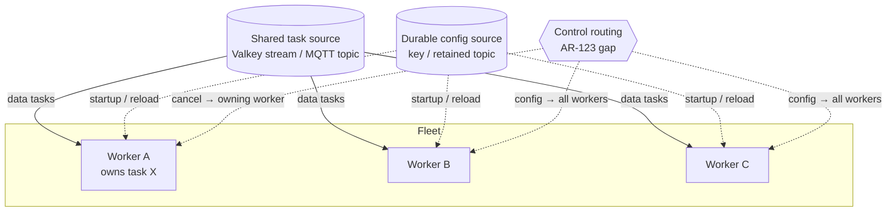

# Architecture Review

- **Date:** 2026-09-20
- **Version:** 4.5.0 (`src/scietex/service/version.py:6`)
- **Scope:** control-plane routing across a multi-worker fleet — `cancel_task` delivery to the owning worker, and `config:*` fan-out to every worker
- **Method:** read `docs/architecture/*` and prior `docs/reviews/architecture/*.md` as an initial map (not authoritative), then verified every significant claim against source. Focused audit of the control-plane path (`CancelTaskHandler`, `ConfigApplyHandler`/`ConfigStoreHandler`/`ConfigShowHandler`, `TaskExecutor.cancel`, `TaskProcessor._cancel_task`, the transport delivery model, and the durable config source).
- **Type:** focused architectural review (read-only). The only repository change is this document.
- **Identifier note:** the prior review (`2026-09-18-1.md`) ended at **AR-122** (all resolved). This review continues at **AR-123**.

---

## Executive Summary

The v4.5.0 control-plane work (AR-108) made control commands **ingestible** on a saturated worker by routing them to a local priority lane. That fix is correct and complete **for a single worker process**. It does not address — and was never scoped to address — **control-plane routing across a fleet of workers sharing one task source**.

Two gaps follow from the delivery model, and both are pre-existing (AR-108 neither introduced nor worsened them):

1. **`cancel_task` does not reach the worker that owns the target.** A `cancel_task` is an ordinary task delivered through the shared transport; whichever worker wins the read handles it, and `TaskExecutor.cancel` resolves the target against its **local** `TaskLifecycle` tracker map. If the target runs on a different worker, the cancel is a no-op (`TASK_NOT_RUNNING`).
2. **`config:*` commands do not fan out to all workers.** A `config:apply`/`config:store`/`config:show` task is consumed by exactly one worker. The *durable desired state* (Valkey key / MQTT retained topic) is shared, but the command is not; other workers only observe the change on their own next startup/reload.

The architecture is otherwise sound; this is a **scope/contract gap**, not a correctness break in the single-worker model. The current design is implicitly single-worker-per-service for control semantics.

**What to fix first:** decide the intended deployment contract (single worker per service vs. a fleet), then either (a) document the single-worker constraint explicitly, or (b) add a control-plane routing/fan-out mechanism (per-worker control subject, or a shared cancel-request key + a change-notification on the durable config source).

---

## Architecture Assessment

**Boundaries.** The control handlers are cleanly separated: `CancelTaskHandler` and the three `config:*` handlers reach the processor only through injected callbacks (`cancel=`, `apply=`, `store=`, `show=`), and `TaskExecutor.cancel` owns the cancellation mechanics. The boundary that matters here is the **transport delivery model**: control commands and data tasks share one ordered source and one delivery path.

**Responsibilities.** `TaskExecutor.cancel` (`task_executor.py:265-302`) is correctly scoped to *this process's* running/queued tasks — it consults `self._lifecycle.get(target_id)` and `self._remove_queued(target_id)`, both local. There is no cross-worker ownership lookup anywhere in the codebase.

**Dependencies.** Direction is correct. The durable config source (`ValkeyConfigSource` / `MqttConfigSource`) is the only genuinely shared control artifact; the command handlers are per-process.

**Abstractions.** The `TaskTransport`/`TaskSink` seam is transport-agnostic and has no notion of "which worker owns task X" or "broadcast this command". Adding fleet routing is a new concern, not a widening of an existing one.

**Concurrency.** AR-108's priority lane is a **local** concurrency fix (a second in-process queue + reserved budget). It does not interact with cross-worker delivery.

**State ownership.** Task ownership is per-process: `TaskLifecycle` trackers, `_retry_attempts`, `_timeout_requeues`, and the Valkey `_entry_ids`/lease maps are all worker-local. The Valkey lease is the closest thing to a cross-worker ownership signal, but it is used for recovery dedup, not for routing a cancel.

**Testability.** The single-worker control path is well covered (`tests/task_processor/test_control_priority.py`, `tests/task_executor/*`). There is no multi-worker test because there is no multi-worker routing to test.

**Extensibility.** A fleet-routing mechanism would be a new seam. The review records it as a finding rather than prescribing an implementation, because the right shape depends on the deployment contract (see Open Questions).

---

## Strengths

- **AR-108 priority lane is correct for its scope.** Control commands bypass data-plane backpressure and the data concurrency budget within a process; the lane accounting (`_control_running`, per-lane `task_done`) is sound and tested.
- **Durable desired state is genuinely shared.** `ValkeyConfigSource` (durable key `scietex:{service}:config`) and `MqttConfigSource` (retained topic) mean a config change *is* observable fleet-wide — the gap is the *trigger*, not the storage.
- **Cancellation mechanics are robust.** `TaskExecutor.cancel` uses `asyncio.wait` (not `wait_for`), marks the reason before `cancel()` with no intervening await, and refuses to requeue a handler that ignored cancellation — all correct and well-commented.
- **Control handlers are transport-agnostic.** They depend only on injected callbacks, so a future routing layer can reuse them unchanged.

---

## Critical Issues

None.

---

## Major Issues

### AR-123 — Control-plane commands are not routed across a multi-worker fleet
- **Status:** ✅ RESOLVED (2026-09-21) — both gaps are closed. The single-worker scope boundary was first documented (D0, commit `20144bf`); v5.0.0 then implemented the fleet routing/fan-out (D4), lifting that boundary. A durable unified control plane per transport now carries every control command on two channels: a **directed** one per worker (`scietex:{service}:control:{instance_id}` / `scietex/{service}/control/{instance_id}`) and a **broadcast** one per service (`scietex:{service}:control` / `scietex/{service}/control`). Gap 1 (cancel routing) is closed by directed addressing plus `ControlPublisher.resolve_owner(task_id)`, which reads the Valkey tracking record's `TaskStatus.instance_id` or the MQTT retained owner marker `scietex/{service}/tasks/{task_id}/owner`; gap 2 (config fan-out) is closed by broadcast addressing. Control is read with plain `XREAD` + a `$`-seeded in-memory cursor (no consumer groups, no PEL, no lease), so a command published while a worker is down is skipped rather than replayed, and control is never retried; retention mirrors the heartbeat (`MAXLEN ~ control_stream_maxlen`, directed stream `active_ttl` refreshed on the heartbeat tick). The MQTT inbox is partitioned into data and control stores so a saturated data lane cannot delay a control command. Proven end to end by `tests/test_control_plane_integration.py` (directed cancel crosses workers; broadcast reaches both; owner resolution). Commits `3e5c2a7`, `aff43a6`, `8b12540`, `f0fad7d`, `8141d10`.
- **Severity:** MEDIUM
- **Evidence:**
  - `cancel_task` is delivered as an ordinary task through the shared transport; `CancelTaskHandler.handle` (`task_handler/cancel.py:90-133`) decodes the target id and calls the injected `cancel` callback, which is `TaskProcessor._cancel_task` (`task_processor.py:578`) → `TaskExecutor.cancel` (`task_executor.py:265-302`).
  - `TaskExecutor.cancel` resolves the target against **local** state only: `tracker = self._lifecycle.get(target_id)` (`task_executor.py:274`) and `queued_data = await self._remove_queued(target_id)` (`task_executor.py:304`). Both consult this process's `TaskLifecycle`/queues. A target owned by another worker is not found → the handler returns `TASK_NOT_RUNNING` (`task_handler/cancel.py:128-133`).
  - `config:apply`/`config:store`/`config:show` are likewise ordinary tasks (`task_handler/config.py:144-399`); each is consumed by exactly one worker. The durable source (`ValkeyConfigSource` / `MqttConfigSource`) is shared, but the command is not — other workers observe a change only on their own next startup/reload.
  - AR-108 (`task_executor.py` priority lane, `task_processor.py` `__control_queue`) made control commands *ingestible* under local saturation; it did not add any cross-worker routing.
- **Problem:** With N workers sharing one task source, a `cancel_task` is handled by whichever worker wins the read, not the worker running the target; and a `config:*` command reaches one worker, not all. The control plane is implicitly single-worker-per-service, but this contract is nowhere stated.
- **Why it matters:** An operator cannot reliably cancel a stuck task or reconfigure a fleet through the task pipeline. A cancel silently no-ops (`TASK_NOT_RUNNING`) when it lands on the wrong worker; a config change appears to succeed while most workers keep the old settings until they restart. Both are silent, hard-to-diagnose operational failures at fleet scale.
- **Recommendation:** Decide and document the deployment contract, then either:
  - **(a) Document the single-worker constraint** — state that control commands are only meaningful when one worker owns the service's task source, and that `cancel_task`/`config:*` are not fleet-routed. Cheapest; makes the limitation explicit.
  - **(b) Add fleet routing** — for cancel, a per-worker control subject (each worker subscribes to its own control channel) or a shared cancel-request key the owning worker polls; for config, a broadcast control subject or a change-notification on the durable source that every worker observes. This is a new seam and a larger change; scope it separately.
- **Confidence:** HIGH (the local-only lookup and single-consumer delivery are verified in source; the operational impact is a direct consequence).

---

## Minor Issues

None raised in this review.

---

## Cross-Cutting Analysis

**The dominant theme is a scope boundary, not a defect.** AR-108 correctly solved *intra-process* control-plane starvation. The multi-worker question is a distinct concern — control-plane **routing and fan-out** — that the prior review did not raise and AR-108 did not claim to cover. The two gaps (cancel routing, config fan-out) share one root: control commands travel the same single-consumer delivery path as data tasks, and task ownership is worker-local.

**The durable config source is the one shared control artifact.** This is why config fan-out is closer to solvable than cancel routing: the desired state is already fleet-visible; only the *trigger* to re-read it is missing. Cancel routing has no shared ownership signal today (the Valkey lease is a recovery-dedup mechanism, not a routing table).

---

## Architectural Recommendations

1. **State the deployment contract.** Add to `AGENTS.md` / `docs/architecture/*` whether a service's task source is single-worker or fleet-shared, and what that implies for `cancel_task` and `config:*`. (Cheapest; prerequisite for choosing between (a) and (b) below.)
2. **If fleet-shared is intended, scope a routing design** (AR-123b): per-worker control subject or shared cancel-request key for cancel; broadcast subject or durable-source change-notification for config. Do not fold into AR-108's priority lane — it is a different layer.

---

## Suggested Target Architecture

The dashed control edges do not exist today: cancel is delivered via the shared source (lands on one worker), and config commands are delivered via the shared source (land on one worker) while only the durable state is fleet-visible.

---

## Migration Strategy

1. **Document the contract** (recommendation 1) — no code change; makes the limitation explicit and unblocks the decision.
2. **If fleet routing is wanted**, scope AR-123b as a separate design: choose the cancel-routing mechanism and the config fan-out mechanism, define the ownership signal, and add multi-worker tests. Independent of the AR-108 priority lane.

---

## Open Questions

1. **Is a service's task source intended to be single-worker or fleet-shared?** This determines whether AR-123 is a documentation fix or a routing design.
   - **Answered (D0 + D4):** the single-worker-per-service scope boundary was documented (D0), and fleet-shared control routing was implemented in v5.0.0 (D4), lifting that boundary.
2. **For cancel routing, is a per-worker control subject acceptable** (requires submitters to know the target worker), or is a shared cancel-request key the owning worker polls preferred (no submitter knowledge, but a polling cost)?
   - **Answered (D4):** a per-worker directed control channel, with `ControlPublisher.resolve_owner(task_id)` mapping a task to its owning worker so the submitter does not need to know the target worker.
3. **For config fan-out, is a broadcast control subject acceptable**, or should workers observe a change-notification on the durable source (no new subject, but requires a notification channel)?
   - **Answered (D4):** a service-scoped broadcast control channel; the durable source stays the desired state, the broadcast channel is the trigger.
4. **Should the Valkey lease be repurposed as an ownership signal** for cancel routing, or is a dedicated ownership map needed?
   - **Answered (D4):** a dedicated ownership signal — the Valkey tracking record's `TaskStatus.instance_id` and the MQTT retained owner marker `scietex/{service}/tasks/{task_id}/owner`; the lease stays a recovery-dedup mechanism.

---

## Final Prioritization

| ID | Issue | Severity | Impact | Effort | Priority |
|---|---|---|---|---|---|
| AR-123 | Control-plane commands not routed across a multi-worker fleet | MEDIUM | Cancel silently no-ops on the wrong worker; config reaches one worker | Low (document) / High (route) | 3 | ✅ resolved (documented + routed in v5.0.0) |

---

**Verdict:** The v4.5.0 control-plane work is correct for a single worker process. The multi-worker routing/fan-out gap (AR-123) was a scope boundary, not a regression: pre-existing, silent, and operational. It was first made explicit by documenting the single-worker contract (D0), then closed in v5.0.0 by the fleet-routing design (D4) — a durable unified control plane with per-worker directed and service-scoped broadcast channels, plus owner resolution for cancel routing.

Succeeded: 1 finding resolved in this review (AR-123, documented in D0 and routed in v5.0.0). Failed: 0. Skipped: 0.
