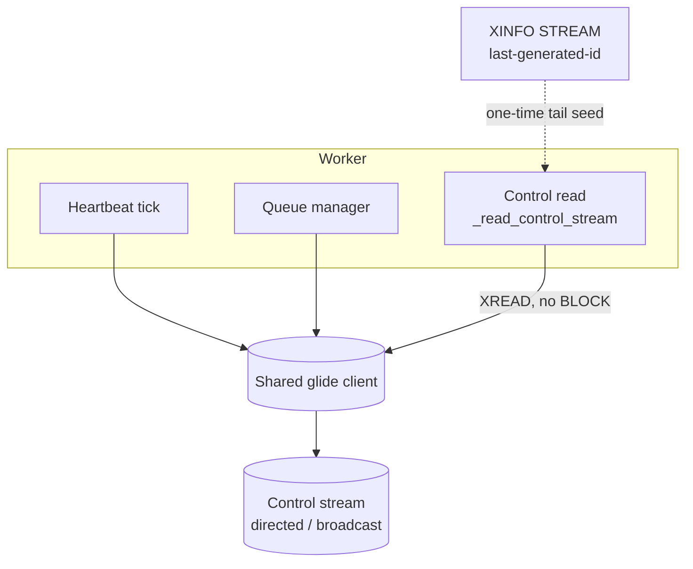

# Architecture Review

- **Date:** 2026-09-21
- **Version:** 5.0.0 (`src/scietex/service/version.py:6`)
- **Scope:** the Valkey control-plane read path — `ValkeyTransport._read_control_stream` and its cursor lifecycle — plus the test double that covers it
- **Method:** read `docs/architecture/*` and prior `docs/reviews/architecture/*.md` as an initial map (not authoritative), then verified every significant claim against source and against a live Valkey 9.0.2 server. The two defects were found by running the new real-server integration tier (`tests/valkey/integration/`), not by reading the mocked suite.
- **Type:** focused architectural review (read-only). The only repository change is this document.
- **Identifier note:** the prior review (`2026-09-20-1.md`) ended at **AR-123** (resolved). This review continues at **AR-124**.

---

## Executive Summary

The v5.0.0 control plane (AR-123 D4) is architecturally sound: a durable unified control plane per transport, two channels (directed + broadcast), plain `XREAD` with an in-memory cursor, no consumer groups, no PEL, no lease. The design is correct.

Its **implementation of the read path was not**. Two independent defects sat in `ValkeyTransport._read_control_stream`, and both were invisible to the entire mocked test suite:

1. **`block_ms=0` means "block forever", not "do not block".** The control read intended a non-blocking poll but emitted `XREAD ... BLOCK 0`, which the server reads as an unbounded block. On an empty control stream — the normal steady state — the read parked the shared connection indefinitely, stalling the worker's heartbeat and queue-manager reads until the 5 s `request_timeout` tripped. The client never recovered.
2. **The `$` cursor never pinned a position.** The cursor was seeded to the literal `"$"`, which `XREAD` re-resolves to the *live tail on every call*. Any command published between two polls was silently skipped — a correctness hole in the very mechanism AR-123 introduced to deliver control commands.

Both are now fixed (commit `0d8725d`). The third finding is the reason they survived: the `DummyClient` test double **cannot observe the arguments that carried the bugs**, so the mocked suite was structurally incapable of catching either. The new integration tier is what surfaced them.

**What to fix first:** nothing is outstanding — all three findings are resolved. The durable lesson is AR-126: a test double that discards the argument under test provides false confidence, and the integration tier is the structural remedy.

---

## Architecture Assessment

**Boundaries.** The control-plane read is correctly isolated in `ValkeyTransport._read_control_stream` (`valkey/transport.py:315-360`), separate from the data-plane `xreadgroup` path (`valkey/transport.py:166`). The two use different read primitives for different reasons — the data plane blocks briefly (`block_ms=1000`) because it wants to wait for work; the control plane must not block at all because it polls alongside the heartbeat.

**Responsibilities.** The cursor is owned by the transport (`_control_cursor` / `_broadcast_cursor`), advanced only on a returned entry, and independent per channel. That ownership is correct. The defect was in the *seed* and the *read options*, not the ownership model.

**Dependencies.** The read depends on glide's `StreamReadOptions` semantics, which are non-obvious: `block_ms=None` omits `BLOCK`; `block_ms=0` emits `BLOCK 0` (block forever). This is documented glide behavior, not a glide bug — verified against `StreamReadOptions.to_args()` and the Rust core's `get_timeout_from_cmd_arg`, which maps `0.0` to `RequestTimeoutOption::NoTimeout`.

**Abstractions.** The `TaskTransport` seam is unaffected. The fix is internal to one method plus one new helper (`_resolve_stream_tail`).

**Concurrency.** This is where the defect bit. The control read shares the worker's glide client with the heartbeat and the data plane. A read that blocks forever does not merely fail its own poll — it **poisons the shared connection**, so unrelated operations (heartbeat writes, queue-manager fetches) time out. The blast radius of a blocking read is the whole client, not the one call.

**State ownership.** The cursor is in-memory and per-worker, matching the design's "commands published while a worker is down are skipped, not replayed" contract. The `$`-seed defect violated that contract in the opposite direction: it skipped commands published while the worker was *up*.

**Testability.** This is the finding that matters most (AR-126). The mocked suite asserts on wire calls for the data plane (`client.xread_calls`, `set_calls` with the NX flag, `client.acked`, `client.deleted`) but the control-plane double's `xread` signature is `xread(self, streams)` — it **never receives the `StreamReadOptions`**, so `block_ms` is unobservable by construction. The double also treated `"$"` as "stream start", a shortcut that masked the real re-resolution semantics. The suite was green while the feature was broken.

**Extensibility.** The integration tier added in this work (`tests/valkey/integration/`, `tests/mqtt/integration/`) is the structural remedy: it exercises the real server, where `BLOCK 0` actually blocks and `$` actually re-resolves.

---

## Strengths

- **The control-plane design itself is correct.** Two channels, directed + broadcast, plain `XREAD` with a tail-resolved cursor, no consumer groups, no PEL, no lease, no retry — the AR-123 D4 design holds up. The defects were implementation, not design.
- **The fix is minimal and well-scoped.** `block_ms=None` plus a one-time `XINFO STREAM` tail resolution; no new abstraction, no new dependency, no change to the transport seam.
- **The integration tier proved its worth immediately.** It found two production bugs on its first real run, in a feature whose mocked suite was fully green. That is the strongest possible argument for its existence.
- **The bug was correctly diagnosed as client poisoning, not server saturation.** The `inflight=2→2 STABLE`, `pending=0`, `cause=ServerUnresponsive` signature initially read as a server problem; the server was healthy throughout (1 client, 0 blocked, 0 rejected). The real cause was the client's connection parked by `BLOCK 0`.

---

## Critical Issues

None outstanding. Two critical defects were found and fixed in this work (AR-124, AR-125); they are recorded below as resolved.

---

## Major Issues

### AR-124 — Control-stream read used `block_ms=0`, which blocks forever
- **Status:** ✅ RESOLVED (2026-09-21) — `_read_control_stream` now passes `StreamReadOptions(block_ms=None)`, which omits `BLOCK` entirely and returns immediately on an empty stream. Commit `0d8725d`.
- **Severity:** HIGH
- **Evidence:**
  - `valkey/transport.py:351` (pre-fix) used `StreamReadOptions(block_ms=0)` for the control-stream `XREAD`, intending "non-blocking".
  - Glide maps `block_ms=0` to `XREAD ... BLOCK 0`; the server reads `BLOCK 0` as **block forever**. Verified against `StreamReadOptions.to_args()` (`python/glide-shared/glide_shared/commands/stream.py`) and the Rust core's `get_timeout_from_cmd_arg`, which maps `0.0` to `RequestTimeoutOption::NoTimeout`. Reproduced on both RESP2 and RESP3.
  - Live symptom: with an empty control stream, the read parked the shared connection (`inflight=2→2 STABLE`, `pending=0`, `cause=ServerUnresponsive`); the worker's heartbeat and queue-manager reads then timed out at the 5 s `request_timeout` and the client never recovered.
  - Post-fix probe: `xread $ block_ms=None (empty): OK -> None`; `ping after: OK -> b'PONG'`.
- **Problem:** The control-plane poll blocked indefinitely whenever the control stream was empty — which is the normal steady state. Because the read shares the worker's glide client, the block poisoned the whole connection, not just the control poll.
- **Why it matters:** A worker with a healthy data plane would stall its heartbeat and stop observing control commands, with no error surfaced to the operator. The failure mode is silent and total: the control plane AR-123 built simply stops working, and the worker looks alive while being unreachable.
- **Recommendation:** Use `block_ms=None` for any genuinely non-blocking read. Treat `block_ms=0` as "block forever" in all future glide code; it is a footgun, not a synonym for "no block".
- **Confidence:** HIGH (reproduced against a live server; glide semantics confirmed in source).

---

### AR-125 — The `$` cursor seed skipped commands published between polls
- **Status:** ✅ RESOLVED (2026-09-21) — the cursor is now seeded once via `_resolve_stream_tail`, which reads `XINFO STREAM`'s `last-generated-id` (or `"0-0"` when the stream does not exist yet, detected via `RequestError`). Commit `0d8725d`.
- **Severity:** HIGH
- **Evidence:**
  - The cursor was seeded to the literal string `"$"` and only replaced by a real entry id when entries were returned.
  - `XREAD` re-resolves `$` to the **live tail on every call**. A cursor that is still `"$"` therefore means "from now", re-evaluated each poll — so any command published between two polls is skipped.
  - The window is not narrow: the control poll runs on the heartbeat cadence, so a command published in the interval between polls is lost.
  - Post-fix: `_resolve_stream_tail` pins the tail once at startup; the cursor then advances by real entry id, so no published command is skipped.
- **Problem:** The mechanism AR-123 introduced to deliver control commands could silently drop them. A `task:cancel` or `config:apply` published between two polls was never read.
- **Why it matters:** This is a correctness hole in the control plane's core guarantee. It is worse than AR-124 in kind — AR-124 made the control plane stop; AR-125 made it *appear to work* while dropping commands. An operator would see a cancel accepted and never applied, with no error anywhere.
- **Recommendation:** Never seed a stream cursor with `$` when the cursor is retained across calls. Resolve the tail once to a concrete entry id (`XINFO STREAM` `last-generated-id`, or `0-0` for a stream that does not exist) and advance from there.
- **Confidence:** HIGH (the re-resolution semantics are documented `XREAD` behavior; the skip window follows directly from the poll cadence).

---

## Minor Issues

### AR-126 — The `DummyClient` control double cannot observe the arguments that carried the bugs
- **Status:** ✅ RESOLVED (2026-09-21) — the double now models the real semantics: `_SharedStreams.xread` treats `"0-0"` as stream start (the `$`-as-stream-start shortcut is gone), and `xinfo_stream` was added to both `_SharedStreams` and `DummyClient` (raising `RequestError` for a missing stream, mirroring the server). The integration tier is the structural remedy. Commit `0d8725d`.
- **Severity:** MEDIUM
- **Evidence:**
  - `tests/valkey/_helpers.py:59` — `_SharedStreams.xread(self, streams)` takes only the stream map. It **never receives the `StreamReadOptions`**, so `block_ms` is unobservable by construction. AR-124 could not have been caught by this double at any assertion.
  - The double treated `"$"` as "stream start" (pre-fix), a shortcut that inverted the real semantics and masked AR-125.
  - The mocked suite was fully green (748 passed) while both defects were live.
  - The data-plane double *does* assert on wire calls (`client.xread_calls`, `set_calls` with the NX flag, `client.acked`, `client.deleted`), so the gap is specific to the control-plane double, not a general mocking weakness.
- **Problem:** A test double that discards the argument under test provides false confidence. The control-plane double's signature made the two most dangerous parameters (`block_ms`, the cursor seed) structurally invisible, and its `$` shortcut encoded the wrong semantics.
- **Why it matters:** The suite's green light was not evidence of correctness for this path. Any future change to the control read options or cursor seeding would be equally invisible. The double's fidelity, not the test count, is what determines whether the mocked tier can catch a regression here.
- **Recommendation:** When a double models a call, it must accept and assert on the arguments that determine behavior — here, the read options and the cursor. Where a double cannot faithfully model a primitive (blocking semantics, `$` re-resolution), cover it with the integration tier instead of a shortcut. The new `tests/valkey/integration/` and `tests/mqtt/integration/` tiers exist for exactly this class of gap.
- **Confidence:** HIGH (the signature and the shortcut are verified in source; the masking is a direct consequence).

---

## Cross-Cutting Analysis

**The dominant theme is that a green mocked suite is not evidence about the wire.** Both critical defects lived in arguments the double never saw. The suite asserted the *shape* of the control read (which stream, which cursor) but not the *options* that made it block forever, and it encoded the wrong cursor semantics outright. The lesson is not "write more tests" — it is "a double must model the parameters that carry the behavior, or the behavior must be tested against the real thing."

**The two defects are independent but compounding.** AR-124 made the control plane stop; AR-125 made it drop commands while appearing to work. Together they meant the v5.0.0 control plane was non-functional in production despite a fully green suite. Neither was a design flaw — the AR-123 D4 design is sound — which is precisely why reading the design could not have found them.

**The blast radius of a blocking read is the shared client.** The control read shares the worker's glide connection with the heartbeat and the data plane. This is why AR-124 presented as a heartbeat failure rather than a control-plane failure, and why the initial diagnosis (server saturation) was wrong. Any future non-blocking read on the shared client must be verified to actually not block.

---

## Architectural Recommendations

1. **Treat `block_ms=0` as "block forever" everywhere.** It is not a synonym for "non-blocking"; `None` is. Add this to the project's glide notes so the footgun is not re-introduced.
2. **Never retain a `$` cursor across calls.** Resolve the tail once to a concrete entry id and advance from there. `$` is only safe for a single, immediately-consumed read.
3. **Make doubles model the arguments that carry behavior.** A double whose signature omits the parameter under test cannot catch a regression in it. Where faithful modeling is impractical, cover the primitive with the integration tier.
4. **Keep the integration tier opt-in and additive.** It found two production bugs on its first real run; it is the structural remedy for the class of gap the mocked tier cannot reach. It must never replace the mocked tier, which remains the primary coverage.

---

## Suggested Target Architecture

The control read must return immediately on an empty stream (no `BLOCK`), and its cursor must be a concrete entry id resolved once at startup — never a retained `$`. Both properties are required for the shared client to stay healthy and for no published command to be skipped.

---

## Migration Strategy

1. **Fixed in `0d8725d`** — `block_ms=None` and `_resolve_stream_tail`; the double updated to model `0-0` and `xinfo_stream`.
2. **No further migration required.** The fixes are internal to `ValkeyTransport` and its test double; no public API, wire format, or config changed.

---

## Open Questions

1. **Should the control read share the worker's glide client at all**, or should it own a dedicated connection so a future blocking regression cannot poison the heartbeat?
   - **Open.** The current fix removes the block, but the shared-client coupling is what turned a control-plane bug into a heartbeat outage. A dedicated connection would bound the blast radius; it also adds a connection per worker. Worth deciding before the fleet grows.
2. **Can the mocked tier assert on `StreamReadOptions`** by widening the double's `xread` signature, or is the integration tier the only faithful home for read-option behavior?
   - **Open.** Widening the signature would let the mocked tier catch a `block_ms` regression cheaply; the integration tier would still be needed for the actual blocking semantics.
3. **Are there other retained cursors or read options in the codebase with the same class of defect?**
   - **Open.** The data-plane read uses `block_ms=1000` (intentional, bounded) and a consumer-group cursor, so it is not affected. A sweep of remaining `StreamReadOptions` uses would confirm.

---

## Final Prioritization

| ID | Issue | Severity | Impact | Effort | Priority |
|---|---|---|---|---|---|
| AR-124 | Control read used `block_ms=0` (blocks forever) | HIGH | Poisons the shared client; stalls heartbeat and control plane | Low | 1 | ✅ resolved (`0d8725d`) |
| AR-125 | `$` cursor seed skipped commands published between polls | HIGH | Control commands silently dropped while appearing to work | Low | 1 | ✅ resolved (`0d8725d`) |
| AR-126 | Control double cannot observe the arguments that carried the bugs | MEDIUM | Green suite gave false confidence; regressions invisible | Medium | 2 | ✅ resolved (`0d8725d`) |

---

**Verdict:** The v5.0.0 control-plane design (AR-123 D4) is correct; its read-path implementation was not. Two independent HIGH defects — a read that blocked forever and a cursor that skipped commands — shipped behind a fully green mocked suite, because the control-plane double could not observe the arguments that carried them. Both are fixed, the double now models the real semantics, and the new opt-in integration tier is the structural remedy: it found both bugs on its first run against a live server. The remaining open question is whether the control read should keep sharing the worker's glide client, since that coupling is what turned a control-plane bug into a heartbeat outage.

Succeeded: 3 findings resolved in this review (AR-124, AR-125, AR-126). Failed: 0. Skipped: 0.
